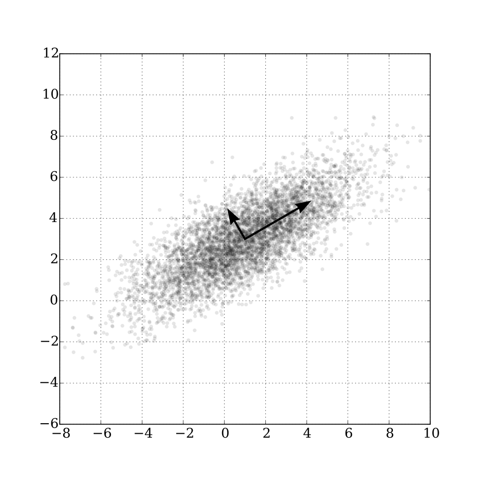
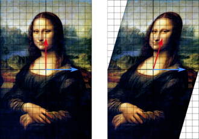

# Vlastní čísla a vlastní vektory matic. Způsob výpočtu a praktická interpretace

## Vlastní vektory

Většina vektorů po vynásobení maticí (obecnou, ne např. jednotkovou) se otočí do jiného směru a změní svou délku. **Vlastní vektory** jsou však takové vektory, které po vynásobení maticí **zůstanou ve stejném směru**, pouze se změní jejich délka.

- Platí: $\boldsymbol{A}\boldsymbol{u} = \lambda \boldsymbol{u} \iff (\boldsymbol{A} - \lambda \boldsymbol{I})\boldsymbol{u} = 0$.

## Vlastní čísla

- Vlastní čísla jsou faktory, o které se vektory prodlouží nebo zkrátí, příp. vyjdou-li komplexně, tak o kolik se zrotují.
- Vlastní čísla se počítají jako řešení charakteristické rovnice $\det(\boldsymbol{A} - \lambda \boldsymbol{I}) = 0$.
- Můžou být i komplexní, i když matice obsahuje pouze reálné prvky, což má za důsledek to, že vektor rotuje o určitý úhel, ale nezmění svou délku,
  - např. pro rotaci o 90°: $\boldsymbol{A} = \begin{bmatrix}0 & -1\\ 1 & 0\end{bmatrix}$ vychází $\lambda^2 = -1 \implies \lambda_1 = i, \lambda_2 = -i \implies u_1 = \begin{bmatrix}1\\-i\end{bmatrix}, u_2=\begin{bmatrix}1\\ i\end{bmatrix}$.
- $0$ je vlastním číslem matice, když je matice singulární.

## Výpočet

$$
\boldsymbol{A} = \begin{bmatrix}
4 & 2 \\
1 & 3
\end{bmatrix}\\
\Downarrow\\
\det(\boldsymbol{A} - \lambda \boldsymbol{I}) = \begin{vmatrix}
4 - \lambda & 2 \\
1 & 3 - \lambda
\end{vmatrix} = 0\\
\Downarrow\\
(4 - \lambda)(3-\lambda) - (2\times1)=0\\
12 - 4\lambda - 3\lambda + \lambda^2 - 2 = 0\\
\lambda^2 - 7\lambda + 10 = 0\\
\Downarrow\\
\lambda_1 = 5, \lambda_2 = 2\\

\lambda_1 = 5: (\boldsymbol{A} - 5\boldsymbol{I})\boldsymbol{u} = 0\\ \Downarrow\\ \begin{bmatrix}-1 & 2\\ 1 & -2\end{bmatrix}\boldsymbol{u} = 0\\
\begin{bmatrix} -1 & 2\\ 1 & -2\end{bmatrix}\begin{bmatrix}x\\y\end{bmatrix} = 0\\
-x + 2y = 0 \iff x = 2y\\
\boldsymbol{u}_1 = \begin{bmatrix}2\\1\end{bmatrix}\\

\lambda_2 = 2: (\boldsymbol{A} - 2\boldsymbol{I})\boldsymbol{u} = 0\\ \Downarrow\\ \begin{bmatrix}2 & 2\\ 1 & 1\end{bmatrix}\boldsymbol{u} = 0\\
\begin{bmatrix}2 & 2\\ 1 & 1\end{bmatrix}\begin{bmatrix}x\\y\end{bmatrix} = 0\\
x + y = 0 \iff x = -y\\
\boldsymbol{u}_2 = \begin{bmatrix}1\\-1\end{bmatrix}
$$

## Praktická využití

- Zvětšení: $\begin{bmatrix}k & 0\\0 & k\end{bmatrix}$,
  - $\lambda_1=\lambda_2=k$,
  - $u$ všechny nenulové vektory.
- Různé zvětšení po osách: $\begin{bmatrix}k_1 & 0\\0 & k_2\end{bmatrix}$,
  - $\lambda_1=k_1,\lambda_2=k_2$,
  - $\boldsymbol{u}_1=\begin{bmatrix}1\\0\end{bmatrix}, \boldsymbol{u}_2=\begin{bmatrix}0\\1\end{bmatrix}$.
- Rotace: $\begin{bmatrix}\cos\theta & -\sin\theta\\\sin\theta & \cos\theta\end{bmatrix}$,
  - $\lambda_1=e^{i\theta}=\cos\theta + i\sin\theta, \lambda_2=e^{-i\theta}=\cos\theta - i\sin\theta$,
  - $\boldsymbol{u}_1=\begin{bmatrix}1\\-i\end{bmatrix}, \boldsymbol{u}_2=\begin{bmatrix}1\\i\end{bmatrix}$.
- Horizontální zkosení: $\begin{bmatrix}1 & k\\0 & 1\end{bmatrix}$,
  - $\lambda_1=\lambda_2=1$,
  - $\boldsymbol{u}_1=\begin{bmatrix}1\\0\end{bmatrix}$.
- Vertikální zkosení: $\begin{bmatrix}1 & 0\\k & 1\end{bmatrix}$,
  - $\lambda_1=\lambda_2=1$,
  - $\boldsymbol{u}_1=\begin{bmatrix}0\\1\end{bmatrix}$.
- Zrcadlení: $\begin{bmatrix}1 & 0\\0 & -1\end{bmatrix}$,
  - $\lambda_1=1, \lambda_2=-1$,
  - $\boldsymbol{u}_1=\begin{bmatrix}1\\0\end{bmatrix}, \boldsymbol{u}_2=\begin{bmatrix}0\\1\end{bmatrix}$.
- **Analýza hlavních komponent** (Principal component analysis)
  - Slouží k **dekorelaci dat**.
  - Využívá se např. ke **snížení dimenze pro účely zjednodušování výpočtů s co nejmenší ztrátou informace**.
  - Počítá se **kovarianční matice dat, ze které poté počítají vlastní čísla a vlastní vektory**.
  - **Odstraňují se komponenty s nejmenší variancí**, tedy s nejmenším vlastním číslem:
    
  - např.
    $$
    \operatorname{cov}\boldsymbol{X}=\begin{bmatrix}\sigma^2_{X_1} & C_{X_1 X_2}\\C_{X_2 X_1} & \sigma^2_{X_2}\end{bmatrix}=\begin{bmatrix}3 & 1\\ 1 & 3\end{bmatrix}\\
    \Downarrow\\
    \begin{vmatrix}3-\lambda & 1\\ 1 & 3-\lambda\end{vmatrix}=0\\
    \Downarrow\\
    (3-\lambda)^2 - 1 = 0\\
    \Downarrow\\
    \lambda_1=4, \lambda_2=2,\\
    $$
    kde první směrová osa $\lambda_1$ v sobě nese více informace než druhá $\lambda_2$, a proto se druhá odstraní, tudíž se 2D data zredukují na 1D data ve směru $u_1$.

- Např. zde je modrý vektor vlastním vektorem matice zobrazení.
