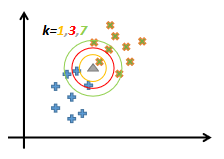
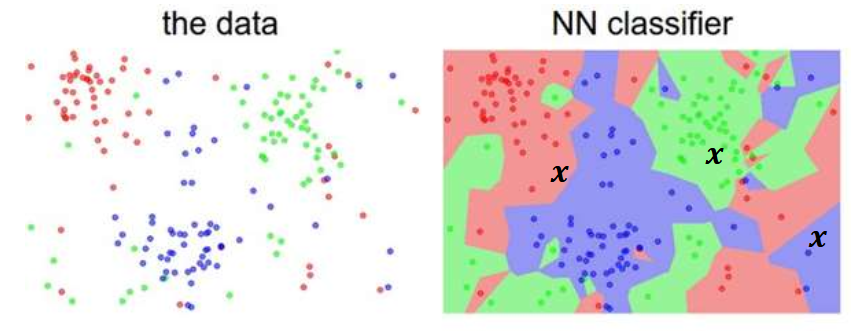
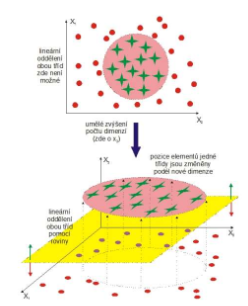
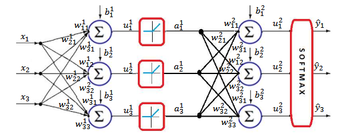
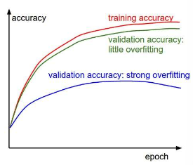

# Nelineární klasifikace a neuronové sítě typu vícevrstvý perceptron, učení neuronových sítí - algoritmus zpětné propagace

## Nelineární klasifikace

Lineární klasifikátory jsou trénovány tak, aby rozdělovaly prostor příznaků přímkami nebo rovinami, což není pro všechny případy vhodné.

### Vzdálenostní metody

Realizují se metodami (k)NN, kdy se vybírá 1 nebo více nejbližších bodů v příznakovém prostoru, a na základě jejich třídy je poté vybraná třída pro další data.

- Nejsou parametrické, tj. není zde žádný parametr $\theta$ nebo $\Theta$.
- S klasifikátorem je nutno distribuovat i trénovací data.
- Můžeme využít např.
  - euklidovskou vzdálenost $d(\boldsymbol{x}, \boldsymbol{z}) = \sqrt{(\boldsymbol{x}-\boldsymbol{z})^T(\boldsymbol{x}-\boldsymbol{z})} = \sqrt{\sum_{i=1}^n (x_i-z_i)^2}$,
  - manhattanovskou vzdálenost $d(\boldsymbol{x}, \boldsymbol{z}) = \sum_{i=1}^n |x_i-z_i|$,
  - Mahalanobisova vzdálenost $d(\boldsymbol{x}, \boldsymbol{z}) = \sqrt{\sum_{i=1}^n \frac{(x_i - z_i)^2}{\sigma^2_i}}$,
    - která je vhodná pro klasifikace s dynamickými rozsahy příznaků.

### Parametrické metody

Řadí se mezi ně např.

- zapojení vyšších mocnin příznaků v rámci lineárního klasifikátoru,
  
- kernelové transformace
- gaussovské mixturové modely,
- neuronové sítě typu vícevrstvý perceptron,
  - tedy efektivně sériové zapojení lineárních klasifikátorů.

## Vícevrstvý perceptron

Je parametrický, přičemž počet parametrů roste s každou další vrstvou modelu, ale neroste s velikostí dat, jako např. u kernelů.

- Obsahuje paralelní i sériová spojení neuronů.
- Má vstupní a výstupní vrstvu a navíc jednu nebo více skrytých vrstev s nelineární aktivační funkcí,
  - přičemž při 2 a více skrytých vrstvách mluvíme o hlubokých neuronových sítích (DNNs).

- Neuron zpracovává výstupní hodnoty nelineární funkcí, např. logistická (sigmoida) $\sigma(x) = \frac{1}{1 + e^{-x}}$, ReLU $r(x) = \max(0, x)$.

### Zpětná propagace

Zpětná propagace představuje způsob učení neuronových sítí, který pracuje s řetízkovým pravidlem z diferenciálního počtu.

- Hlavním úkolem je přenesení gradientu z výstupu funkce na jeden z vektorů vah.

  $$
  L = \sum_{c=1}^N y_c \log \hat{y}_c,\\
  \begin{align*}
  \frac{\partial L}{\partial \boldsymbol{w}_i} &= \frac{\partial L}{\partial u_j} \frac{\partial u_j}{\partial \boldsymbol{w}_i}\;(u_j=\boldsymbol{x}^T\boldsymbol{w}_i)\\
  &= (y_i-\hat{y}_i)\frac{\partial u_j}{\partial w_i}\\
  &= (y_i-\hat{y}_i)\frac{\partial(\boldsymbol{x}^T\boldsymbol{w}_i)}{\partial \boldsymbol{w}_i}\\
  &= (y_i-\hat{y}_i)\boldsymbol{x},
  \end{align*}
  $$

  přičemž toto se aplikuje od výstupu směrem ke vstupům.

- Můžeme definovat např. následující přenosy gradientů:
  - Blok sčítání $f(x,y) = x+y: \frac{df}{dx} = 1, \frac{df}{dy} = 1,$
  - Blok násobení $f(x,y) = x \cdot y: \frac{df}{dx} = y, \frac{df}{dy} = x,$
  - ReLU $f(x) = \max(0,x): \frac{df}{dx} = \begin{cases} 0, & x \leq 0 \\ 1, & x > 0 \end{cases}$.

- Pro nejjednodušší příklad nelineární klasifikace $\boldsymbol{u}^2 = {\boldsymbol{W}^{2}}^T \boldsymbol{a}^1 + \boldsymbol{b}^2$ (horní indexy jsou čísla vrstev, ne mocniny) tedy můžeme definovat gradienty takto:

  $$
    \frac{\partial \hat{\boldsymbol{y}}}{\partial \boldsymbol{u}^2} = d\boldsymbol{u}^2 = \hat{\boldsymbol{y}}^T - \boldsymbol{y}^T,\\
    \frac{\partial \boldsymbol{u}^2}{\partial\boldsymbol{W}^2} = d\boldsymbol{W}^2 = d\boldsymbol{u}^2 {\boldsymbol{a}^{1}}^T,\\
    \frac{\partial \boldsymbol{u}^2}{\partial\boldsymbol{b}^2} = d\boldsymbol{b}^2 = d\boldsymbol{u}^2,\\
    \frac{\partial \boldsymbol{u}^2}{\partial\boldsymbol{a}^1} = d\boldsymbol{a}^1 = {\boldsymbol{W}^{2}}^T d\boldsymbol{u}^2,\\
    \frac{\partial \boldsymbol{u}_1}{\partial \boldsymbol{W}^1} = d\boldsymbol{W}^1 = d\boldsymbol{u}^1 \boldsymbol{x}^T,\\
    \frac{\partial \boldsymbol{u}_1}{\partial\boldsymbol{b}^1} = d\boldsymbol{b}^1 = d\boldsymbol{u}^1.\\
  $$

- Jeden běh modelu je tedy:

- Jelikož mohou trénovací data obsahovat miliony vzorků, můžeme využít tzv. mini-batch gradient descent.
  - Každá iterace rozděluje data na dávky (batches) a aktualizace parametrů se provádí vždy pro jednou dávku.
  - Teoreticky MBGD nepřesný, prakticky ale funguje, protože trénovací vzorky jsou vždy nějak korelované (podobné, závislé).

- Prakticky dává smysl trénovat na velké množině dat, jestliže:
  - náhodně inicializované parametry modelu vedou k $\frac{1}{C}$ přesnosti rozpoznávání, kde $C$ je počet tříd
  - a pokud při použití malého množství dat konverguje hodnota kriteriální funkce k nule.

- Inicializace modelu se realizuje pomocí nastavení malých náhodných čísel do váhových matic a 0 do biasových vektorů.
  - Toto musí být kvůli tomu, že při nastavení 0 do váhových matic by všechny neurony měly stejnou hodnotu výstupu a tedy i stejný gradient.

- Malé množství dat může vést k přetrénování.
- Vhodné pro úlohu klasifikace, spíše nevhodné pro úlohu regrese, protože natrénovat výstup ze sítě jako jeden neuron je prakticky obtížné na naučení a optimalizaci.

