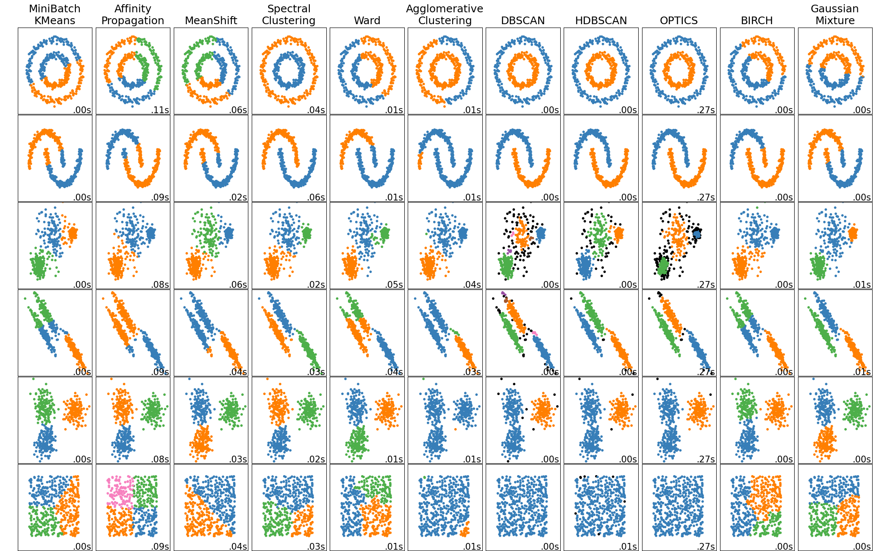
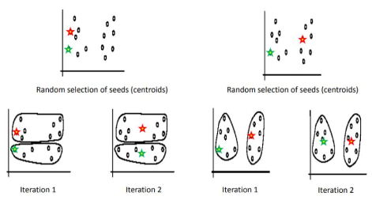
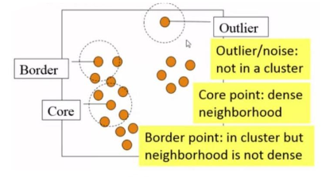
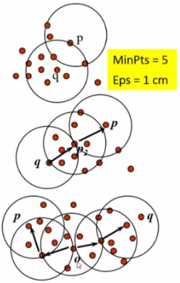
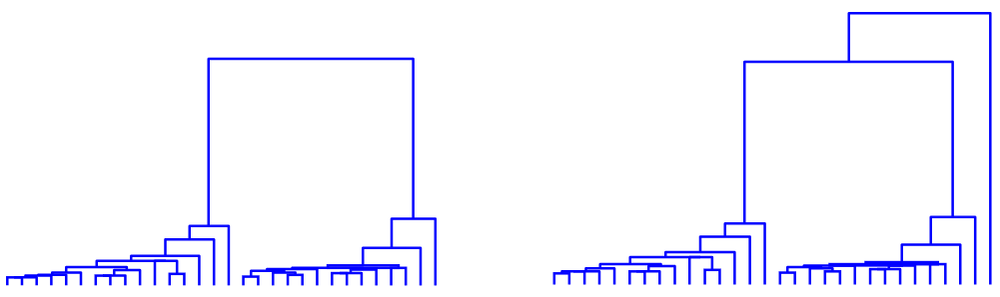

# Metody učení bez učitele, shlukování - algoritmus K-means a LGB, hierarchické shlukování

Mezi metody učení bez učitele se počítají např. **shlukovací algoritmy**, **algoritmy redukce dimenzí** (např. PCA) nebo **autoenkodéry** (které slouží také hlavně k redukci dimenzí).

## Nehierarchické shlukování

### K-means

Metoda **K-means** je metoda **nehierarchického shlukování**, přičemž jako u jiných metod shlukování se bere v potaz hlavně **vnitřní kompaktnost shluků stejné třídy** a **vzájemná izolace shluků jiných tříd**.

- Hledá **optimální rozklad** na $K$ shluků, přičemž
  - **reprezentace** každého $j$-tého **shluku** je reprezentována **centroidem** $\mu_j$
  - a **minimalizuje se součet všech vzdáleností**: $\min(\sum_{i=1}^k \sum_{x\in S_i} ||\boldsymbol{x}- \mu_i||^2)$.

- Je to **iterační algoritmus**:
  1. **Zvolíme $K$ prvků** jako **prvotní odhady** centroidů.
  2. **Zařadíme každý prvek** do jedné z $K$ skupin **na základě nejmenší vzdálenosti k centroidu**.
  3. Spočítáme **nové centroidy**: $\mu_j = \frac{1}{|S_j|}\sum_{x\in S_j}x_i$.
  4. **Vyhodnotíme $J$ kritérium**.
  5. **Opakuj** krok 2.

- Má **výpočetní náročnost** $O(T\cdot K\cdot N)$, kde $T$ jsou iterace, $K$ jsou shluky a $N$ jsou data.

- Má nevýhody, že:
  - **není zajištěno** $\min_{\text{abs.}}(J)$,
  - je **náchylný na iniciaci** počátečních odhadů,
  - je **náchylný na outliery**,
  - **není vhodný pro všechny typy dat** (ale např. na elipsoidy ano).

#### LBG

Algoritmus **LBG** (Linde, Buzo, Gray) řeší **lepší inicializaci centroidů** K-means.

- Je to **dvounásobný iterační algoritmus**:
  1. **Inicializujeme centroid** s $K=1$,
  2. **Rozdělíme** $K_t = 2K_{t-1}$,
  3. Najdeme **centroidy** a **určíme** hodnotu $J$,
  4. **Ukončíme při dosažení cílové hodnoty** $K$ nebo **konvergence** $J$, jinak opakujeme krok 2.

### DBSCAN

Metoda **DBSCAN** (Density-Based Spatial Clustering Algorithm) je **neiterativní metoda** založená na základě **hustoty dat**.

- **Shluk** je definován jako **maximální množina hustě spojených bodů**.
- Oproti K-means to není iterační algoritmus a **umožňuje shluky jakéhokoliv tvaru**.

- Má 2 parametry:
  - $\epsilon$: **radius** okolo bodu,
  - $\operatorname{minPts}$: **minimální počet sousedních bodů**, které jsou potřeba, **aby byl bod přiřazen do shluku**.

- Definujeme **3 typy bodů**:
  1. **core bod**
     - $|N_{\epsilon}(p)| \geq \operatorname{minPts}$,
  2. **border bod**
     - leží v okolí $\epsilon$-okolí core bodu, ale sám jím není,
     - $|N_{\epsilon}(p)| < \operatorname{minPts}$,
  3. **outlier bod**
     - nenáleží do clusteru.

  

- **Do shluku core bodu** $q$ **přiřadíme** bod $p$ na základě **tří kritérií**:
  1. **přímo dosažitelné**
     - $p\in N_{\epsilon}(q)$,
     - $|N_{\epsilon}(q)| \geq \operatorname{minPts}$,
  2. **nepřímo dosažitelné**
     - **existuje řetězec bodů** $(p_1 = p,\dots,p_n = q)$ a **každý $p_{i+1}$ je přímo dosažitelný** z $p_i$,
  3. **propojitelné**
     - **body $p$ a $q$ jsou propojené**, pokud exi**stuje bod** $o$, **ze kterého jsou $p$ a $q$ nepřímo dosažitelné**.

## Hierarchické shlukování

**Hierarchické shlukování** hledá **strukturu v datech pomocí hierarchie**.

- Jednotlivé **kroky lze vizualizovat pomocí dendrogramu**, který reflektuje míru podobnosti jednotlivých shluků.
- Může být **aglomerativní** (sloučíme dva nejbližší shluky) nebo **divizní** (rozděláme podle heuristiky, např. bisecting K-means).
- **Nevýhoda zafixování** dat již **jednou zařazených** do shluku.

