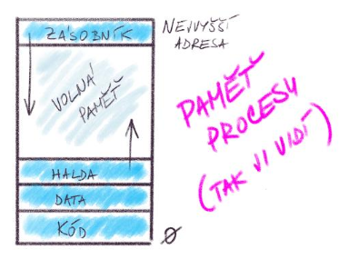
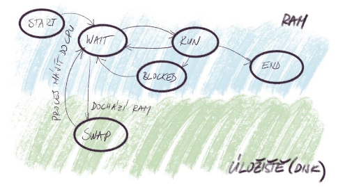

# Operační systém, vysvětlení pojmu, typy, poskytované funkce. Správa procesů v operačním systému, vztah programu a procesu, životní cyklus procesu

## Operační systém

Operační systém je software spravující počítačové zdroje a programy v jednotném řízeném prostředí.

- Funguje jako rozhraní mezi HW a aplikačním SW/uživatelem.
- Musí mít funkce:
  - zapouzdření a řízení přístupu k HW,
  - řízení IO,
  - runtime pro programy,
  - UI,
  - API pro programátory,
  - zabezpečení,
  - detekce chyb,
  - částečné zotavení z chybových stavů,
  - vyvažování výkonu mezi výpočetní jádra,
  - záznam událostí,
  - správcovské nástroje,
  - dokumentace aj.

- Musí mít efektivní kód, být velmi rychlý a být maximálně spolehlivý.
- Operační systémy můžou být serverové, počítačové, mobilní, embedded (RTOS) nebo IoT.

### Jádro

Jádro operačního systému je jeho nejdůležitější součást.

- Zodpovídá za správu zdrojů PC a HW/SW komunikaci.
- Zajišťuje bezpečnost.
- Jádro pracuje v chráněném (kernel) režimu, data jsou v chráněné části paměti.

- Rozlišujeme tyto typy jader:
  - **monolitické**: všechny služby běží v kernel módu (méně bezpečné, může spadnout celý systém),
  - **mikrojádro**: v kernel módu běží naprosté minimum procesů (bezpečné, pomalejší),
  - **hybridní**: kompromis (Windows, macOS).

### Procesy

Program je statický soubor instrukcí uložený na disku, např. ve formě .exe souboru, proces je pak spuštěná instance programu, tedy kdy je kód programu v RAM (navíc obsahuje stav CPU, přidělený paměťový blok, PCB).

- Paměť procesu v RAM je přiřazena jen jemu.
- Na jednom CPU jádru běží vždy jen jeden proces.
- Je tvořen z:
  - **kódu**, v RAM, cache a registrech,
  - **dat**, v RAM, cache a registrech (zásobník pro lok. proměnné a dynamicky alokovaná halda v paměti procesu),
  - a **zdrojů**, formou odkazů v RAM.
- **PCB** je datová struktura jádra OS obsahující metadata o procesu, které jsou uloženy v chráněné části RAM.

#### Správa procesů

OS spravuje proces pomocí plánovačů (schedulerů), které vybírají z fronty `ready` procesy nebo se starají o odswapování z RAM na disk.

- Při přepínání kontextu jádro:
  1. uloží stav běžícího procesu do jeho PCB,
  2. načte stav dalšího procesu z jeho PCB,
  3. předá CPU novému procesu.

#### Životní cyklus procesu

1. **start**: vytvoření a načtení do RAM,
2. **wait (ready)**: čekání ve frontě na přidělení CPU schedulerem,
3. **run**: proces běží,
4. **blocked**: čekání na I/O nebo jiný zdroj (např. přístup k locked souboru),
5. **swap**: odswapovaní do úložiště schedulerem (např. dlouho neběžel, nebo dochází RAM),
6. **end**: dokončení/ukončení procesu a uvolnění zdrojů.

