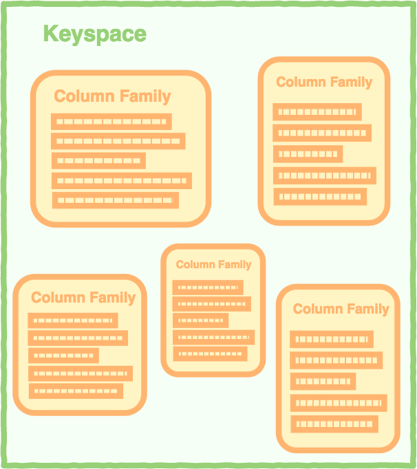
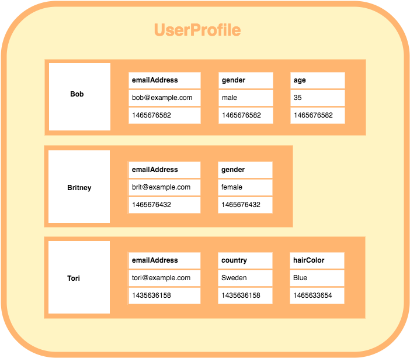
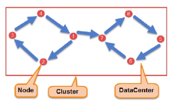

# Sloupcové databáze - koncept, sloupcově orientovaný model, výhody a nevýhody. Cassandra - architektura, distribuce dat a replikace, sekundární index

## Sloupcové databáze

**Sloupcové databáze** jsou distribuované NoSQL databáze optimalizované pro **rychlý přístup k velkým objemům dat**.

- Využívají **sloupcový model ukládání dat**,
  - který je schopný pojmout **velké množství dynamických sloupců**,
  - **keyspace** dává představu o struktuře databáze (~ schéma v RDBMS),
  - **column families** volně **odpovídají relacím v RDBMS**,
    - které **obsahují seřazené řádky**,
      - které **obsahují sloupce** (patřící jen svému řádku), jejichž **počet se může lišit**.

```text
keyspace > column family > row > column > (name, value, timestamp)
```




- U sloupcových databází je zpravidla **množství zápisů výrazně vyšší než čtení**, s **malým množstvím aktualizací**, tedy např. pro časové řady.
- Dají se velmi **jednoduše škálovat**, a **replikovat s volným schématem**.

### Cassandra

**Cassandra** je v současnosti **nejpopulárnější sloupcová databáze** od Apache původně vyvinutá pro Facebook.

- Velmi často **se vyskytuje na velkém množství uzlů přes více datových center**,
  - přičemž **každý uzel má stejnou funkcionalitu** (není to master-slave architektura),
    - **uzly o sobě vědí** pomocí tzv. **snitch**, který **poskytuje uzlům informace o topologii sítě a směřuje requesty**,
    - a **komunikují spolu mezi sebou** pomocí tzv. **gossip**, což je peer-to-peer komunikační protokol.

- Využívá se např. pro
  - **katalogy produktů/playlisty** (Netflix, Hulu),
  - **doporučovací systémy** (eBay),
  - **detekce podvodů** (Instagram),
  - **platformy pro odesílání zpráv**,
  - **IoT/senzorová data**.

- Využívá **dotazovací jazyk CQL** (Cassandra Query Language), který je podobný SQL,
  - nemá ale `JOIN`, **všechna kýžená data v jednom dotazu tedy musí být v jedné tabulce**,
  - `UPDATE` je pak realizován **jako přidání nového záznamu s novějším `timestampem`**, a **v případě konfliktů se vybírá nejnovější záznam**,
  - **mazání** je realizováno pomocí vytvoření tzv. **tombstone** (značky smazání), a **fyzické smazání proběhne až po uplynutí nějaké doby**,
  - v CQL modelu je pak **datový model definován** takto:

    ```text
    keyspace > table > partition > row
    ```



- **Sekundární indexy** umožňují filtrování nad danými sloupci (s `WHERE`),
  - **nezrychlují prohledávání, ale umožňují jej i nad ostatními sloupci**,
  - umožnění definice nad vybranými sloupci (kromě partition key, který už indexovaný je),
  - pro každý sekundární index je vytvořená skrytá tabulka na každém uzlu.
