# Derivace, diferenciál a integrál

## Diferenciál

Diferenciál **aproximuje skutečnou změnu hodnoty funkce** pomocí lineární části.

- $dy = f'(x)\,dx$,
  - $dy$ je **absolutní změna** na tečně,
  - $\frac{dy}{dx}$ je podíl dvou absolutních změn, tj. změna $y$ ku změně $x$.
- Využívá se k **odhadu chyby** nebo přibližné hodnotě funkce v okolí bodu.

### Totální diferenciál

Zobecnění diferenciálu na **funkci více proměnných**.

- Přibližně vyjadřuje závislost změny hodnoty $f(\boldsymbol{x})$, kde $\boldsymbol{x}$ je **vektorová proměnná**, na malé změně jedné nebo více proměnných v okolí bodu $\boldsymbol{x}$,
- $df = \frac{\partial f}{\partial x_1}\,dx_1 + \cdots + \frac{\partial f}{\partial x_n}\,dx_n = \nabla f(\boldsymbol{x}) \cdot d\boldsymbol{x}$.

## Derivace

Derivace funkce $f(x)$ v bodě $x$ je pojem matematické analýzy vyjadřující **okamžitou změnu funkční hodnoty** $f(x)$ **v daném bodě**.

- Geometricky je reprezentována jako **směrnice tečny** ke grafu funkce $f(x)$,
- **Definice:** $f'(a) = \lim_{h \to 0} \frac{f(a+h) - f(a)}{h}$,
- **Tečna** u funkce jedné proměnné je definována v bodě $a$ jako: $y = f(a) + f'(a)(x-a)$.
- **Výčet** některých derivací:

  | $f(x)$   | $f'(x)$       |
  | -------- | ------------- |
  | x^n      | $nx^{n-1}$    |
  | a^x      | $a^x \ln a$   |
  | $e^x$    | $e^x$         |
  | $\sin x$ | $\cos x$      |
  | $\cos x$ | $-\sin x$     |
  | $\ln x$  | $\frac{1}{x}$ |

- **Pravidla pro derivace** dvou funkcí:
  - $[f+g]' = f'+g'$,
  - $[f\cdot g]' = f'g + fg'$,
  - $\left[\frac{f}{g}\right]' = \frac{f'g - fg'}{f^2}$,
  - $[g(f)]' = g'(f) \cdot f'$.

### Využití v analýze funkcí

- $f'(x) = 0 \implies x$ je tzv. **stacionární bod** $f(x)$ a poté můžeme u tohoto bodu určit **lok. extrém** pomocí okolních intervalů:
  - $f'(x) > 0 \implies f(x) \text{ je rostoucí}$,
  - $f'(x) < 0 \implies f(x) \text{ je klesající}$.
- $f''(x) = 0 \implies x$ je **bod**, kde může být **inflexe**, a poté můžeme u tohoto bodu určit inflexi pomocí intervalů:
  - $f''(x) > 0 \implies f(x) \text{ je konvexní}$,
  - $f''(x) < 0 \implies f(x) \text{ je konkávní}$.

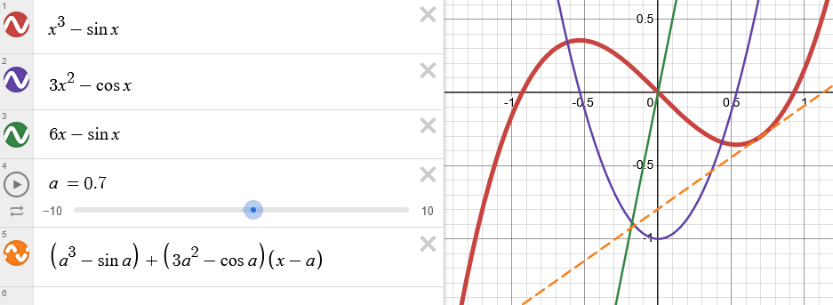

### Parciální derivace

Parciální derivace $f(\boldsymbol{x})$ je její **derivace vzhledem k jedné z proměnných** $x_i \in \boldsymbol{x}$, přičemž **ostatní proměnné** $x_{j \neq i} \in \boldsymbol{x}$ jsou při derivování **považovány za konstanty**.

- Zapisuje se jako: $\frac{\partial}{\partial x_i} f(\boldsymbol{x}) = \frac{\partial f(\boldsymbol{x})}{\partial x_i}$,
- **Na pořadí derivací jednotlivých proměnných u vícenásobných parciálních derivací nezáleží**, je-li v bodě zájmu funkce a její smíšené parc. derivace spojité, tj. platí tzv. **Schwarzova věta**:
  $$
  \frac{\partial}{\partial y} \left( \frac{\partial f}{\partial x} \right)
  =
  \frac{\partial}{\partial x} \left( \frac{\partial f}{\partial y} \right)
  =
  \frac{\partial^2 f}{\partial x \partial y}
  =
  \frac{\partial^2 f}{\partial y \partial x},
  $$
- Lze pomocí nich počítat **derivace po osách** nebo např. i **směrové derivace** (derivace v libovolném úhlu).

## Integrál

Integrál lze definovat jako **inverzní operaci derivace**.

### Primitivní funkce a neurčitý integrál

Primitivní funkce $F$ k funkci $f$ je taková funkce, že pro každé $x$ platí $F'(x) = f(x)$.

- Platí rovnost $F(x) = \int f(x)\,dx + C$, $C \in \mathbb{R}$,
- **Neurčitý integrál** je poté množina všech primitivních funkcí k dané funkci.

- Mezi metody řešení neurčitého integrálu patří např.:
  - **per-partes**: $\int uv'\,dx = uv - \int u'v\,dx$, např.

    $$
      \begin{align*}
        \int \ln x\,dx &\rightarrow \begin{bmatrix} u = \ln x & v' = 1 \\ u' = x^{-1} & v = x \end{bmatrix}\\
        &= x\ln x - \int \frac{x}{x}\,dx\\
        &= x\ln x - x,
      \end{align*}
    $$

  - **parciální zlomky**, např.
    $$
      \int \frac{dx}{x^2-1} = \int \frac{dx}{(x+1)(x-1)}\rightarrow \int \frac{A}{x+1} + \int \frac{B}{x-1},
    $$
  - **substituce**, např.
    $$
      \int e^{x^2}\cdot 2x\,dx\rightarrow t = x^2\rightarrow dt = 2x\,dx\\
      \int e^{x^2}\cdot 2x\,dx = \int e^t\,dt,
    $$
  - **definice**:

    | $f(x)$        | $F(x)$                |
    | ------------- | --------------------- |
    | $x^n$         | $\frac{x^{n+1}}{n+1}$ |
    | $a^x$         | $\frac{a^x}{\ln a}$   |
    | $\frac{1}{x}$ | $\ln x$               |
    | $\sin x$      | $-\cos x$             |
    | $\cos x$      | $\sin x$              |

### Určitý integrál

Určitý integrál lze geometricky chápat jako obsah plochy pod křivkou danou grafem nezáporné funkce na daném intervalu.

- $\int_a^b f(x)\,dx = F(b) - F(a)$, kde $a, b \in \mathbb{R}$ jsou integrační meze, výsledkem je tedy číslo,
- **Numerické možnosti výpočtu určitého integrálu** jsou např.:
  - **obdélníková metoda** (suma obsahů obdélníků, které rozdělují graf funkce a jejichž výška je např. střední hodnota funkce v dané oblasti $(x_n, x_{n+1})$),
    - blíží-li se šířka obdélníků, tj. $x_{n+1} - x_n$, limitně k $0$, zmenšuje se absolutní chyba též k $0$,
  - **lichoběžníková metoda** (suma obsahu lichoběžníků, které vznikají z bodů na ose $x$ a $(f(x_n), f(x_{n+1}))$),
  - **Monte Carlo**.


# Soustava lineárních rovnic a metody jejich řešení

## Soustava lineárních rovnic

Soustava $m$ lineárních rovnic o $n$ neznámých:

$$
a_{1,1}x_1 + a_{1,2}x_2 + \cdots + a_{1,n}x_n = b_1 \\
a_{2,1}x_1 + a_{2,2}x_2 + \cdots + a_{2,n}x_n = b_2 \\
\vdots \\
a_{m,1}x_1 + a_{m,2}x_2 + \cdots + a_{m,n}x_n = b_m,
$$

kde:

- $a_{i,j}$ jsou koeficienty,
- $b_i$ jsou pravé strany,
- $x_j$ jsou neznámé.

## Ekvivalentní úpravy

Ekvivalentní úpravy jsou takové úpravy, které nezmění řešení.

- Můžou soustavu rovnic ale výrazně zjednodušit.
- Jedná se např. o:
  - **výměnu** libovolných dvou rovnic soustavy:
    $$
      a_i x = b_i \\
      a_j x = b_j \\
      \Downarrow \\
      a_j x = b_j \\
      a_i x = b_i,
    $$
  - **vynásobení** obou stran libovolné rovnice libovolným nenulovým číslem:
    $$
      a_n x = b_n \\
      \Downarrow \\
      C a_n x = C b_n,\ C \in \mathbb{R}\setminus \{0\},
    $$
  - **přičtení násobku** některé rovnice k rovnici jiné:
    $$
      a_i x = b_i \\
      a_j x = b_j \\
      \Downarrow \\
      a_i x = b_i \\
      a_j x + C a_i x = b_j + C b_i,\ C \in \mathbb{R}.
    $$

## Maticový zápis soustavy

Soustava lineárních rovnic se dá zapsat maticově:

$$
\begin{bmatrix}
a_{1,1} & a_{1,2} & \cdots & a_{1,n} \\
a_{2,1} & a_{2,2} & \cdots & a_{2,n} \\
\vdots & \vdots & \ddots & \vdots \\
a_{m,1} & a_{m,2} & \cdots & a_{m,n}
\end{bmatrix}
\begin{bmatrix}
x_1 \\
x_2 \\
\vdots \\
x_n
\end{bmatrix}
=
\begin{bmatrix}
b_1 \\
b_2 \\
\vdots \\
b_m
\end{bmatrix},
$$

tedy $\mathbf{A}\boldsymbol{x} = \boldsymbol{b}$.

Při řešení soustav rovnic se používá také zápis pomocí tzv. **rozšířené matice soustavy**:

$$
\left[
\begin{array}{c c c c | c}
  a_{1,1} & a_{1,2} & \cdots & a_{1,n} & b_1 \\
  a_{2,1} & a_{2,2} & \cdots & a_{2,n} & b_2 \\
  \vdots & \vdots & \vdots & \ddots & \vdots \\
  a_{m,1} & a_{m,2} & \cdots & a_{m,n} & b_m \\
\end{array}
\right],
$$

- I v případě zápisu pomocí rozšířené matice soustavy platí podobné operace jako u soustavy rovnic jako takové:
  - **výměna** dvou libovolných řádků,
  - **vynásobení** jakéhokoliv řádku libovolným nenulovým číslem,
  - **přičtení násobku** některého řádku k řádku jinému.

## Gaussova eliminační metoda

Gaussova eliminační metoda je numerická metoda řešení soustav lineárních rovnic; pracuje s tzv. **schodovitým tvarem** matice.

- **Schodovitý tvar** matice je takový, kdy v každém řádku jsou nulové všechny prvky před prvním nenulovým prvkem, který se nachází vpravo od prvního nenulového prvku v řádku nad ním, např. tedy:
  $$
  \left[\begin{array}{c c c c | c}
  1 & 2 & 0 & 3 & 4 \\
  0 & 7 & 4 & 5 & 6 \\
  0 & 0 & 4 & 6 & 7 \\
  0 & 0 & 0 & 3 & 8 \\
  \end{array}\right]
  \iff
  \begin{array}{c}
  1x_1 + 2x_2 + 0x_3 + 3x_4 = 4 \\
  0x_1 + 7x_2 + 4x_3 + 5x_4 = 6 \\
  0x_1 + 0x_2 + 4x_3 + 6x_4 = 7 \\
  0x_1 + 0x_2 + 0x_3 + 3x_4 = 8 \\
  \end{array},
  $$
- **Gaussova eliminační metoda** spočívá v tom, že pomocí ekvivalentních úprav převedeme rozšířenou matici soustavy do schodovitého tvaru, a poté pomocí zpětné substituce získáme řešení soustavy,
- **Gaussova-Jordanova eliminační metoda** se pak liší tím, že převedeme levou stranu rozšířené matice soustavy do jednotkové matice; pravá strana pak bude obsahovat řešení soustavy:

  $$
  \left[ \begin{array}{ccc|c}
  2 & 1 & -1 & 8 \\
  0 & \frac{1}{2} & \frac{1}{2} & 1 \\
  0 & 0 & -1 & 1
  \end{array} \right]
  \begin{array}{l}
  ~ \\
  ~ \\
  \quad (\times -1)
  \end{array}
  \iff
  \begin{alignedat}{3}
  2x_1 & + 1x_2         && - 1x_3 && = 8 \\
       & \frac{1}{2}x_2 && + \frac{1}{2}x_3 && = 1 \\
       &                && - 1x_3 && = 1
  \end{alignedat}
  \\
  \Downarrow
  \\
  \left[ \begin{array}{ccc|c}
  2 & 1 & -1 & 8 \\
  0 & \frac{1}{2} & \frac{1}{2} & 1 \\
  0 & 0 & 1 & -1
  \end{array} \right]
  \begin{array}{l}
  \quad (+ III.) \\
  \quad (- \frac{1}{2} III.) \\
  ~
  \end{array}
  \iff
  \begin{alignedat}{3}
  2x_1 & + 1x_2         && - 1x_3 && = 8 \\
       & \frac{1}{2}x_2 && + \frac{1}{2}x_3 && = 1 \\
       &                && 1x_3   && = -1
  \end{alignedat}
  \\
  \Downarrow
  \\
  \left[ \begin{array}{ccc|c}
  2 & 1 & 0 & 7 \\
  0 & \frac{1}{2} & 0 & \frac{3}{2} \\
  0 & 0 & 1 & -1
  \end{array} \right]
  \begin{array}{l}
  ~ \\
  \quad (\times 2) \\
  ~
  \end{array}
  \iff
  \begin{alignedat}{3}
  2x_1 & + 1x_2         &&        && = 7 \\
       & \frac{1}{2}x_2 &&        && = \frac{3}{2} \\
       &                && 1x_3   && = -1
  \end{alignedat}
  \\
  \Downarrow
  \\
  \left[ \begin{array}{ccc|c}
  2 & 1 & 0 & 7 \\
  0 & 1 & 0 & 3 \\
  0 & 0 & 1 & -1
  \end{array} \right]
  \begin{array}{l}
  \quad (- II.) \\
  ~ \\
  ~
  \end{array}
  \iff
  \begin{alignedat}{3}
  2x_1 & + 1x_2         &&        && = 7 \\
       & x_2            &&        && = 3 \\
       &                && 1x_3   && = -1
  \end{alignedat}
  \\
  \Downarrow
  \\
  \left[ \begin{array}{ccc|c}
  2 & 0 & 0 & 4 \\
  0 & 1 & 0 & 3 \\
  0 & 0 & 1 & -1
  \end{array} \right]
  \begin{array}{l}
  \quad (\div 2) \\
  ~ \\
  ~
  \end{array}
  \iff
  \begin{alignedat}{3}
  2x_1 &                &&        && = 4 \\
       & x_2            &&        && = 3 \\
       &                && 1x_3   && = -1
  \end{alignedat}
  \\
  \Downarrow
  \\
  \left[ \begin{array}{ccc|c}
  1 & 0 & 0 & 2 \\
  0 & 1 & 0 & 3 \\
  0 & 0 & 1 & -1
  \end{array} \right]
  \iff
  \begin{alignedat}{3}
  x_1  &                &&        && = 2 \\
       & x_2            &&        && = 3 \\
       &                && x_3    && = -1
  \end{alignedat}
  \\
  \Downarrow
  \\
  \underline{\underline{x_1 = 2, x_2 = 3, x_3 = -1}}.
  $$

- **Gaussova-Jordanova eliminační metoda** se používá také např. pro výpočet inverzní matice, kdy se rozšířená matice soustavy sestává z původní matice a jednotkové matice, tedy $[\boldsymbol{A} \mid \boldsymbol{I}] \Rightarrow [\boldsymbol{I} \mid \boldsymbol{A}^{-1}]$.

- Soustava rovnic může mít:
  - **právě jedno řešení**,
    - v případě, že hodnost matice (počet lineárně nezávislých řádků) je rovna počtu neznámých,
  - **nekonečně mnoho řešení**,
    - v případě, že vznikne řádek, který bude obsahovat pouze nulové koeficienty a pravá strana řádku je také nulová,
  - **žádné řešení**,
    - v případě, že vznikne řádek, který bude obsahovat pouze nulové koeficienty a pravá strana řádku je nenulová,
  - toto lze vyjádřit i tzv. **Frobeniovou větou**:
    - soustava $\boldsymbol{A} \boldsymbol{x} = \boldsymbol{b}$ má řešení právě tehdy, když rozšířená matice soustavy má stejnou hodnost (_rank_, počet lineárně nezávislých řádků) jako matice soustavy, tedy $\operatorname{rank}(\boldsymbol{A}) = \operatorname{rank}([\boldsymbol{A} \mid \boldsymbol{b}])$,
    - $\operatorname{rank}(\boldsymbol{A}) = \operatorname{rank}([\boldsymbol{A} \mid \boldsymbol{b}]) = n$: soustava má právě jedno řešení,
    - $\operatorname{rank}(\boldsymbol{A}) = \operatorname{rank}([\boldsymbol{A} \mid \boldsymbol{b}]) < n$: soustava má nekonečně mnoho řešení,
    - $\operatorname{rank}(\boldsymbol{A}) < \operatorname{rank}([\boldsymbol{A} \mid \boldsymbol{b}])$: soustava nemá řešení.


# Maticová algebra, typy matic, inverzní matice, determinant

Matice jsou obdélníkovým nebo čtvercovým uspořádáním čísel, symbolů nebo výrazů, které jsou uspořádány do řádků a sloupců.

## Maticová algebra

- **Sčítání matic:** $(A + B)_{ij} = a_{ij} + b_{ij};\ A, B \in T^{m \times n}$,
  - sčítat lze pouze matice **stejného rozměru**.
- **Násobení** je trojího typu:
  - **násobení skalárem:** $(kA)_{ij} = k \cdot a_{ij};\ A \in T^{m \times n},\ k \in T$,
  - **Hadamardovo násobení** (dot-product): $(A \circ B)_{ij} = a_{ij} b_{ij}$ (musí mít stejné rozměry),
  - **maticové násobení:** sčítají se řádky první matice s odpovídajícími sloupci druhé matice, tedy $C_{ij} = \sum_{k=1}^{n} A_{ik} \cdot B_{kj}$, $A \in T^{m \times n}$, $B \in T^{n \times p}$, $C \in T^{m \times p}$,
    - např.:
      $$
      \begin{bmatrix}
      1 & 2 \\
      3 & 4 \\
      5 & 6
      \end{bmatrix}
      \cdot
      \begin{bmatrix}
      7 & 8 & 9 \\
      10 & 11 & 12
      \end{bmatrix}
      =
      \begin{bmatrix}
      1 \cdot 7 + 2 \cdot 10 & 1 \cdot 8 + 2 \cdot 11 & 1 \cdot 9 + 2 \cdot 12 \\
      3 \cdot 7 + 4 \cdot 10 & 3 \cdot 8 + 4 \cdot 11 & 3 \cdot 9 + 4 \cdot 12 \\
      5 \cdot 7 + 6 \cdot 10 & 5 \cdot 8 + 6 \cdot 11 & 5 \cdot 9 + 6 \cdot 12
      \end{bmatrix}
      =
      \begin{bmatrix}
      27 & 30 & 33 \\
      61 & 68 & 75 \\
      95 & 106 & 117
      \end{bmatrix}, \\
      \begin{bmatrix}
      1 & 2 & 3 \\
      4 & 5 & 6
      \end{bmatrix}
      \cdot
      \begin{bmatrix}
      7 & 8 \\
      9 & 10 \\
      11 & 12
      \end{bmatrix}
      =
      \begin{bmatrix}
      1 \cdot 7 + 2 \cdot 9 + 3 \cdot 11 & 1 \cdot 8 + 2 \cdot 10 + 3 \cdot 12 \\
      4 \cdot 7 + 5 \cdot 9 + 6 \cdot 11 & 4 \cdot 8 + 5 \cdot 10 + 6 \cdot 12
      \end{bmatrix}
      =
      \begin{bmatrix}
      58 & 64 \\
      139 & 154
      \end{bmatrix},
      $$
    - počet řádků $A$ musí odpovídat počtu sloupců $B$.
- **Transpozice matice:** $A^T$, kde $(A^T)_{ij} = A_{ji}$.
- **Inverze matice:** $A^{-1}$, kde $A A^{-1} = A^{-1} A = I$.
- **Algebraické doplňky:** $\tilde{a}_{ij} = (-1)^{i+j}\det(A_{ij})$, kde $A_{ij}$ je matice vzniklá **vynecháním** $i$-tého řádku a $j$-tého sloupce z matice $A$.
- **Ekvivalentní úpravy matic**:
  - prohození řádků,
  - vynásobení řádku nenulovým číslem,
  - přičtení násobku jednoho řádku k jinému řádku.

## Typy matic

- **Nulová matice** $\boldsymbol{O}_{m,n} \in T^{m \times n}$,
  - matice, jejíž **všechny prvky jsou nulové**.
- **Jednotková matice** $\boldsymbol{I}_n \in T^{n \times n}$,
  - čtvercová matice, jejíž **prvky na hlavní diagonále jsou jedničky** a všechny **ostatní prvky jsou nuly**.
- **Diagonální matice**,
  - čtvercová matice, jejíž **prvky mimo hlavní diagonálu jsou nulové** ($\boldsymbol{I}\boldsymbol{x},\ \boldsymbol{x} \in \mathbb{R}^n$).
- **Symetrická matice**,
  - čtvercová matice, pro kterou platí $\boldsymbol{A}^T = \boldsymbol{A}$.
- **Ortogonální matice**,
  - čtvercová matice, jejíž **řádky a sloupce jsou ortogonální jednotkové vektory**, tj. $\boldsymbol{A}^T \boldsymbol{A} = \boldsymbol{A} \boldsymbol{A}^T = \boldsymbol{I}$,
  - $\boldsymbol{A}^{-1} = \boldsymbol{A}^T$, tedy $\boldsymbol{A}^T \boldsymbol{A} = \boldsymbol{A}^{-1} \boldsymbol{A} = \boldsymbol{I}$.
  - **Permutační matice** $\boldsymbol{P}_\pi \in T^{n \times n}$,
    - čtvercová matice, ve které má **každý řádek a každý sloupec právě jednu jedničku** a všechny ostatní prvky jsou nuly, přičemž umístění jedniček odpovídá permutaci $\pi$.
  - **Rotační matice** $\boldsymbol{R}_\theta \in T^{2 \times 2}$,
    - čtvercová matice, která **reprezentuje rotaci** v rovině o úhel $\theta$ kolem počátku, tedy
      $$
      R_\theta = \begin{bmatrix}
      \cos \theta & -\sin \theta \\
      \sin \theta & \cos \theta
      \end{bmatrix}.
      $$
- **Regulární matice**,
  - čtvercová matice, která má inverzní matici, tj. **existuje matice** $\boldsymbol{A}^{-1}$ taková, že $\boldsymbol{A} \boldsymbol{A}^{-1} = \boldsymbol{A}^{-1} \boldsymbol{A} = \boldsymbol{I}$,
  - $\det(\boldsymbol{A}) \neq 0$,
- **Singulární matice**,
  - čtvercová matice, která **nemá inverzní matici**,
  - $\det(\boldsymbol{A}) = 0$,
  - řádky nebo sloupce jsou lineárně závislé a $\operatorname{rank}(\boldsymbol{A}) < n$,
- **Adjungovaná matice** $\operatorname{adj} \boldsymbol{A}$,
  - matice, která se získá z původní matice $\boldsymbol{A}$ tak, že se **pro každý prvek** $a_{ij}$ **spočítá jeho algebraický doplněk** $\tilde{a}_{ji}$ a výsledná matice se transponuje, např.:
    $$
    \operatorname{adj} A = \begin{bmatrix}
    \tilde{a}_{11} & \tilde{a}_{12} & \tilde{a}_{13} \\
    \tilde{a}_{21} & \tilde{a}_{22} & \tilde{a}_{23} \\
    \tilde{a}_{31} & \tilde{a}_{32} & \tilde{a}_{33}
    \end{bmatrix}^T = \begin{bmatrix}
    \tilde{a}_{11} & \tilde{a}_{21} & \tilde{a}_{31} \\
    \tilde{a}_{12} & \tilde{a}_{22} & \tilde{a}_{32} \\
    \tilde{a}_{13} & \tilde{a}_{23} & \tilde{a}_{33}
    \end{bmatrix};\\
    A = \begin{bmatrix}
    1 & 2 & 3 \\
    4 & 5 & 6 \\
    7 & 8 & 9
    \end{bmatrix},\quad \text{pak}\quad
    \tilde{a}_{12} = (-1)^{1+2} \cdot
    \begin{vmatrix}
    4 & 6 \\
    7 & 9
    \end{vmatrix} = -12,
    $$
- **Řídká matice**,
  - matice, která obsahuje převážně nulové prvky, které vznikají např. při výpočtech metodou konečných prvků,
  - při práci s nimi lze využívat efektivní datové struktury, což šetří paměť, např. **CSR formát**, který ukládá:
    - hodnoty nenulových prvků,
    - indexy sloupců nenulových prvků,
    - indexy řádků, které obsahují nenulové prvky.

## Inverzní matice

**Inverzní matice** $\boldsymbol{A}^{-1}$ k matici $\boldsymbol{A}$ je taková matice, že platí $\boldsymbol{A} \boldsymbol{A}^{-1} = \boldsymbol{A}^{-1} \boldsymbol{A} = \boldsymbol{I}$. Inverzní matice existuje pouze pro regulární matice.

- Počítá se pomocí **Gauss-Jordanovy eliminace**: $[\boldsymbol{A} \mid \boldsymbol{I}] \rightarrow [\boldsymbol{I} \mid \boldsymbol{A}^{-1}]$,
- Platí rovnosti $(\boldsymbol{A}^{-1})^{-1} = \boldsymbol{A}$ a $(\boldsymbol{A}^T)^{-1} = (\boldsymbol{A}^{-1})^T$,
- $A^{-1} = \frac{1}{\det(A)} \cdot \operatorname{adj} A$,
- **Využití inverzní matice**:
  - řešení soustavy lineárních rovnic $\boldsymbol{A} \boldsymbol{x} = \boldsymbol{b}$ lze zapsat jako $\boldsymbol{x} = \boldsymbol{A}^{-1} \boldsymbol{b}$.

## Determinant

Determinant je skalární hodnota, která se přiřazuje čtvercové matici a **poskytuje informace o vlastnostech matice, jako je regulárnost, objem transformace** atd.

- Pro matici 2. řádu $\boldsymbol{A} = \begin{bmatrix} a & b \\ c & d \end{bmatrix}$ je determinant $\det(\boldsymbol{A}) = |\boldsymbol{A}| = \begin{vmatrix} a & b \\ c & d \end{vmatrix} = ad - bc$,
- Pro matici 3. řádu lze použít tzv. **Sarrusovo pravidlo** (rozšíření matice o první dva sloupce a následný součet součinů diagonál zleva doprava a odečtení součinu diagonál zprava doleva):

  $$
  \begin{vmatrix}
  a & b & c \\
  d & e & f \\
  g & h & i
  \end{vmatrix} \Rightarrow \left[
    \begin{array}{ccccc}
    a & b & c & \color{red}{a} & \color{red}{b} \\
    d & e & f & \color{red}{d} & \color{red}{e} \\
    g & h & i & \color{red}{g} & \color{red}{h}
    \end{array}
  \right]\\
  = aei + bfg + cdh - gec - hfa - idb.
  $$

- Pro matici $n$-tého řádu lze determinant vypočítat např. pomocí **Gaussovy eliminace** (při prohazování řádků v GE se mění znaménko determinantu, při vynásobení řádku $k \in \mathbb{R}\setminus\{0\}$ v GE se celý determinant vynásobí číslem $k$),
  - pokud je matice horní trojúhelníková, pak je determinant roven součinu prvků na hlavní diagonále, protože ostatní složky obsahují nulu.
- **Vlastnosti determinantů**:
  - $\det(\boldsymbol{A}\boldsymbol{B}) = \det(\boldsymbol{A})\cdot\det(\boldsymbol{B})$,
  - $\det(\boldsymbol{A}^T) = \det(\boldsymbol{A})$,
  - $\det(\boldsymbol{A}^{-1}) = \frac{1}{\det(\boldsymbol{A})}$,
  - $\det(k\boldsymbol{A}) = k^n \cdot \det(\boldsymbol{A})$ pro matici $n$-tého řádu a skalár $k$,
  - $\det(\boldsymbol{I}) = 1$,
  - $\det(\boldsymbol{O}) = 0$,
  - $\det(\boldsymbol{A}) = 0$ pro singulární matice,
  - $\det(\boldsymbol{A}) \neq 0$ pro regulární matice.
- **Využití determinantů**:
  - určení **jednoznačnosti řešení** soustavy rovnic ($\det A \neq 0 \Rightarrow$ právě jedno řešení soustavy $\boldsymbol{A} \boldsymbol{x} = \boldsymbol{b}$),
  - výpočet **inverzní matice** pomocí **adjungované matice**,
  - výpočet **objemu geometrických útvarů** transformovaných maticí zobrazení, viz:

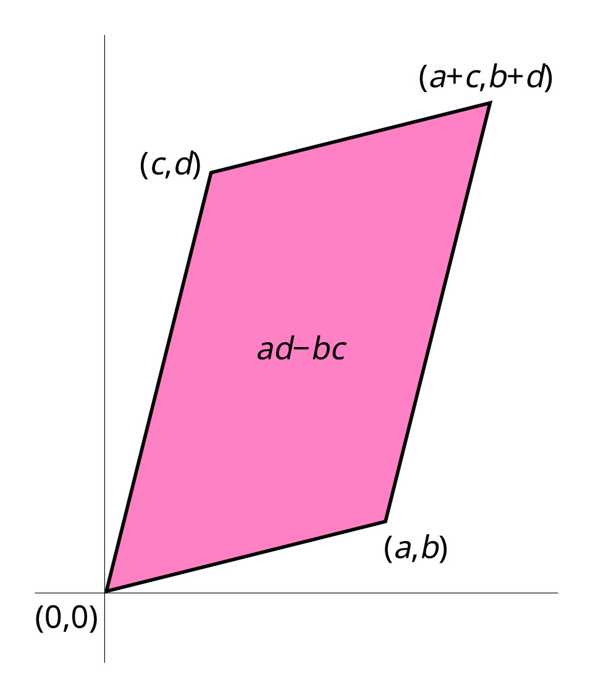


# Vlastní čísla a vlastní vektory matic. Způsob výpočtu a praktická interpretace

## Vlastní vektory

Většina vektorů po vynásobení maticí (obecnou, ne např. jednotkovou) se otočí do jiného směru a změní svou délku. **Vlastní vektory** jsou však takové vektory, které po vynásobení maticí **zůstanou ve stejném směru**, pouze se změní jejich délka.

- Platí: $\boldsymbol{A}\boldsymbol{u} = \lambda \boldsymbol{u} \iff (\boldsymbol{A} - \lambda \boldsymbol{I})\boldsymbol{u} = 0$.

## Vlastní čísla

- Vlastní čísla jsou faktory, o které se vektory prodlouží nebo zkrátí, příp. vyjdou-li komplexně, tak o kolik se zrotují.
- Vlastní čísla se počítají jako řešení charakteristické rovnice $\det(\boldsymbol{A} - \lambda \boldsymbol{I}) = 0$.
- Můžou být i komplexní, i když matice obsahuje pouze reálné prvky, což má za důsledek to, že vektor rotuje o určitý úhel, ale nezmění svou délku,
  - např. pro rotaci o 90°: $\boldsymbol{A} = \begin{bmatrix}0 & -1\\ 1 & 0\end{bmatrix}$ vychází $\lambda^2 = -1 \implies \lambda_1 = i, \lambda_2 = -i \implies u_1 = \begin{bmatrix}1\\-i\end{bmatrix}, u_2=\begin{bmatrix}1\\ i\end{bmatrix}$.
- $0$ je vlastním číslem matice, když je matice singulární.

## Výpočet

$$
\boldsymbol{A} = \begin{bmatrix}
4 & 2 \\
1 & 3
\end{bmatrix}\\
\Downarrow\\
\det(\boldsymbol{A} - \lambda \boldsymbol{I}) = \begin{vmatrix}
4 - \lambda & 2 \\
1 & 3 - \lambda
\end{vmatrix} = 0\\
\Downarrow\\
(4 - \lambda)(3-\lambda) - (2\times1)=0\\
12 - 4\lambda - 3\lambda + \lambda^2 - 2 = 0\\
\lambda^2 - 7\lambda + 10 = 0\\
\Downarrow\\
\lambda_1 = 5, \lambda_2 = 2\\

\lambda_1 = 5: (\boldsymbol{A} - 5\boldsymbol{I})\boldsymbol{u} = 0\\ \Downarrow\\ \begin{bmatrix}-1 & 2\\ 1 & -2\end{bmatrix}\boldsymbol{u} = 0\\
\begin{bmatrix} -1 & 2\\ 1 & -2\end{bmatrix}\begin{bmatrix}x\\y\end{bmatrix} = 0\\
-x + 2y = 0 \iff x = 2y\\
\boldsymbol{u}_1 = \begin{bmatrix}2\\1\end{bmatrix}\\

\lambda_2 = 2: (\boldsymbol{A} - 2\boldsymbol{I})\boldsymbol{u} = 0\\ \Downarrow\\ \begin{bmatrix}2 & 2\\ 1 & 1\end{bmatrix}\boldsymbol{u} = 0\\
\begin{bmatrix}2 & 2\\ 1 & 1\end{bmatrix}\begin{bmatrix}x\\y\end{bmatrix} = 0\\
x + y = 0 \iff x = -y\\
\boldsymbol{u}_2 = \begin{bmatrix}1\\-1\end{bmatrix}
$$

## Praktická využití

- Zvětšení: $\begin{bmatrix}k & 0\\0 & k\end{bmatrix}$,
  - $\lambda_1=\lambda_2=k$,
  - $u$ všechny nenulové vektory.
- Různé zvětšení po osách: $\begin{bmatrix}k_1 & 0\\0 & k_2\end{bmatrix}$,
  - $\lambda_1=k_1,\lambda_2=k_2$,
  - $\boldsymbol{u}_1=\begin{bmatrix}1\\0\end{bmatrix}, \boldsymbol{u}_2=\begin{bmatrix}0\\1\end{bmatrix}$.
- Rotace: $\begin{bmatrix}\cos\theta & -\sin\theta\\\sin\theta & \cos\theta\end{bmatrix}$,
  - $\lambda_1=e^{i\theta}=\cos\theta + i\sin\theta, \lambda_2=e^{-i\theta}=\cos\theta - i\sin\theta$,
  - $\boldsymbol{u}_1=\begin{bmatrix}1\\-i\end{bmatrix}, \boldsymbol{u}_2=\begin{bmatrix}1\\i\end{bmatrix}$.
- Horizontální zkosení: $\begin{bmatrix}1 & k\\0 & 1\end{bmatrix}$,
  - $\lambda_1=\lambda_2=1$,
  - $\boldsymbol{u}_1=\begin{bmatrix}1\\0\end{bmatrix}$.
- Vertikální zkosení: $\begin{bmatrix}1 & 0\\k & 1\end{bmatrix}$,
  - $\lambda_1=\lambda_2=1$,
  - $\boldsymbol{u}_1=\begin{bmatrix}0\\1\end{bmatrix}$.
- Zrcadlení: $\begin{bmatrix}1 & 0\\0 & -1\end{bmatrix}$,
  - $\lambda_1=1, \lambda_2=-1$,
  - $\boldsymbol{u}_1=\begin{bmatrix}1\\0\end{bmatrix}, \boldsymbol{u}_2=\begin{bmatrix}0\\1\end{bmatrix}$.
- **Analýza hlavních komponent** (Principal component analysis)
  - Slouží k **dekorelaci dat**.
  - Využívá se např. ke **snížení dimenze pro účely zjednodušování výpočtů s co nejmenší ztrátou informace**.
  - Počítá se **kovarianční matice dat, ze které poté počítají vlastní čísla a vlastní vektory**.
  - **Odstraňují se komponenty s nejmenší variancí**, tedy s nejmenším vlastním číslem:
    
  - např.
    $$
    \operatorname{cov}\boldsymbol{X}=\begin{bmatrix}\sigma^2_{X_1} & C_{X_1 X_2}\\C_{X_2 X_1} & \sigma^2_{X_2}\end{bmatrix}=\begin{bmatrix}3 & 1\\ 1 & 3\end{bmatrix}\\
    \Downarrow\\
    \begin{vmatrix}3-\lambda & 1\\ 1 & 3-\lambda\end{vmatrix}=0\\
    \Downarrow\\
    (3-\lambda)^2 - 1 = 0\\
    \Downarrow\\
    \lambda_1=4, \lambda_2=2,\\
    $$
    kde první směrová osa $\lambda_1$ v sobě nese více informace než druhá $\lambda_2$, a proto se druhá odstraní, tudíž se 2D data zredukují na 1D data ve směru $u_1$.


- Např. zde je modrý vektor vlastním vektorem matice zobrazení.


# Pojem pravděpodobnost, náhodný jev. Podmíněná pravděpodobnost, nezávislost. Náhodná veličina – diskrétní, spojitá a jejich použití. Střední hodnota, kvantily, rozptyl

## Pravděpodobnost

Pravděpodobnost je **míra očekávatelnosti** výskytu náhodného jevu, obecně se označuje číslem v intervalu $[0, 1]$.

- **Klasická pravděpodobnost**: $P(A) = \frac{m}{n}$, kde
  - $m$ je počet výsledků příznivých jevů $A$
  - a $n$ je počet všech možných výsledků.

- **Statistická pravděpodobnost**: $P(A) = \frac{n(A)}{n}$, kde
  - $n(A)$ je počet realizací, při kterých nastal jev $A$.
  - $n$ je počet realizací všech pokusů.
  - Na jejím základě je postavená metoda Monte Carlo, kdy se mnohonásobně opakuje náhodný pokus a sleduje se úspěšnost pokusů.

- **Podmíněná pravděpodobnost**: $P(A|B) = \frac{P(A\cap B)}{P(B)}$, tedy pravděpodobnost, že nastane jev $A$ **za podmínky, že nastal jev** $B$.
  - U nezávislých jevů platí $P(A|B) = P(A)$.

- Teorie pravděpodobnosti obsahuje tvrzení, která vyjadřují vlastnosti, ve statistice se snažíme samotnou pravděpodobnost zjistit pomocí dat.

## Náhodná veličina

Náhodná veličina je **reálná veličina, kterou je možné opakovaně měřit** u různých objektů, v různých místech či čase.

- **Rozdělení pravděpodobnosti** náhodné veličiny je pravidlo, kterým se **každému jevu** popisovanému touto veličinou **přiřazuje určitá pravděpodobnost**.
- **Distribuční funkce** $F(x)$ přiřazuje každému reálnému $x$ pravděpodobnost, že **náhodná veličina** $X$ **bude nabývat hodnoty menší nebo rovno** $x$.
  - Je neklesající a omezená zleva i zprava (má hodnoty od $0$ do $1$).

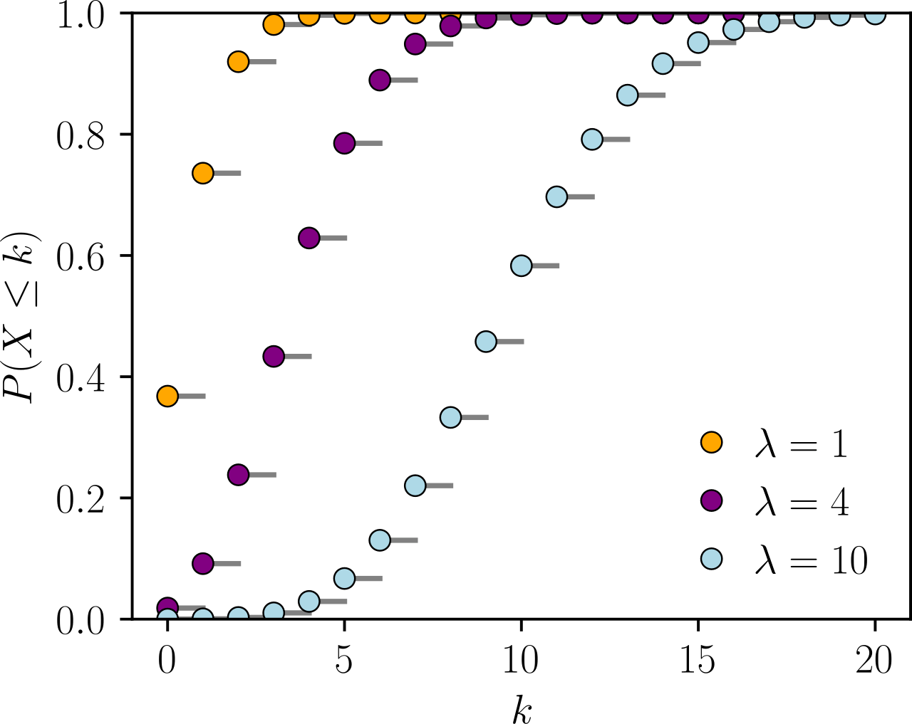

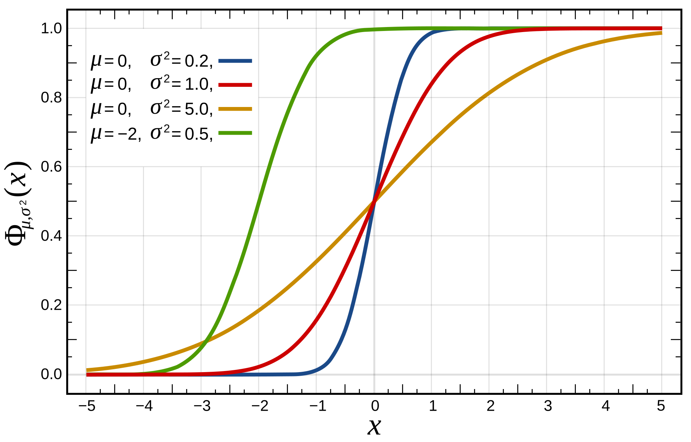

### Diskrétní náhodná veličina

Hodnoty diskrétní náhodné veličiny mohou nabývat pouze **konečného nebo spočetného množství hodnot**.

- **Pravdepodobnostní funkce** $p(x_i)$ popisuje rozdělení pravděpodobnosti náhodné veličiny $X$:

  $$
  P[X = x_i] = p(x_i); \sum_i P[X=x_i]=1.
  $$

- Např. **binomické**, **Poissonovo**.

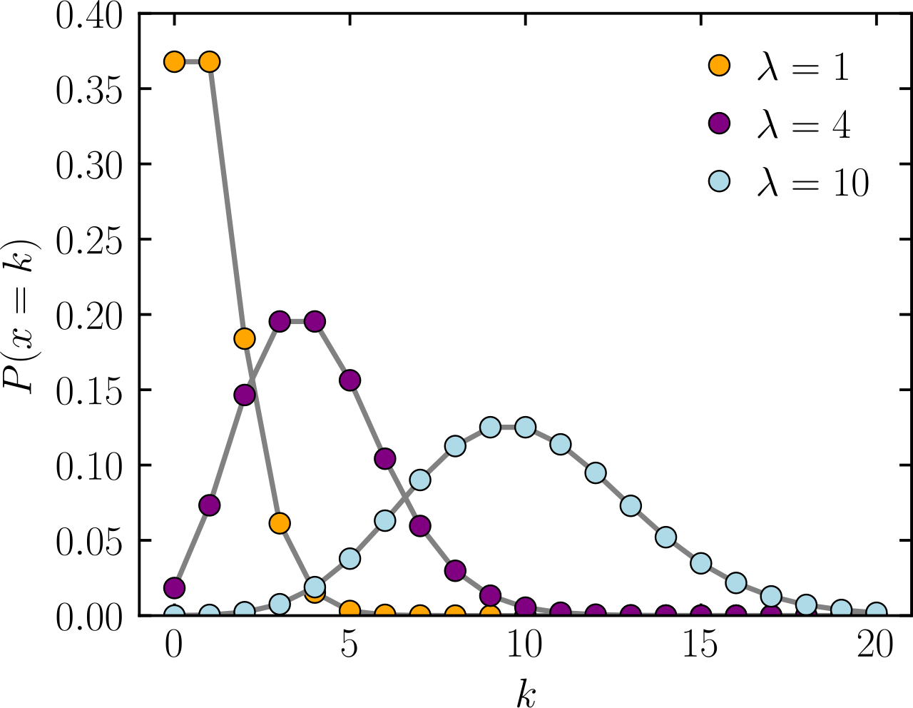

### Spojitá náhodná veličina

Hodnoty spojité náhodné veličiny mohou **nabývat jakékoliv hodnoty z určitého intervalu**.

- **Hustota pravděpodobnosti** $f_X(x)$ popisuje relativní četnost hodnoty prvku v rámci celé množiny možných hodnot,
  - je derivací distribuční funkce: $f_X(x) = \frac{dF(x)}{dx}$

  $$
  \begin{align*}
    f_X(x) &= \frac{P[X=x]}{P[X \in \mathcal{X}]}\\
    &= \frac{dF(x)}{dx}\\
    1 &= \int_{-\infty}^{\infty}f_X(x)dx
  \end{align*}
  $$

- Např.:
  - **normální** (Gaussovo),
    - hustota pravděpodobnosti: $f(x) = \frac{1}{\sigma\sqrt{2\pi}}\exp\left(-\frac{(x-\mu)^2}{2\sigma^2}\right)$,
    - kde $E[X] = \mu$, $E[(X-\mu)^2] = \sigma^2$,
    - **centrální limitní věta**
      - **součet velkého počtu libovolných vzájemně nezávislých náhodných veličin se vždy podobá normálně rozdělené náhodné veličině**,
      - **Ljapunovova věta**: $\sum_{i=1}^n X_i \sim \mathcal{N}(n\mu_X, n\sigma_X^2) \sim \mathcal{N}(\sum_i^n \mu_i, \sum_i^n \sigma_i^2)$,
  - **rovnoměrné**,
  - **exponenciální**.

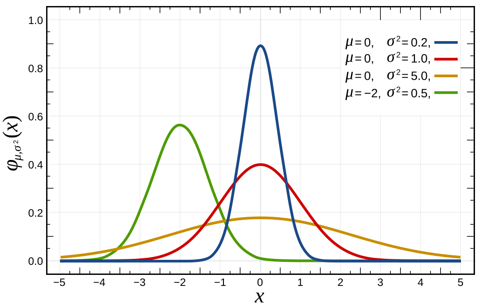

## Náhodný jev

Náhodný jev představuje libovolný možný výsledek pokusu; každý možný, navzájem se vylučující výsledek (_elementární jev_) se značí $\omega \in \Omega$, kde $\Omega$ je tzv. _základní pravděpodobnostní prostor_ (množina všech možných výsledků),

- např. hod kostkou: $\omega \in \Omega = \{1,2,3,4,5,6\}$.

## Střední hodnota, kvantily, rozptyl

- **Střední hodnota** (1. obecný moment) $E[X]$:
  - $E[X] = \sum_i x_i P[X = x_i]$ pro diskrétní veličiny,
  - $E[X] = \int_{-\infty}^{\infty} xf_X(x)dx$ pro spojité veličiny.

- **Kvantil** $x_p$ představuje takovou hodnotu, že pravděpodobnost, že náhodná veličina nabude hodnoty menší nebo rovné $x_p$, je rovna $p$ ($100\cdot p$ %).
  - 50% kvantil: medián,
  - 25% kvantil: první kvartil,
  - 75% kvantil: třetí kvartil,
  - 1% kvantil: percentil.

- **Rozptyl** (2. centrální moment) $E[(X-\mu)^2]$:
  - $E[(X-E[X])^2] = \sum_i(x_i-E[X])^2P[X=x_i]$ pro diskrétní veličiny,
  - $E[(X-E[X])^2] = \int_{-\infty}^\infty(x-E[X])^2f_X(x)dx$ pro spojité veličiny.
  - Označuje odchylku dat od střední hodnoty.


# Signály a systémy. LTI systémy. Přenosová funkce, impulzní odezva. Konvoluce u číslicových signálů

## Signál

**Signál je nositelem informace**.

- Speciálními signály jsou např.:
  - **Jednotkový impulz** $\delta[0] = 1, \delta[n] = 0$ pro $n \neq 0$,
  - **Jednotkový skok** $u[n] = 1$ pro $n \geq 0, u[n] = 0$ pro $n < 0$,
  - Sinc $\operatorname{sinc}[t] =\frac{\sin(\pi t)}{\pi t}$,
  - **Obdélníkový** a trojúhelníkový pulz.

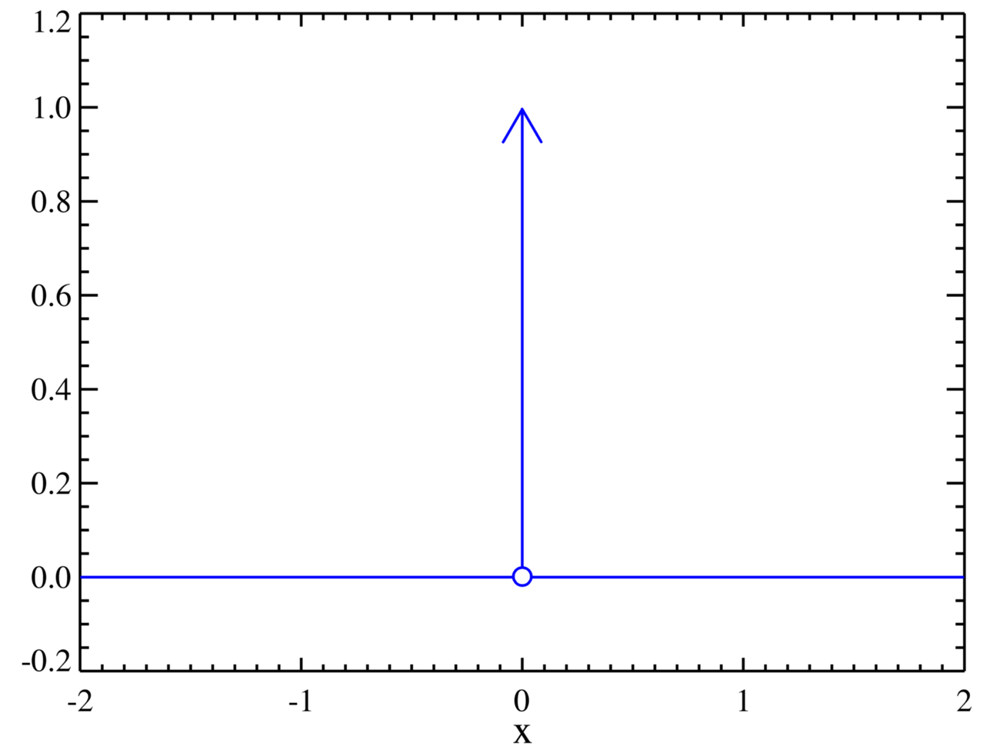

- Operace se signály jsou např.:
  - **Posunutí** v čase $x[n-k]$,
  - **Otočení** v čase $x[-n]$,
  - **Otočení** v hodnotě $-x[n]$,
  - Násobení konstantou $a x[n]$,
  - **Přičtení stejnosměrné složky** $x[n] + k$,
  - **Operace** se dvěma signály jako sčítání, atd. (oba musí mít stejnou $f_s$),
  - **Diference** zpětná $y[n] = x[n] - x[n-1]$,
  - **Diference** dopředná $y[n] = x[n+1] - x[n]$.
  - **Konvoluce** $y[n] = h[n] * x[n] = \sum_{k=-\infty}^{\infty} h[k] x[n-k]$.

## Systém

Systém dokáže **generovat, zpracovávat, modifikovat a přijímat signály**. **Signál** je pak **projevem činnosti systému**.

- Popisuje se pomocí **systémové funkce**, **vstupu** $x[n]$ a **výstupu** $y[n]$, např.
  - zesilovač: $y[n] = k x[n]$,
  - usměrňovač: $y[n] = |x[n]|$.
- Můžeme je klasifikovat podle:
  - **charakteru signálu** (spojité, číslicové, hybridní - fungují jako převodníky),
  - **kauzality**:
    - **kauzální**: $y[n]$ závisí **pouze na současných a minulých hodnotách vstupu**, např. $y[n] = x[n] + x[n-1]$,
    - **nekauzální**: $y[n]$ **závisí i na budoucích hodnotách vstupu**, tedy musí být celý signál v paměti, např. $y[n] = x[n+1] + x[n-1]$,
  - **linearity**:
    - **lineární**: platí podmínka $F[a x_1[n] + b x_2[n]] = a F[x_1[n]] + b F[x_2[n]]$ pro všechny $a, b$ a signály $x_1[n], x_2[n]$, např. $y[n] = 2 x[n]$,
    - **nelineární**: neplatí podmínka linearity, např. $y[n] = x[n]^2$,
  - **stacionarity** (čas. nezávislosti):
    - **stacionární**: systémové vlastnosti se **nemění v čase**, např. $y[n] = x[n] + x[n-1]$,
    - **nestacionární**: systémové vlastnosti se mění v čase, např. $y[n] = n x[n]$.

### LTI systémy

LTI systémy jsou **lineární časově invariantní systémy**.

- U **spojitých systémů** jejich chování popisují **diferenciální rovnice**.
- U **číslicových systémů** jejich chování popisují **diferenční rovnice** ve tvaru

  $$
  A_0y[n] + A_1y[n-1] + \ldots + A_Ny[n-N] = B_0x[n] + B_1x[n-1] + \ldots + B_Mx[n-M],
  $$

  což lze přepsat do tvaru

  $$
  y[n] = (B_0x[n] + B_1x[n-1] + \ldots + B_Mx[n-M] - A_1y[n-1] - \ldots - A_Ny[n-N]) / A_0,
  $$

  přičemž je-li $N$ rovno nule, jedná se o nerekurzivní systém FIR - systém s konečnou odezvou.

### Z-transformace

Při tzv. $z$-transformaci se číslicový signál $x[n]$ **převádí na komplexní funkci** $X(z)$, která je definována jako

$$
X(z) = \sum_{k=-\infty}^{\infty} x[k] z^{-k}.
$$

- Substitucí $z = e^{j2\pi F}$ lze získat tzv. **frekvenční charakteristiku** $H(F)$, kde $F = f/f_s$,
  - popisuje **závislost přenosových vlastností** systému (např. amplitudy a fáze) **na frekvenci**,
  - je **definována na jednotkové kružnici** v $z$-rovině.

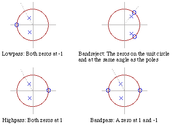

### Přenosová funkce

Přenosová funkce $H(z)$ vzniká **aplikací** **$z$-transformace** na **diferenční rovnici popisující systém**, tedy

$$
y[n] + A_1y[n-1] + \ldots + A_Ny[n-N] = B_0x[n] + B_1x[n-1] + \ldots + B_Mx[n-M]\\
\Downarrow\quad z\text{-transformace}\\
Y(z) + A_1z^{-1}Y(z) + \ldots + A_Nz^{-N}Y(z) = B_0X(z) + B_1z^{-1}X(z) + \ldots + B_Mz^{-M}X(z)\\
\Downarrow\quad \text{vytkneme}\\
Y(z)(1 + A_1z^{-1} + \ldots + A_Nz^{-N}) = X(z)(B_0 + B_1z^{-1} + \ldots + B_Mz^{-M})\\
\Downarrow\quad \text{vydělíme a substituujeme}\\
H(z) = \frac{Y(z)}{X(z)} = \frac{B_0 + B_1z^{-1} + \ldots + B_Mz^{-M}}{1 + A_1z^{-1} + \ldots + A_Nz^{-N}}.
$$

- Pro libovolný LTI systém platí

  $$
  y[n] = h[n] * x[n] \Rightarrow Y(z) = H(z) X(z),
  $$

  kde $h[n]$ je **impulzní odezva** systému, tedy **výstup systému při vstupu jednotkového impulzu** $\delta[n]$.

## Příklad

- **Systémová funkce**: $y[n] = 2 x[n] + 3 x[n-1] - 4 y[n-2]$.
- **Impulzní odezva**: $h[n] = 2 \delta[n] + 3 \delta[n-1] - 4 h[n-2]$.
- **Přenosová funkce**: $H(z) = \frac{2 + 3 z^{-1}}{1 + 4 z^{-2}}$.
- Jedná se tedy o systém IIR (s nekonečnou odezvou), protože $H(z)$ má nenulový jmenovatel.

```
// Konvoluce

x = [1 2 3 4]
h = [5 6 7] // pro zjednoduseni zacneme od 7

y[0] = 1*7 = 7
y[1] = 2*7 + 1*6 = 20
y[2] = 3*7 + 2*6 + 1*5 = 38
y[3] = 4*7 + 3*6 + 2*5 = 56
y[4] = 4*6 + 3*5 = 39
y[5] = 4*5 = 20

```


# Fourierovy řady. Diskrétní Fourierova transformace, její použití a interpretace. Spektrum signálu, FFT. Číslicové filtry FIR a IIR. Filtrace v čase nebo prostoru

## Fourierovy řady

**Umožňují rozložit a složit** jakýkoliv periodický a spojitý signál **na harmonické složky**.

- Pro periodický signál $x(t)$ lze zapsat jako:

  $$
  x(t) = \sum_{k = 0}^{\infty} c_k \cos(k 2\pi f_0t + \varphi_k),
  $$

  v polárním, nebo

  $$
  x(t) = \sum_{k = -\infty}^{\infty} X_k e^{j k 2\pi f_0 t},
  $$

  v exponenciálním tvaru.
  - $c_k = 2 |X_k|$ pro $k > 0$ a $c_0 = |X_0|$.
  - $\varphi_k = \arg(X_k) = \arctan\left(\frac{\operatorname{Im}(X_k)}{\operatorname{Re}(X_k)}\right)$.

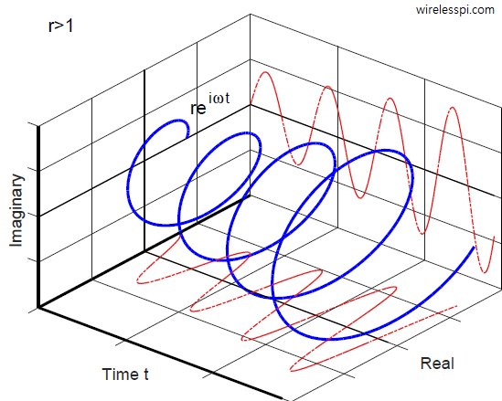

## Diskrétní Fourierova transformace

Pro diskrétní signály musíme použít **diskrétní** Fourierovu transformaci.

- Je definována jako

  $$
  X[k] = \sum_{n=0}^{N-1} x[n] e^{-j 2\pi k n / N}, \quad k = 0, 1, \ldots, N-1,
  $$

  kde:
  - $N$ je **délka signálu**,
  - $x[n]$ je **vstupní signál**,
  - $X[k]$ je **výstupní spektrum složené z komplexních čísel**,
  - $k$ je **index frekvenční složky**, přičemž $k=0$ odpovídá stejnosměrné složce a $k=N/2$ odpovídá **Nyquistově frekvenci**,
  - $n$ je **index časové složky**.

- Dá se použít pro **analýzu frekvenčního obsahu signálu, jeho filtraci a kompresi**.
- Pokud je spektrum signálu v čase proměnné, **počítá se postupně v rámci krátkých úseků** a zobrazuje se pomocí **spektrogramu**, což je grafické vyjádření spektra v závislosti na čase.
- Při zpětné transformaci se používá **inverzní diskrétní Fourierova transformace**, jejíž **výstup** je opět **diskrétní signál**.


### FFT

**Rychlá Fourierova transformace** (FFT) je algoritmus pro efektivní výpočet diskrétní Fourierovy transformace.

- Snižuje **časovou složitost** z $O(N^2)$ na $O(N \log N)$, což umožňuje rychlejší analýzu a zpracování signálů.

## Spektrum signálu

**Spektrum signálu** popisuje **frekvenční složení signálu, tedy jaké frekvence a s jakou celkovou amplitudou se v signálu vyskytují**.

- Může být:
  - **jednostranné**: vychází z polárního tvaru Fourierovy transformace a obsahuje **pouze kladné frekvence**,
  - **oboustranné**: vychází z exponenciálního tvaru Fourierovy transformace a obsahuje **kladné i záporné frekvence**.
- **Oba dva typy spekter obsahují stejné informace**, ale oboustranné spektrum je symetrické kolem nuly a zobrazuje i záporné frekvence, které jsou komplexními konjugáty kladných frekvencí.

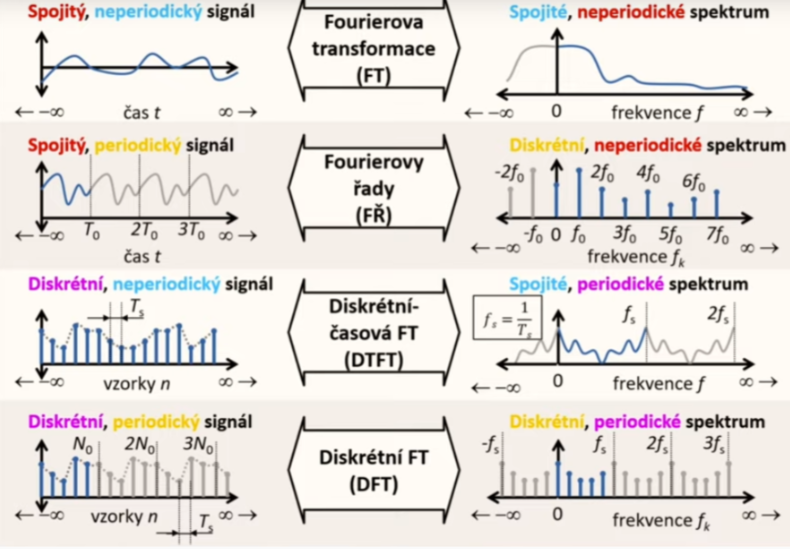

## Číslicové filtry

- **Číslicové filtry** jsou systémy, které zpracovávají digitální signály a **mění jejich frekvenční charakteristiky**.

- LTI systémy se dají **popsat** 4 možnostmi:
  - **časovým popisem diferenční rovnicí**: $y[n] + A_1y[n-1] + \ldots + A_Ny[n-N] = B_0x[n] + B_1x[n-1] + \ldots + B_Mx[n-M],$
  - **časovým popisem \*impulzní odezvou**: $y[n] = h[n] * x[n] = \sum_{k=-\infty}^\infty h[k]x[n-k]$,
    - důležitý pro popis v časové oblasti,
  - **systémovým popisem přenosovou funkcí**: $H(z) = \frac{Y(z)}{X(z)} = \frac{B_0 + B_1z^{-1} + \ldots + B_Mz^{-M}}{1 + A_1z^{-1} + \ldots + A_Nz^{-N}}$,
  - **frekvenčním popisem frekvenční charakteristikou**: $H[F] =\frac{B_0 + B_1e^{-j2\pi F} + \ldots + B_Me^{-j2\pi MF}}{1 + A_1e^{-j2\pi F} + \ldots + A_Ne^{-j2\pi NF}}$,
    - důležitý pro popis ve frekvenční oblasti $Y[F] = H[F]X[F]$, kde vše jsou DFT.

- **Konvoluce v čase** se transformuje na **součin ve frekvencích**.

- Existují dva hlavní typy:
  - **FIR (Finite Impulse Response)**
    - mají **konečnou odezvu na jednotkový impuls**, tedy jejich **impulzní odezva je konečná**,
    - **jmenovatel roven $1$**,
    - v $z$-rovině mají **všechny póly v počátku**, což zajišťuje **stabilitu** a lineární fázi,
  - **IIR (Infinite Impulse Response)**
    - mají **nekonečnou odezvu na jednotkový impuls**, tedy jejich **impulzní odezva je nekonečná**,
    - mohou mít **nenulový jmenovatel v $z$-transformaci**, což znamená, že jejich přenosová funkce může mít **póly mimo počátek**,
    - v $z$-rovině **mohou mít póly mimo jednotkovou kružnici**, což způsobuje **nestabilitu**.
      

- **Návrh filtrů** spočívá v **nalezení koeficientů impulzní odezvy**, tedy $h[k]$ (které jsou **pro FIR totožné s koeficienty $B$**).

### Chování filtrů v z-rovině

**Polynom přenosové funkce** lze **rozložit** na **součin faktorů**, které odpovídají nulám a pólům v z-rovině.

- **Nuly** jsou hodnoty $z$ pro které $H(z) = 0$, tedy **kořeny čitatele** přenosové funkce, a **mají tendenci potlačovat frekvence, které jsou k nim blízko**.
- **Póly** jsou hodnoty $z$ pro které $H(z) \to \infty$, tedy **kořeny jmenovatele** přenosové funkce, a **mají tendenci zesilovat frekvence**, které jsou k nim blízko.
  - U FIR filtrů jsou všechny póly v počátku.
- Pro **stabilitu** musí být **všechny póly uvnitř jednotkové kružnice v z-rovině**, tedy $|z| < 1$ pro všechny póly.
- Na **jednotkové kružnici** v z-rovině se nachází **frekvenční charakteristika filtru**, tedy $H(e^{j2\pi F})$, která určuje, jak filtr ovlivňuje různé frekvence.

### Filtrace v čase

**Filtrace v čase** se provádí **konvolucí vstupního signálu s impulzní odezvou filtru**.

- Pro **1D signály**, jako jsou zvukové nahrávky, se používá **1D konvoluce**, která je definována jako

  $$
  y[n] = h[n] * x[n] = \sum_{k=-\infty}^{\infty} h[k] x[n-k].
  $$

- Jsou různé typy aproximačních metod návrhů filtrů, např. **Butterworth**, nebo **Čebyšev**.

- Např.
  - **echo**: $h_{\text{echo}} = \begin{bmatrix} 1 & 0 & \dots & 0 & 0.5 \end{bmatrix}$,
  - **vibrato**: $h_{\text{vibrato}} = \begin{bmatrix} 1 & 0 & \dots & 0 & \alpha(n) \end{bmatrix}$ - není LTI, ale LTV.

### Filtrace v prostoru

**Filtrace v prostoru** se používá pro **zpracování obrazů a dalších vícerozměrných dat**.

- Pro **2D signály**, jako jsou obrazy, se používá **2D konvoluce**, která je definována jako

  $$
  y[m, n] = h[m, n] * x[m, n] = \sum_{k=-\infty}^{\infty} \sum_{l=-\infty}^{\infty} h[k, l] x[m-k, n-l].
  $$

- Např.
  - **DP pro potlačení šumu a detailů**, např. $h_{\text{DP}} = \frac{1}{9} \begin{bmatrix} 1 & 1 & 1 \\ 1 & 1 & 1 \\ 1 & 1 & 1 \end{bmatrix}$,
  - **HP pro zvýraznění rychlých změn a hran**, např. $h_{\text{HP}} = \begin{bmatrix} -1 & -1 & -1 \\ -1 & 5 & -1 \\ -1 & -1 & -1 \end{bmatrix}$.


# Vzorkování, kvantování. Vzorkovací teorém. Aliasing

## Vzorkování

Vzorkování je **proces převodu spojitého signálu na diskrétní** tím, že se **měří jeho hodnota v pravidelných intervalech**.

- $x[n] = x(nT)$, kde $T$ je vzorkovací perioda $(T = f_s^{-1})$.
- Jedna ze součástí AD převodníku.

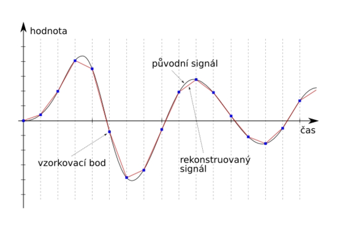

## Kvantování

Kvantování je **proces převodu na menší (konečný) počet úrovní**, což vede k určité ztrátě informace.

- Například u 16bit (tedy na zakódování jedné hodnoty potřebujeme 16 bitů) audio signálu je možné reprezentovat $2^{16} = 65536$ různých úrovní, zatímco u 8bit signálu pouze $2^8 = 256$ úrovní.
- **Nemusí být lineární**, ale např. logaritmické (např. A-law u telefonie/VoIP).
- Druhá ze součástí AD převodníku.

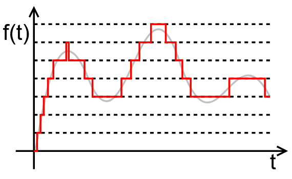

## Aliasing

Aliasing nastává, když **vzorkovací frekvence není dostatečně vysoká** na to, aby **zachytila všechny frekvence obsažené ve vstupním signálu**, což vede k tomu, že **vyšší frekvence jsou přeloženy do nižších frekvencí**.

- Např. u **audio CD je vzorkovací frekvence 44,1 kHz**, což znamená, že **nejvyšší frekvence, kterou lze správně zachytit (Nyquistova frekvence), je 22,05 kHz**.
  - Pokud by se např. vzorkovala frekvence 25 kHz, byla by přeložena (folding - zrcadlení) na 19,1 kHz, což je nižší frekvence, která se vyskytuje v slyšitelném rozsahu a může způsobit nežádoucí zkreslení.

- Aby se **zabránilo aliasingu**, používají se před vzorkováním **antialiasingové filtry, které odstraňují frekvence nad Nyquistovou frekvencí**.

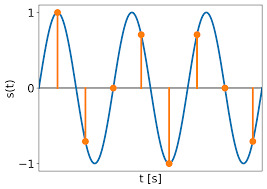

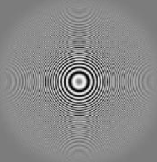

### Vzorkovací teorém

**Nemá-li dojít při vzorkování k aliasingu**, musí být **vzorkovací frekvence** alespoň **dvojnásobkem nejvyšší frekvence obsažené ve vstupním signálu** (Nyquistovy frekvence), tedy

$$
f_s \geq 2 f_{\text{max}}.
$$

- Musí být splněn **i u obrazových signálů**, kde $f_{\text{max}}$ odpovídá **nejvyšší prostorové frekvenci**, tedy **nejmenšímu detailu**, který chceme zachovat.


# Základní typy úloh strojového učení a rozdělení dat. Základy klasifikace, vyhodnocování výsledků, matice záměn

## Strojové učení

**Strojové učení** je podoblast umělé inteligence, která má za cíl **řešit úlohy bez explicitní definice sady pravidel**.

- Využívá **sad dat**, ze kterých se model učí:
  - **Trénovací data**
    - se používají ke **stanovení parametrů modelu**
    - a ke **zpětné propagaci**, tedy k učení modelu.
  - **Ověřovací (validační) data**
    - se používají k **optimalizaci parametrů modelu**
    - a k **výběru nejlepšího modelu**.
      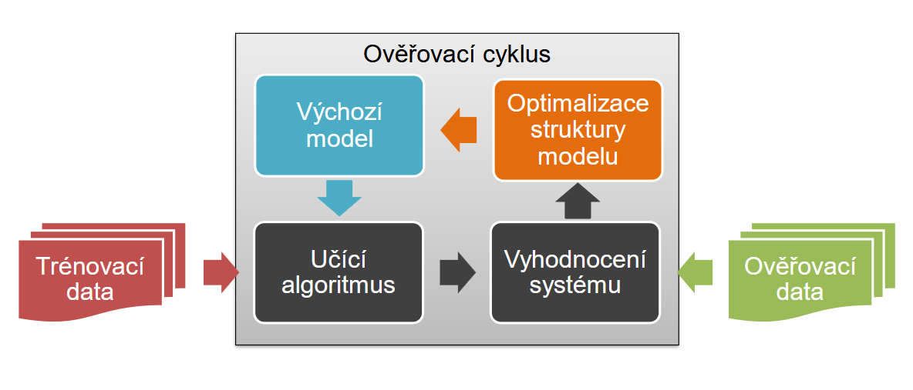
  - **Testovací data**
    - **musí být oddělená**,
    - využívají se k **vyhodnocování úspěšnosti modelu**
    - a k detekci **overfittingu** (tedy až moc dokonalému natrénování na trénovacích datech).
      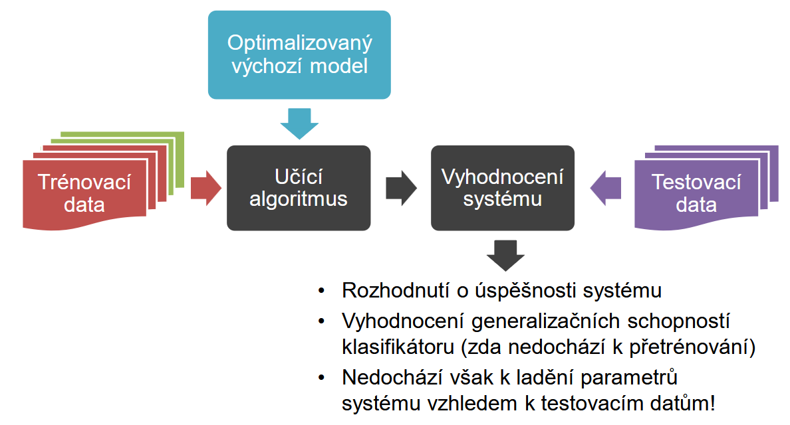
- Dělení dat **může být náhodné** nebo např. **stratifikované** (zachování poměru tříd).

### Základní typy úloh strojového učení

#### Klasifikace

Jejím cílem je přiřadit vstupní data **do jedné z předem definovaných kategorií (tříd)**.

- **Supervised learning**, protože model se učí z označených dat (každý vstup má přiřazenou správnou třídu).
- Např. rozpoznávání rukopisu, detekce spamu, diagnostika nemocí.
- **Výstupem je diskrétní hodnota (třída)**.
- Základní premisou je to, že **jsou-li objekty podobné**, měly by i jejich **reprezentace v příznakovém prostoru být blízko sebe**.
- Může se řešit např. pomocí **(k)NN**, **logistické regrese**, **rozhodovacích stromů**, **SVM**, **neuronových sítí**.

#### Regrese

Jejím cílem je **předpovědět spojitou hodnotu** na základě vstupních dat.

- **Supervised learning**, protože model se učí z označených dat (každý vstup má přiřazenou správnou hodnotu).
- Např. předpověď ceny nemovitosti, teploty, prodejů.
- **Výstupem je spojitá hodnota**.

#### Shlukování (Clustering)

Jeho cílem je **rozdělit data do skupin (shluků) na základě podobnosti mezi daty**, aniž by byly k dispozici předem definované třídy.

- **Unsupervised learning**, protože model se učí z neoznačených dat.
- Např. segmentace zákazníků, analýza sociálních sítí, detekce anomálií.
- **Výstupem jsou skupiny dat**, které jsou **podobné mezi sebou** a **odlišné od ostatních skupin**.

#### Asociační pravidla

Jejich cílem je nalézt **zajímavé vztahy mezi proměnnými v datové sadě**.

- Např. analýza nákupního košíku, doporučovací systémy.
- **Výstupem jsou pravidla**, která popisují **vztahy mezi položkami**.

## Vyhodnocování výsledků

Vyhodnocování výsledků je **klíčové pro posouzení výkonu modelu** a jeho schopnosti generalizovat se na nová data.

- Pro klasifikaci se často používají metriky jako **přesnost**, **preciznost**, **recall**, **F1-score** a **matice záměn**.
- Pro regresi se používají metriky jako **MSE (Mean Squared Error)**: $\operatorname{MSE} = \frac{1}{N} \sum_{i=1}^N (y_i - \hat{y}_i)^2$.

### Matice záměn

Matice záměn (confusion matrix) je **tabulka, která obsahuje informace o skutečných a předpovězených třídách modelu u klasifikačních úloh**.

|                  | Předpovězená třída P | Předpovězená třída N |
| ---------------- | -------------------- | -------------------- |
| Skutečná třída P | TP (True Positive)   | FN (False Negative)  |
| Skutečná třída N | FP (False Positive)  | TN (True Negative)   |

- **Metriky** odvozené z matice záměn:
  - **Accuracy**: $\frac{\operatorname{TP} + \operatorname{TN}}{\operatorname{TP} + \operatorname{TN} + \operatorname{FP} + \operatorname{FN}}$
    - se používá, když jsou třídy vyvážené,
  - **Precision**: $\frac{\operatorname{TP}}{\operatorname{TP} + \operatorname{FP}}$
    - se používá, když je důležité minimalizovat falešně pozitivní výsledky,
  - **Recall**: $\frac{\operatorname{TP}}{\operatorname{TP} + \operatorname{FN}}$
    - se používá, když je důležité minimalizovat falešně negativní výsledky,
  - **F1-score**: $2 \cdot \frac{\operatorname{Precision} \cdot \operatorname{Recall}}{\operatorname{Precision} + \operatorname{Recall}} = \frac{2\operatorname{TP}}{2\operatorname{TP}+\operatorname{FP}+\operatorname{FN}}$.


# Regrese, analytické řešení metodou nejmenších čtverců, numerické řešení metodou největšího spádu

## Regrese

Regrese je metoda, která umožňuje **odhadovat hodnotu náhodné veličiny** (závislé proměnné) **na základě hodnot jiných veličin** (nezávislých proměnných).

- Může být např. **lineární**, tj. prokládá data přímkou/rovinou:

$$
  \hat{y} = \theta_0 + \theta_1x_1 + \theta_2x_2 + \dots + \theta_kx_k,\\
  \hat{y} = \boldsymbol{\theta}^T\tilde{\boldsymbol{x}},\\
  \hat{y} = \begin{bmatrix}\theta_0 & \theta_1 & \dots & \theta_k\end{bmatrix} \begin{bmatrix}1 \\ x_1 \\ \dots \\ x_k\end{bmatrix}.
$$

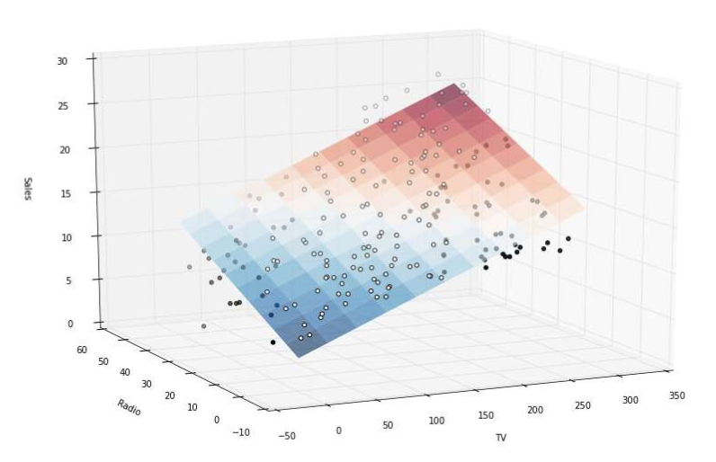

- Může být i **nelineární**, např. polynomická regrese.

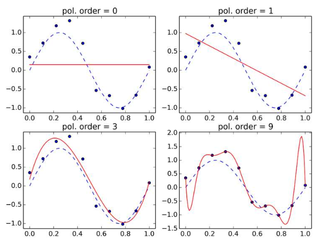

- Chyba modelu (loss function) $L(\boldsymbol{\theta})$ je funkce, kterou se snažíme minimalizovat během trénování modelu, aby se dosáhlo co nejlepších výsledků.

### Analytické řešení

- Pro regresi se často používá **MSE (Mean Squared Error)** nebo **SSE (Sum of Squared Errors)**, která měří průměrnou kvadratickou odchylku mezi skutečnými hodnotami $y_i$ a predikovanými hodnotami $\hat{y}_i$:

  $$
  L(\boldsymbol{\theta}) = \sum_{i=1}^N (y_i - \hat{y}_i)^2\\
  L(\boldsymbol{\theta}) = (\boldsymbol{y}-\tilde{\boldsymbol{X}}\boldsymbol{\theta})^T(\boldsymbol{y}-\tilde{\boldsymbol{X}}\boldsymbol{\theta}),
  $$

  kde
  - $\boldsymbol{y}$ je vektor skutečných hodnot,
  - $\tilde{\boldsymbol{X}}$ je matice nezávislých proměnných s přidaným sloupcem jedniček pro zachycení interceptu
  - a $\boldsymbol{\theta}$ je vektor parametrů modelu.

- Vektor $\boldsymbol{\theta}$ má pak tvar:

  $$
    \boldsymbol{\theta} = (\tilde{\boldsymbol{X}}^T\tilde{\boldsymbol{X}})^{-1}\tilde{\boldsymbol{X}}^T\boldsymbol{y},
  $$

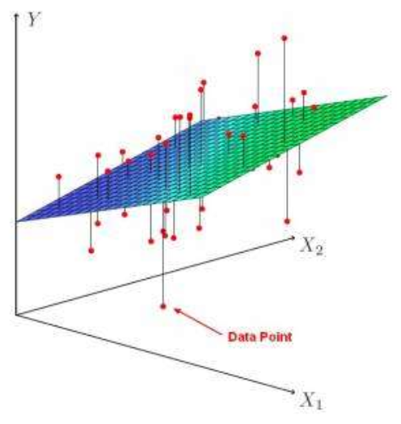

- Můžeme přidat tzv. **regularizaci**, která **penalizuje složitost modelu, aby se zabránilo přetrénování**:

  $$
    L(\boldsymbol{\theta}) = \sum_{i=1}^N (y_i - \hat{y}_i)^2 + \lambda \sum_{k=1}^K \theta_k^2,\\
    \boldsymbol{\theta} = (\tilde{\boldsymbol{X}}^T\tilde{\boldsymbol{X}} + \lambda \boldsymbol{I})^{-1}\tilde{\boldsymbol{X}}^T\boldsymbol{y},
  $$

  kde $\lambda$ je regularizační parametr (čím větší, tím větší důraz na zabránění přeučení) a $\boldsymbol{I}$ je jednotková matice.
  - Parametr $\lambda$ se často volí pomocí validační sady dat.

### Numerické řešení

Numerické řešení **metodou největšího spádu (gradient descent)** spočívá v **iterativním přizpůsobování parametrů modelu směrem k minimalizaci chyby**.

- Funguje na principu výpočtu **gradientu** (směru největšího vzestupu) a **aktualizace parametrů v opačném směru, aby se minimalizovala chyba**:

$$
  \boldsymbol{x}_{t+1} = \boldsymbol{x}_t - \alpha \frac{\partial}{\partial\boldsymbol{x}}L(\boldsymbol{x}_t)
$$

- Momentum **umožňuje potlačit oscilace** a **urychlit konvergenci** tím, že **bere v úvahu předchozí aktualizace parametrů**:

  $$
    \boldsymbol{v}_{t+1} = -\alpha \frac{\partial}{\partial\boldsymbol{x}}L(\boldsymbol{x}_t) + \gamma \boldsymbol{v}_t,\\
    \boldsymbol{x}_{t+1} = \boldsymbol{x}_t + \boldsymbol{v}_{t+1},
  $$

  kde $\gamma$ je **hyperparametr určující, jak moc se má brát v úvahu předchozí posun** (např. $\gamma \approx 0.9$).

- Je-li tedy

  $$
    L(\boldsymbol{\theta}) = \sum_{i=1}^N (y_i - \boldsymbol{\theta}^T\tilde{\boldsymbol{x}}_i)^2,
  $$

  kde $\tilde{\boldsymbol{x}}_i$ je vektor pro $i$-tý vzorek, pak gradient pro aktualizaci parametrů $\theta$ je dán vzorcem:

  $$
    \frac{\partial}{\partial\boldsymbol{\theta}}L(\boldsymbol{\theta}) = -2\sum_{i=1}^N (y_i - \boldsymbol{\theta}^T\tilde{\boldsymbol{x}}_i)\tilde{\boldsymbol{x}}_i,
  $$

  a aktualizace parametrů pomocí gradient descent je tedy:

  $$
    \boldsymbol{\theta}_{t+1} = \boldsymbol{\theta}_t + 2\alpha \sum_{i=1}^N (y_i - \boldsymbol{\theta}_t^T\tilde{\boldsymbol{x}}_i)\tilde{\boldsymbol{x}}_i\\
    \Downarrow\\
    \boldsymbol{\theta}_{t+1} = \boldsymbol{\theta}_t - \alpha \sum_{i=1}^N \tilde{\boldsymbol{x}}_i(\boldsymbol{\theta}_t^T\tilde{\boldsymbol{x}}_i - y_i).
  $$

- Kompletní vzorec i s regularizací je tedy:
  $$
    \boldsymbol{\theta}_{t+1} = \boldsymbol{\theta}_t(1 - \alpha \lambda) - \alpha \sum_{i=1}^N \tilde{\boldsymbol{x}}_i(\boldsymbol{\theta}_t^T\tilde{\boldsymbol{x}}_i - y_i)\\
    \Downarrow\\
    \underline{\underline{\boldsymbol{\theta}_{t+1} = \boldsymbol{\theta}_t(1-\alpha \lambda) - \alpha\tilde{\boldsymbol{X}}^T(\tilde{\boldsymbol{X}}\boldsymbol{\theta}_t - \boldsymbol{y})}}.
  $$


# Binární lineární klasifikace a logistická regrese, učení modelu logistické regrese

## Binární lineární klasifikace

Úloha binární lineární klasifikace spočívá v **nalezení hyperroviny**, která **nejlépe odděluje dvě třídy dat v příznakovém prostoru**.

- **Rozhodnutí o příslušnosti** ke třídě se u řešení pomocí regrese provádí na **základě porovnání hodnoty funkce $f$ s prahem**, např.

  $$
  \hat{y} = \begin{cases}
    1, & \text{pokud } f(\boldsymbol{x}) \geq 0,\\
    0, & \text{pokud } f(\boldsymbol{x}) < 0.
  \end{cases}
  $$

- Pokud modelujeme binární jev bez závislosti na okolních datech, můžeme využít **binární náhodnou veličinu** $X \in \{0,1\}$, která má **Bernoulliho rozdělení pravděpodobnosti**:

  $$
  P(X)=\theta^X(1-\theta)^{1-X}=\begin{cases}\theta & X=1\\1-\theta & X = 0\end{cases},
  $$

  přičemž **odhad parametru** $\theta$ se provádí **pomocí metody maximální věrohodnosti** (MLE) s parametry $k$ a $N$:

  $$
    P(X_1, \dots, X_N | \theta) = \prod_{i=1}^N \theta^{X_i}(1-\theta)^{1-X_i} = \theta^k(1-\theta)^{N-k},\\
    \Downarrow\\
    \ln P(X_1, \dots, X_N | \theta) = k\ln\theta + (N-k)\ln(1-\theta),\\
    \Downarrow\\
    \frac{d}{d\theta}(k\ln\theta+(N-k)\ln(1-\theta)) = \frac{k}{\theta} - \frac{(N-k)}{1-\theta}=0,\\
    k(1-\theta)=(N-k)\theta,\\
    k-k\theta = N\theta - k\theta,\\
    \theta = \frac{k}{N},
  $$

  **maximálně věrohodným odhadem** parametru $\theta$ je tedy **poměr počtu úspěchů $k$ k celkovému počtu pokusů $N$**.

## Logistická regrese

Logistická regrese je metoda pro binární klasifikaci, která **modeluje pravděpodobnost, že vstupní data patří do určité třídy**, pomocí logistické funkce (sigmoid):

$$
\sigma(x) = \frac{1}{1 + e^{-x}}.
$$

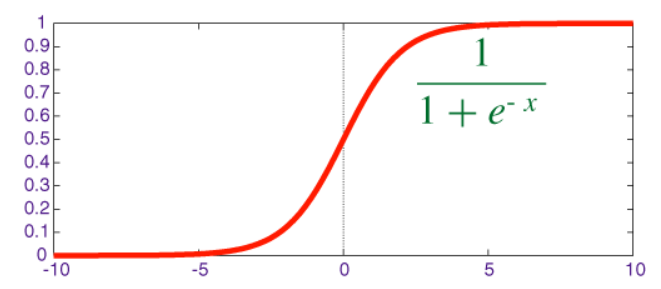

- Realizujeme pomocí **vektoru vstupů** a **vektoru parametrů** (vah):

  $$
  u = \sum_{i=1}^{n+1} \theta_i \tilde{x}_i = \boldsymbol{\theta}^T\tilde{\boldsymbol{x}},
  $$

  kde $u$ **říká, zda bod $\boldsymbol{x}$ leží nad nebo pod hyperrovinou** definovanou $\theta_1x_1 + \dots + \theta_nx_n + \theta_{n+1} \cdot 1$, a tedy **do které třídy patří**.

  $$
  P(y=1|\boldsymbol{x}) = \sigma(u) = \frac{1}{1 + e^{-\boldsymbol{\theta}^T\tilde{\boldsymbol{x}}}},\\
  \hat{y} = \begin{cases}
    1, & \text{pokud } P(y=1|\boldsymbol{x}) \geq 0.5,\\
    0, & \text{pokud } P(y=1|\boldsymbol{x}) < 0.5,
  \end{cases}
  $$

### Učení modelu logistické regrese

Model LR se učí pomocí **optimalizace váhového vektoru** $\boldsymbol{\theta}$ tak, aby **minimalizoval chybu klasifikace na trénovacích datech**.

- Stejně jako u binární náhodné veličiny se zde **využívá metoda maximální věrohodnosti**, která hledá váhy $\boldsymbol{\theta}$, které **maximalizují pravděpodobnost pozorovaných dat vzhledem k modelu**:

  $$
  P(\boldsymbol{Y}|\boldsymbol{\theta},\boldsymbol{X}) = \prod_{i=1}^N P(y_i|\boldsymbol{x}_i) = \prod_{i=1}^N \sigma(\boldsymbol{\theta}^T\tilde{\boldsymbol{x}}_i)^{y_i}(1-\sigma(\boldsymbol{\theta}^T\tilde{\boldsymbol{x}}_i))^{1-y_i},\\
  \Downarrow\\
  \ln P(\boldsymbol{Y}|\boldsymbol{\theta},\boldsymbol{X}) = \sum_{i=1}^N \left( y_i\ln(\sigma(\boldsymbol{\theta}^T\tilde{\boldsymbol{x}}_i))+(1-y_i)\ln(1-\sigma(\boldsymbol{\theta}^T\tilde{\boldsymbol{x}}_i)) \right),\\
  \Downarrow\\
  L(\boldsymbol{\theta}) = -\sum_{i=1}^N\left( y_i\ln(\sigma(\boldsymbol{\theta}^T\tilde{\boldsymbol{x}}_i)) + (1-y_i)\ln(1-\sigma(\boldsymbol{\theta}^T\tilde{\boldsymbol{x}}_i)) \right),
  $$

  kde
  - pro $y=1$ minimalizujeme $-\ln(\sigma(\boldsymbol{\theta}^T\tilde{\boldsymbol{x}}_i))$, protože druhý člen je $0$,
  - a pro $y=0$ pak minimalizujeme $-\ln(1-\sigma(\boldsymbol{\theta}^T\tilde{\boldsymbol{x}}_i))$, protože první člen je $0$.

- Protože $L(\boldsymbol{\theta})$ **nemá analytické řešení, hledáme minimum numericky pomocí metody stochastického gradientního sestupu** (SGD):

  $$
    \boldsymbol{\theta}_{t+1} = \boldsymbol{\theta}_t - \alpha \sum_{i=1}^N \tilde{\boldsymbol{x}}_i (\sigma(\boldsymbol{\theta}^T\tilde{\boldsymbol{x}}_i) - y_i),\\
    \Downarrow\\
    \boldsymbol{\theta}_{t+1} = \boldsymbol{\theta}_t - \alpha \tilde{\boldsymbol{X}}^T(\sigma(\tilde{\boldsymbol{X}}\boldsymbol{\theta}_t) - \boldsymbol{y}),
  $$

  kde $\alpha$ je učící rychlost, která určuje velikost kroků při aktualizaci váhového vektoru $\boldsymbol{\theta}$, přičemž k **prvnímu členu lze přidat také regularizace**: $\boldsymbol{\theta}_{t+1} = \boldsymbol{\theta}_t(1-\alpha\lambda) - \alpha\dots$

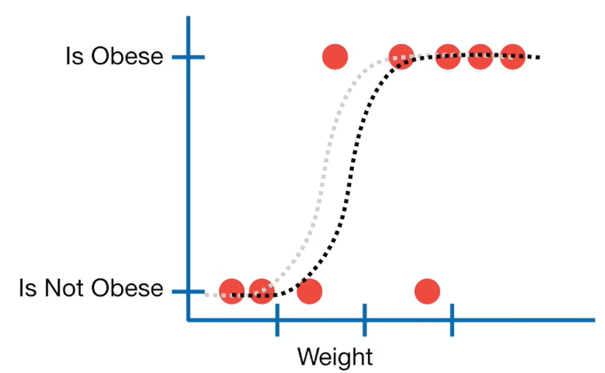

### Křížová entropie

Vztah $y_i\ln(\sigma(\boldsymbol{\theta}^T\tilde{\boldsymbol{x}}_i))+(1-y_i)\ln(1-\sigma(\boldsymbol{\theta}^T\tilde{\boldsymbol{x}}_i))$ vyjadřuje **křížovou entropii**.

- **Informační entropie $H(X) = -\sum_{\omega\in\Omega}p(\omega)\log_2p(\omega)$ je míra nejistoty** a udává potřebný počet bitů na **zakódování informace reprezentované náhodnou veličinou**.
- **Křížová entropie** pak udává, **kolik bitů** musíme použít, chceme-li **místo jednoho rozdělení pravděpodobnosti použít na zakódování informace jiné rozdělení pravděpodobnosti**.
- Minimalizace **křížové entropie** znamená minimalizování **rozdílů mezi dvěma rozděleními pravděpodobnosti**,
  - tj. **skutečné rozdělení** pro trénovací data a **rozdělení určené hodnotami predikovanými modelem**.


# Lineární klasifikace do více tříd, způsoby učení, softmax

## Lineární klasifikace do více tříd s více natrénovanymi klasifikátory

Nejdříve se do více tříd klasifikovalo s více natrénovanými klasifikátory.

- **1 vs 1**
  - Pro každé 2 třídy z celkem $C$ tříd se natrénuje příslušný binární klasifikátor.
  - Klasifikace se provede pro každý z vytvořených klasifikátorů a bod $\boldsymbol{x}$ je klasifikován na základě tzv. majority voting.
- **1 vs all**
  - Celkem $C$ binárních klasifikátorů je natrénováno na úplné sadě dat.

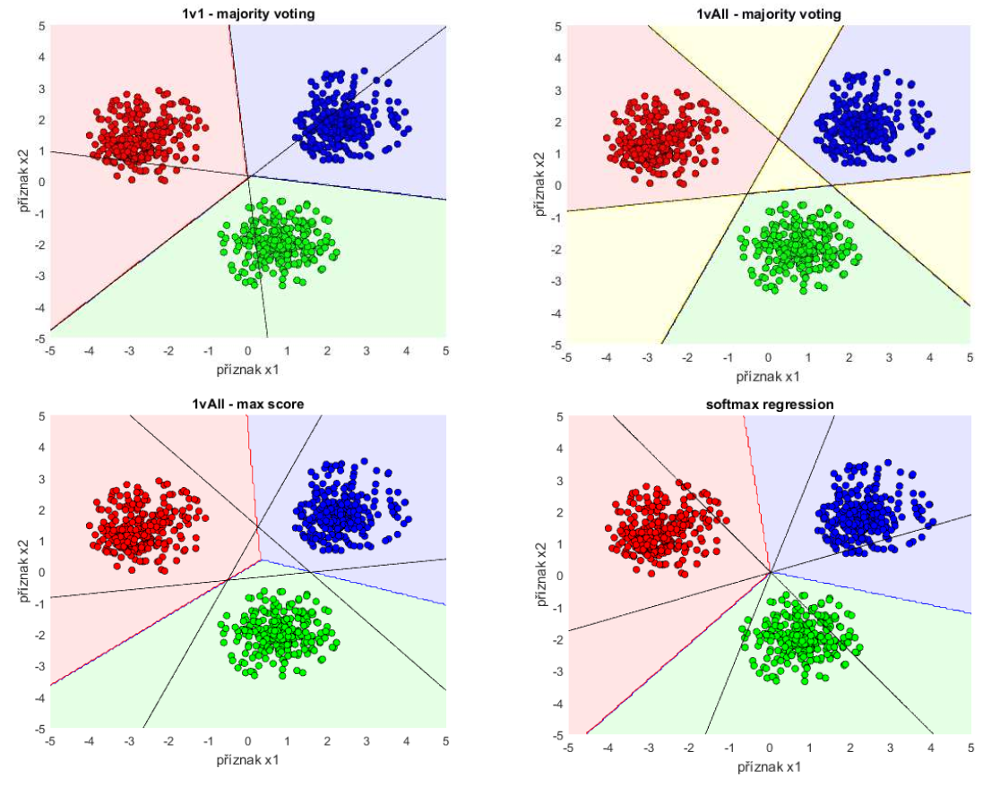
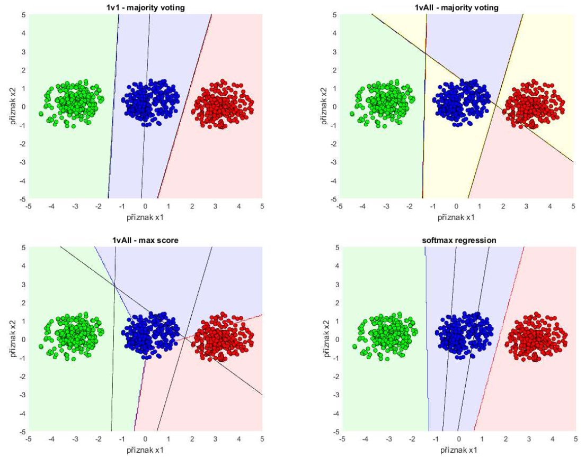

## Lineární klasifikace se softmaxem

Elegantnější způsob, protože lze **trénovat pouze jeden paralelní model**.

$$
\boldsymbol{\Theta}^T =
\left[
\begin{array}{cccc|c}
\theta_{11} & \theta_{12} & \cdots & \theta_{1n} & b_1\\
\theta_{21} & \theta_{22} & \cdots & \theta_{2n} & b_2\\
\vdots & \vdots & \vdots & \ddots & \vdots\\
\theta_{m1} & \theta_{m2} & \cdots & \theta_{mn} & b_m
\end{array}\right]\\

\hat{y}_c = \operatorname{SOFTMAX}(u) = \frac{e^{u_c}}{\sum_{d=1}^C e^{u_d}},
$$

kde $u_c$ je **skóre pro třídu** $c$ a $\sum u_d$ je **součet přes všechny třídy** $d = 1,\dots,C$.

- Tato funkce má $C$ vstupů a $C$ výstupů.
- Vzniká **jakobián**, tedy matice parciálních derivací:

  $$
  \text{JAC}_\text{SMAX} = \begin{bmatrix}
  \frac{\partial \hat{y}_1}{\partial u_1} & \frac{\partial \hat{y}_1}{\partial u_2} & \cdots & \frac{\partial \hat{y}_1}{\partial u_n}\\
  \frac{\partial \hat{y}_2}{\partial u_1} & \frac{\partial \hat{y}_2}{\partial u_2} & \cdots & \frac{\partial \hat{y}_2}{\partial u_n}\\
  \vdots & \vdots & \ddots & \vdots\\
  \frac{\partial \hat{y}_C}{\partial u_1} & \frac{\partial \hat{y}_C}{\partial u_2} & \cdots & \frac{\partial \hat{y}_C}{\partial u_n}
  \end{bmatrix},\\
  \frac{\partial \hat{y}_a}{\partial u_b} = \hat{y}_a(\delta_{a,b} - \hat{y}_b),\\
  \delta_{a,b} = \begin{cases}
  1, & a = b & \rightarrow & \hat{y}_a(1 - \hat{y}_b),\\
  0, & a \neq b & \rightarrow &-\hat{y}_a\hat{y}_b.
  \end{cases}
  $$

### Způsob učení

K **nalezení parametrů** modelu použijeme **MLE**.

- Všechny vektory $\boldsymbol{y}_i$ **jsou nezávislé** a ze stejného rozdělení, tj.

  $$
    P(\boldsymbol{Y}|\boldsymbol{\Theta}, \boldsymbol{X}) = \prod_{i=1}^N\prod_{c=1}^C \hat{y}_{i,c}^{y_{i,c}},
  $$

  díky **one-hot encodingu** tedy např.

  $$
  \prod_{c=1}^3 \hat{y}_{i,c}^{y_{i,c}} = \hat{y}_{i,1}^0\hat{y}_{i,2}^1\hat{y}_{i,3}^0 = \hat{y}_{i,2}.
  $$

- **Loss funkce** bude tedy:

  $$
    \begin{align*}
      \log P(\boldsymbol{Y}|\boldsymbol{\Theta}, \boldsymbol{X}) &= \sum_{i=1}^N\sum_{c=1}^C y_{i,c} \log \hat{y}_{i,c},\\
      L(\boldsymbol{\Theta}, \boldsymbol{X}) &= -\sum_{i=1}^N\sum_{c=1}^C y_{i,c} \log \hat{y}_{i,c}.
    \end{align*}
  $$

  přičemž $L(\boldsymbol{\Theta}, \boldsymbol{X})$ je **křížová entropie**, stejně jako u logistické regrese.

- Hledáme **takovou matici** $\boldsymbol{\Theta}$, pro kterou je **logaritmus věrohodnosti minimální**:

  $$
  L_i = -\sum_{c=1}^C y_{i,c} \log \hat{y}_{i,c},\\
  \begin{align*}
  \frac{\partial L_i}{\partial u_a}&= \sum_{c=1}^C y_{i,c}\cdot\frac{1}{\hat{y}_{i,c}}\cdot\frac{\partial \hat{y}_{i,c}}{\partial u_a}\;(\text{Jakobián})\\
  &= \sum_{c=1}^C y_{i,c} \frac{\hat{y}_c(\delta_{c,a}-\hat{y}_a)}{\hat{y}_c}\\
  &= \sum_{c=1}^C y_{i,c}(\delta_{c,a}-\hat{y}_a)\;(\text{jen } c=a\text{ a } \hat{y}_a \text{ nezávisí na } c)\\
  &= \sum_{c=1}^C y_{i,c}\delta_{c,a}-\hat{y}_a\sum_{c=1}^C y_{i,c} = y_a - \hat{y}_a \cdot 1\\
  &= y_a - \hat{y}_a,
  \end{align*}
  $$

  tj. **gradient je jen reziduum**,
  pak **hledáme minimum pomocí SGD**:

  $$
  \boldsymbol{\theta}_{a,t+1} = \boldsymbol{\theta}_{a,t} - \alpha \sum_{i=1}^N \boldsymbol{x}_i(\hat{y}_{a,i} - y_{a,i})\\
  \Downarrow\\
  \boldsymbol{\Theta_{t+1}} = \boldsymbol{\Theta}_t - \alpha \sum_{i=1}^N \boldsymbol{x}_i(\hat{y}_i - \boldsymbol{y}_i)^T,\\
  \Downarrow\\
  \boldsymbol{\Theta}_{t+1} = \boldsymbol{\Theta}_t - \alpha\tilde{\boldsymbol{X}}^T(\hat{\boldsymbol{Y}} - \boldsymbol{Y}).
  $$

- **Srovnáním s ostatními metodami tedy máme rovnice řešení pomocí SGD takto**:
  - **Lineární regrese**:
    $$
      \boldsymbol{\theta}_{t+1} = \boldsymbol{\theta}_t(1-\alpha\lambda) - \alpha \sum_{i=1}^N \boldsymbol{x}_i(\boldsymbol{x}_i^T\boldsymbol{\theta}-y_i), y_i\in\mathbb{R},\\
      \Downarrow\\
      \boldsymbol{\theta}_{t+1} = \boldsymbol{\theta}_t(1-\alpha\lambda) - \alpha \tilde{\boldsymbol{X}}^T(\tilde{\boldsymbol{X}}\boldsymbol{\theta}-\boldsymbol{y}),
    $$
  - **Binární logistická regrese**:
    $$
      \boldsymbol{\theta}_{t+1} = \boldsymbol{\theta}_t(1-\alpha\lambda) - \alpha \sum_{i=1}^N \boldsymbol{x}_i(\sigma(\boldsymbol{x}_i^T\boldsymbol{\theta})-y_i), y_i\in\{0,1\},\\
      \Downarrow\\
      \boldsymbol{\theta}_{t+1} = \boldsymbol{\theta}_t(1-\alpha\lambda) - \alpha \tilde{\boldsymbol{X}}^T(\sigma(\tilde{\boldsymbol{X}}\boldsymbol{\theta})-\boldsymbol{y}),
    $$
  - **Lineární klasifikace s využítím SOFTMAX**:
    $$
      \boldsymbol{\Theta}_{t+1}=\boldsymbol{\Theta}_t(1-\alpha\lambda) - \alpha \sum_{i=1}^N \boldsymbol{x}_i(\operatorname{SMAX}(\boldsymbol{x}_i^T\boldsymbol{\Theta})^T-\boldsymbol{y}_i^T),\\
      \Downarrow\\
      \boldsymbol{\Theta}_{t+1}=\boldsymbol{\Theta}_t(1-\alpha\lambda) - \alpha \tilde{\boldsymbol{X}}^T(\operatorname{SMAX}(\tilde{\boldsymbol{X}}\boldsymbol{\Theta})-\boldsymbol{Y}), \boldsymbol{Y}\in\{0,1\}^C.
    $$

|                        | Lineární regrese                                        | Binární log. regrese                                            | Softmax klasifikace                                                                       |
| ---------------------- | ------------------------------------------------------- | --------------------------------------------------------------- | ----------------------------------------------------------------------------------------- |
| Vstup $\boldsymbol{x}$ | $\boldsymbol{x}\in\mathbb{R}^n$                         | $\boldsymbol{x}\in\mathbb{R}^n$                                 | $\boldsymbol{x}\in\mathbb{R}^n$                                                           |
| Parametry              | $\boldsymbol{\theta} \in \mathbb{R}^{n+1}$              | $\boldsymbol{\theta} \in \mathbb{R}^{n+1}$                      | $\boldsymbol{\Theta} \in \mathbb{R}^{(n+1) \times C}$                                     |
| Výstupní funkce        | $\hat{y} = \boldsymbol{\theta}^T\tilde{\boldsymbol{x}}$ | $\hat{y} = \sigma(\boldsymbol{\theta}^T\tilde{\boldsymbol{x}})$ | $\hat{\boldsymbol{y}} = \operatorname{SMAX}(\boldsymbol{\Theta}^T\tilde{\boldsymbol{x}})$ |
| Výstup $\hat{y}$       | $\mathbb{R}$ (spojitá hodnota)                          | $(0, 1)$ (pravděpodobnost)                                      | $\mathbb{R}^C$, $\sum_c \hat{y}_c = 1$                                                    |
| Interpretace výstupu   | předpověď hodnoty                                       | $P(y=1\mid\boldsymbol{x})$                                      | $P(y=c\mid\boldsymbol{x})$ pro každou třídu $c$                                           |
| Cílová hodnota $y$     | $y \in \mathbb{R}$                                      | $y \in \{0, 1\}$                                                | $\boldsymbol{y} \in \{0,1\}^C$ (one-hot)                                                  |
| Loss funkce            | SSE / MSE                                               | křížová entropie (binární)                                      | křížová entropie (kategorická)                                                            |
|                        |


# Nelineární klasifikace a neuronové sítě typu vícevrstvý perceptron, učení neuronových sítí - algoritmus zpětné propagace

## Nelineární klasifikace

**Lineární klasifikátory** jsou trénovány tak, aby **rozdělovaly prostor příznaků přímkami nebo rovinami**, **což není pro všechny případy vhodné**.

### Vzdálenostní metody

**Realizují se metodami (k)NN**, kdy se vybírá 1 nebo více nejbližších bodů v příznakovém prostoru, a na základě jejich třídy je poté vybraná třída pro další data.

- **Nejsou parametrické**, tj. není zde žádný parametr $\boldsymbol{\theta}$ nebo $\boldsymbol{\Theta}$.
- S klasifikátorem je **nutno distribuovat i trénovací data**.
- Můžeme využít např.
  - **euklidovskou vzdálenost** $d(\boldsymbol{x}, \boldsymbol{z}) = \sqrt{(\boldsymbol{x}-\boldsymbol{z})^T(\boldsymbol{x}-\boldsymbol{z})} = \sqrt{\sum_{i=1}^n (x_i-z_i)^2}$,
  - **manhattanovskou vzdálenost** $d(\boldsymbol{x}, \boldsymbol{z}) = \sum_{i=1}^n |x_i-z_i|$,
  - **Mahalanobisova vzdálenost** $d(\boldsymbol{x}, \boldsymbol{z}) = \sqrt{(\boldsymbol{x}-\boldsymbol{z})^T\boldsymbol{\sigma}^{-1}(\boldsymbol{x}-\boldsymbol{z})}$,
    - která je vhodná pro klasifikace s dynamickými rozsahy příznaků.


### Parametrické metody

Řadí se mezi ně např.

- zapojení **vyšších mocnin příznaků** v rámci lineárního klasifikátoru,
  
- **kernelové transformace**
- gaussovské mixturové modely,
- **neuronové sítě typu vícevrstvý perceptron**,
  - tedy efektivně **sériové zapojení lineárních klasifikátorů**.

## Vícevrstvý perceptron

Je **parametrický**, přičemž **počet parametrů roste s každou další vrstvou modelu**, ale **neroste s velikostí dat**, jako např. u kernelů.

- Obsahuje **paralelní i sériová spojení neuronů**.
- Má **vstupní a výstupní vrstvu** a navíc **jednu nebo více skrytých vrstev s nelineární aktivační funkcí**,
  - přičemž při 2 a více skrytých vrstvách mluvíme o hlubokých neuronových sítích (DNNs).


- **Neuron** zpracovává **výstupní hodnoty nelineární funkcí**, např.
  - **logistická** (sigmoida) $\sigma(x) = \frac{1}{1 + e^{-x}}$,
  - **ReLU** $r(x) = \max(0, x)$.

### Zpětná propagace

**Zpětná propagace** představuje **způsob učení neuronových sítí, který pracuje s řetízkovým pravidlem z diferenciálního počtu**.

- Hlavním úkolem je **přenesení gradientu z výstupu funkce na jeden z vektorů vah**.

  $$
  L = -\sum_{c=1}^N y_c \log \hat{y}_c,\\
  \begin{align*}
  \frac{\partial L}{\partial \boldsymbol{w}_i} &= \frac{\partial L}{\partial u_i} \frac{\partial u_i}{\partial \boldsymbol{w}_i}\;(u_j=\boldsymbol{x}^T\boldsymbol{w}_i)\\
  &= (\hat{y}_i-y_i)\frac{\partial u_j}{\partial w_i}\\
  &= (\hat{y}_i-y_i)\frac{\partial(\boldsymbol{x}^T\boldsymbol{w}_i)}{\partial \boldsymbol{w}_i}\\
  &= (\hat{y}_i-y_i)\boldsymbol{x},
  \end{align*}
  $$

  přičemž toto se **aplikuje od výstupu směrem ke vstupům**.

- Můžeme definovat např. následující **přenosy gradientů**:
  - Blok **sčítání** $f(x,y) = x+y: \frac{df}{dx} = 1, \frac{df}{dy} = 1,$
  - Blok **násobení** $f(x,y) = x \cdot y: \frac{df}{dx} = y, \frac{df}{dy} = x,$
  - **ReLU** $f(x) = \max(0,x): \frac{df}{dx} = \begin{cases} 0, & x \leq 0 \\ 1, & x > 0 \end{cases}$.

- Pro nejjednodušší příklad nelineární klasifikace $\boldsymbol{u}^2 = {\boldsymbol{W}^{2}}^T \boldsymbol{a}^1 + \boldsymbol{b}^2$ (horní indexy jsou čísla vrstev, ne mocniny) tedy můžeme definovat gradienty takto:

  $$
    \begin{align*}
    \frac{\partial \hat{\boldsymbol{y}}}{\partial \boldsymbol{u}^2} &= d\boldsymbol{u}^2 = \hat{\boldsymbol{y}} - \boldsymbol{y},\\
  \frac{\partial \boldsymbol{u}^2}{\partial\boldsymbol{W}^2} &= d\boldsymbol{W}^2 = d\boldsymbol{u}^2 {\boldsymbol{a}^{1}}^T,\\
  \frac{\partial \boldsymbol{u}^2}{\partial\boldsymbol{b}^2} &= d\boldsymbol{b}^2 = d\boldsymbol{u}^2,\\
  \frac{\partial \boldsymbol{u}^2}{\partial\boldsymbol{a}^1} &= d\boldsymbol{a}^1 = {\boldsymbol{W}^{2}}^T d\boldsymbol{u}^2,\\
  \frac{\partial \boldsymbol{a}^1}{\partial\boldsymbol{u}^1} &= d\boldsymbol{u}^1 = d\boldsymbol{a}^1 \odot \sigma'(\boldsymbol{u}^1),\\
  \frac{\partial \boldsymbol{u}^1}{\partial \boldsymbol{W}^1} &= d\boldsymbol{W}^1 = d\boldsymbol{u}^1 \boldsymbol{x}^T,\\
  \frac{\partial \boldsymbol{u}^1}{\partial\boldsymbol{b}^1} &= d\boldsymbol{b}^1 = d\boldsymbol{u}^1.
    \end{align*}
  $$


- Jelikož **mohou trénovací data obsahovat miliony vzorků**, můžeme využít tzv. **mini-batch gradient descent**.
  - Každá **iterace** rozděluje **data na dávky** (batches) a **aktualizace parametrů se provádí vždy pro jednou dávku**.
  - **Teoreticky** MBGD **nepřesný**, prakticky ale funguje, protože **trénovací vzorky jsou vždy nějak korelované** (podobné, závislé).

- Prakticky **dává smysl trénovat** na velké množině dat, jestliže:
  - **náhodně inicializované parametry modelu vedou k $\frac{1}{C}$ přesnosti** rozpoznávání, kde $C$ je počet tříd
  - a pokud **při použití malého množství** dat **konverguje hodnota kriteriální funkce k nule**.

- **Inicializace** modelu se realizuje pomocí **nastavení malých náhodných čísel do váhových matic** a 0 do biasových vektorů,
  - toto musí být kvůli tomu, že při nastavení 0 do váhových matic by všechny neurony měly stejnou hodnotu výstupu a tedy i stejný gradient.

- **Malé množství dat může vést k přetrénování**.
- **Vhodné pro úlohu klasifikace, spíše nevhodné pro úlohu regrese**, protože natrénovat výstup ze sítě jako jeden neuron je prakticky obtížné na naučení a optimalizaci.


- Je dobré zrychlit konvergenci k minimu:
  - **Momentum SGD**:
    $$
    \boldsymbol{v}_{t+1} = -\alpha\nabla L(\boldsymbol{\theta}_t) + \gamma \boldsymbol{v}_t\\
    \boldsymbol{\theta}_{t+1} = \boldsymbol{\theta}_t + \boldsymbol{v}_{t+1}.
    $$
  - **Adam (Adaptive Momentum)**
    - je kombinace Momentum SGD a RMSProp,
    - a je nejčastější a nejlepší výchozí volbou,

    $$
      \begin{align*}
      \text{momentum akumulace:} \quad & \boldsymbol{v}_{t+1} := \gamma \cdot \boldsymbol{v}_t + (1-\gamma) \cdot \nabla L(\boldsymbol{\theta}_t) \\
      \text{rmsprop akumulace:} \quad & \boldsymbol{u}_{t+1} := \beta \cdot \boldsymbol{u}_t + (1-\beta) \cdot \nabla L(\boldsymbol{\theta}_t)^2 \\
      \\
      \text{korekce:} \quad & \hat{\boldsymbol{v}}_{t+1} := \frac{\boldsymbol{v}_{t+1}}{1 - \gamma^t} \\
      & \hat{\boldsymbol{u}}_{t+1} := \frac{\boldsymbol{u}_{t+1}}{1 - \beta^t} \\
      \\
      \text{Adam update:} \quad & \boldsymbol{\theta}_{t+1} := \boldsymbol{\theta}_t - \alpha \cdot \frac{\hat{\boldsymbol{v}}_{t+1}}{\sqrt{\hat{\boldsymbol{u}}_{t+1}} + \epsilon},
      \end{align*}
    $$

    hyperparametry jsou tedy:
    - $\alpha$ **learning rate**,
    - $\beta$ **rmsprop**,
    - $\gamma$ **momentum**,
    - $\epsilon$ **epsilon**.


# Konvoluční neuronové sítě a jejich aplikace. Rekurentní neuronové sítě a jejich aplikace, modely typu LSTM a GRU

## Konvoluční neuronové sítě

Konvoluční neuronové sítě jsou **specializované pro zpracování prostorových dat, zejména obrazů**; využívají operaci konvoluce, která **aplikuje filtr na vstup** a vytváří tzv. **feature mapy, jež detekují lokalizované vzory**.

- Operace konvoluce je definována jako **skalární součin mezi váhami jádra** a **odpovídajícími hodnotami vstupu v konkrétním okně**:

  $$
  z_{u,v} = \sum_{i=-k}^k \sum_{j=-k}^k w_{ij}x_{u+i,v+j}+b\\
  \Downarrow\\
  z_{uv} = \boldsymbol{w}^T\boldsymbol{x}_{uv}+b.
  $$

  kde
  - $z_{u,v}$ je **výstup konvoluce** v pozici $(u,v)$,
  - $w_{ij}$ je **váha jádra** na pozici $(i,j)$,
  - $x_{u+i,v+j}$ je **vstupní hodnota** a $b$ je **bias**.

- Jádro **posouváme po vstupu s krokem (stride)**, přičemž pro zachování rozměrů výstupu používáme **doplnění okrajů (padding)**, např. zero padding.

- Filtr vždy zahrnuje **všechny vstupní kanály**, tj. např. **u první vrstvy 3 kanály: R, G, B**.
  - **Výstupem** jednoho filtru je pak **feature mapa**, přičemž $F$ filtrů vytváří celkem $F$ feature map.
  - Rozměry vstupů a parametrů konvoluční vrstvy lze popsat následovně:

  $$
  \boldsymbol{X} \in \mathbb{R}^{H \times W \times C},\quad \boldsymbol{Z} \in \mathbb{R}^{Q \times Q \times F},\\
  \boldsymbol{W} \in \mathbb{R}^{K \times K' \times C \times F},\quad
  \boldsymbol{b} \in \mathbb{R}^{F},
  $$

  kde
  - $H \times W \times C$ je **rozměr vstupního tensoru** (výška $\times$ šířka $\times$ počet kanálů),
  - $Q \times Q \times F$ je **rozměr výstupního tensoru**,
  - $K \times K'$ je **velikost konvolučního jádra**,
  - $F$ je **počet filtrů** (hyperparametr),
  - $P$ je **padding** (hyperparametr),
  - $S$ je **stride** (hyperparametr),
  - $C$ je **počet kanálů** (fixní daný vstupem).

  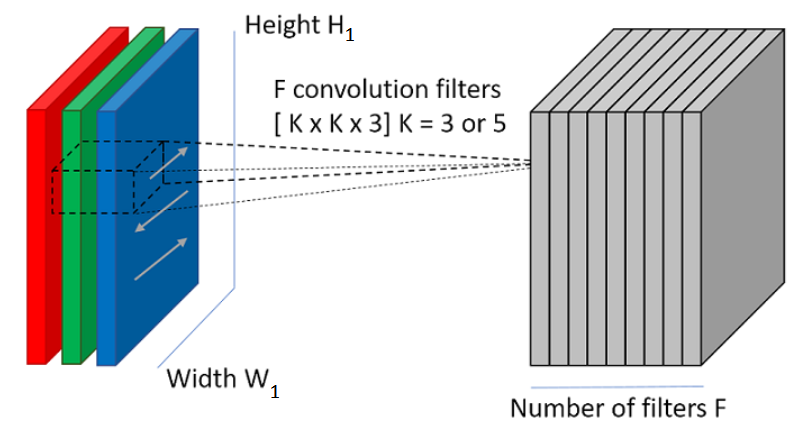

- Při zpětné propagaci u konvoluční vrstvy počítáme gradient vůči váhám a vstupu. Gradient loss funkce $L$ vůči váze $w_{i,j,c}$ je součtem přes všechny pozice výstupu:

  $$
    \frac{\partial z_{u,v}}{\partial w_{i,j,c}} = x_{su+i, sv+j, c}\\
    \frac{\partial L}{\partial w_{i,j,c}} = \sum_{u=1}^Q\sum_{v=1}^Q \frac{\partial L}{\partial z_{u,v}} \frac{\partial z_{u,v}}{\partial w_{i,j,c}}
    = \sum_{u=1}^Q\sum_{v=1}^Q \overline{z_{u,v}} \, x_{su+i, sv+j, c},
  $$

  kde $\overline{z_{uv}} = \frac{\partial L}{\partial z_{uv}}$ je **gradient propagovaný z výstupu konvoluční vrstvy**. **Zpětná propagace gradientu** na vstup konvoluce je tedy **opět konvoluce**, jejíž jádro má transponovanou matici $\boldsymbol{W}$.

- **Pooling snižuje** prostorové **rozměry feature map**, čímž **redukuje počet parametrů** a výpočetní náročnost. **Aplikuje se na bloky hodnot**, přičemž nejčastější varianty jsou:
  - **max pooling** - **do výstupu se bere maximální hodnota z každého bloku**, což zachovává nejsilnější aktivace,
  - **average pooling** - **do výstupu se bere průměrná hodnota z každého bloku**, což potlačuje extrémní hodnoty.

  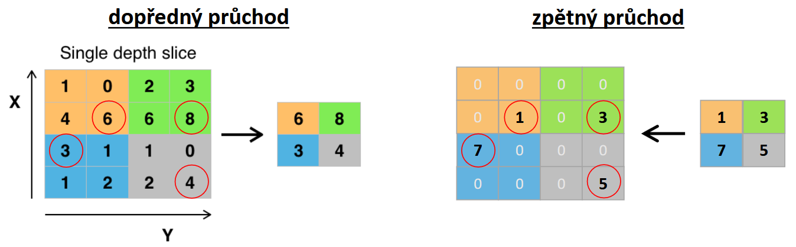

- Často se aplikuje tzv. **transfer learning**, tedy přenos naučených reprezentací z předtrénovaného modelu na novou úlohu:
  - **layer freeze** konvolučních vrstev, tedy zmrazení vah natrénovaných na rozsáhlém datasetu (např. ImageNet), protože nižší vrstvy detekují obecné rysy (hrany, tvary), které jsou přenositelné,
  - **vyhození poslední plně propojené (FC) vrstvy** a její nahrazení novou vrstvou s počtem neuronů odpovídajícím počtu tříd naší úlohy,
  - **využití vlastních dat** k dotrénování nové FC vrstvy, případně i části konvolučních vrstev.

- Existuje mnoho úspěšných konvolučních architektur, které postupně zlepšovaly přesnost a efektivitu, např. **AlexNet**, **VGG**, **GoogLeNet**, **ResNet**, **MobileNet**...

  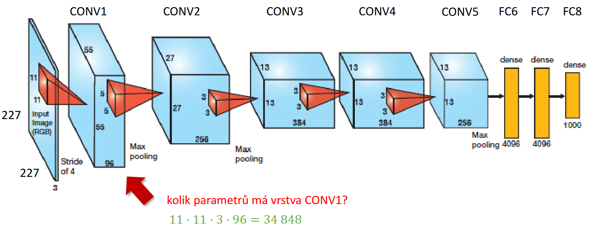

  AlexNet je jednou z prvních hlubokých CNN a její architektura je:

  | Vrstva     |   Typ   |     Filtr     | Stride | Padding |    Výstup     | Parametry                              |
  | :--------- | :-----: | :-----------: | :----: | :-----: | :-----------: | :------------------------------------- |
  | **Vstup**  |    —    |       —       |   —    |    —    | 227 × 227 × 3 | 0                                      |
  | **Conv1**  |  conv   | 11 × 11, F=96 |   4    |    0    | 55 × 55 × 96  | 96 · (11 · 11 · 3 + 1) = 34 944        |
  | **Pool1**  | maxpool |     3 × 3     |   2    |    0    | 27 × 27 × 96  | 0                                      |
  | **Conv2**  |  conv   | 5 × 5, F=256  |   1    |    2    | 27 × 27 × 256 | 256 · (5 · 5 · 96 + 1) = 614 656       |
  | **Pool2**  | maxpool |     3 × 3     |   2    |    0    | 13 × 13 × 256 | 0                                      |
  | **Conv3**  |  conv   | 3 × 3, F=384  |   1    |    1    | 13 × 13 × 384 | 384 · (3 · 3 · 256 + 1) = 885 120      |
  | **Conv4**  |  conv   | 3 × 3, F=384  |   1    |    1    | 13 × 13 × 384 | 384 · (3 · 3 · 384 + 1) = 1 327 488    |
  | **Conv5**  |  conv   | 3 × 3, F=256  |   1    |    1    | 13 × 13 × 256 | 256 · (3 · 3 · 384 + 1) = 884 992      |
  | **Pool3**  | maxpool |     3 × 3     |   2    |    0    |  6 × 6 × 256  | 0                                      |
  | **FC6**    |   fc    |       —       |   —    |    —    |     4096      | 6 · 6 · 256 · 4096 + 4096 = 37 752 832 |
  | **FC7**    |   fc    |       —       |   —    |    —    |     4096      | 4096 · 4096 + 4096 = 16 781 312        |
  | **FC8**    |   fc    |       —       |   —    |    —    |     1000      | 4096 · 1000 + 1000 = 4 097 000         |
  | **Celkem** |         |               |        |         |               | **≈ 62.4M**                            |

- Výstupy z konvolučních sítí lze vizualizovat a interpretovat několika způsoby:
  - **filtry první vrstvy**: zobrazení naučených jader první konvoluční vrstvy odhalí, jaké orientace hran, barvy nebo textury model detekuje,
  - **vizualizace nejbližšího souseda**: pro každou feature mapu hledáme vstupní obrázek, který ji nejvíce aktivuje,
  - **clustering**: shlukování feature map do skupin podle podobnosti,
  - **zobrazení aktivací jednotlivých filtrů**: mapujeme, které části vstupu aktivují daný filtr,
  - **Class Activation Map (CAM)**: zvýrazní oblasti vstupu, které nejvíce přispívají k rozhodnutí o dané třídě, počítá se sečtením všech aktivací jednotlivých filtrů,,
  - **generováním obrázků maximalizujících zadanou třídu**: syntetizujeme obraz, který maximalizuje skóre pro vybranou třídu, čímž získáme představu, co model pro danou třídu považuje za typické.

## Rekurentní neuronové sítě

Rekurentní neuronové sítě (RNN) jsou **architekturou určenou pro sekvenční data**, jako jsou text, řeč nebo časové řady. Na rozdíl od dopředných sítí **mají vnitřní stav** (hidden state), který si **předává informaci z předchozích kroků** a umožňuje modelovat **závislosti v čase**.

- **Vnitřní stav** neuronu $\boldsymbol{h}_t$ v čase $t$ je **funkcí předchozího stavu** $\boldsymbol{h}_{t-1}$ **a aktuálního vstupu** $\boldsymbol{x}_t$:

  $$
  \boldsymbol{h}_t = g(\boldsymbol{h}_{t-1}, \boldsymbol{x}_t).
  $$

- Jako aktivační funkce $g(\cdot)$ se **nejčastěji používá** $\tanh(\cdot)$, přičemž každá RNN pracuje se třemi různými maticemi vah:

  $$
  \boldsymbol{h}_t = \tanh(\boldsymbol{W}^{xh}\boldsymbol{x}_t+\boldsymbol{W}^{hh}\boldsymbol{h}_{t-1}+\boldsymbol{b}^h),\\
  \boldsymbol{s}_t = \boldsymbol{W}^{hs}\boldsymbol{h}_t+\boldsymbol{b}^s.
  $$

  kde
  - $\boldsymbol{W}^{xh}$ je **matice vah mezi vstupem a skrytým stavem**,
  - $\boldsymbol{W}^{hh}$ je **matice rekurentních vah mezi předchozím a aktuálním skrytým stavem**,
  - $\boldsymbol{W}^{hs}$ je **matice vah mezi skrytým stavem a výstupem** $\boldsymbol{s}_t$,
  - a $\boldsymbol{b}^h$, $\boldsymbol{b}^s$ jsou **bias vektory**.

  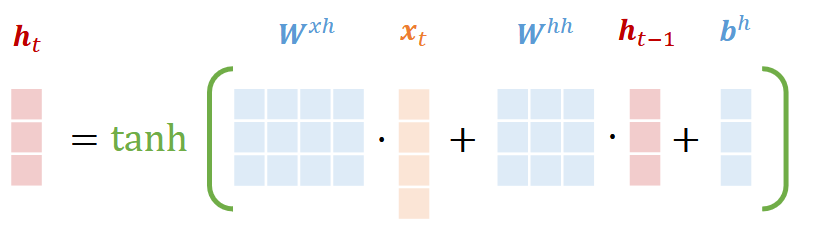
  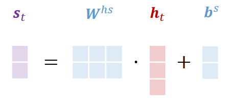
  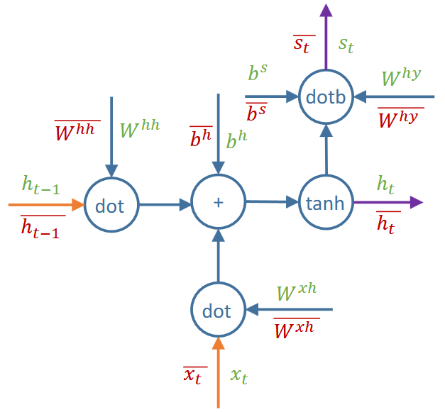

- RNN lze použít pro **modelování jazyka**, kde **každý vstup je one-hot encoding znaku** (nebo tokenu) a výstupem je **pravděpodobnostní rozdělení přes všechny znaky v abecedě**. Největší hodnota ve výstupu je vybrána jako nejpravděpodobnější následující znak v sekvenci.

- Celkový **gradient vůči maticím vah** se počítá jako **součet gradientů z jednotlivých časových kroků**:

  $$
  \overline{\boldsymbol{W}^{hs}} = \sum_{t=1}^T \overline{\boldsymbol{W}^{hs}}_t,
  $$

  kde $\overline{\boldsymbol{W}^{hs}}_t$ je gradient z kroku $t$ a $\overline{\boldsymbol{W}^{hs}}$ je celkový gradient.

  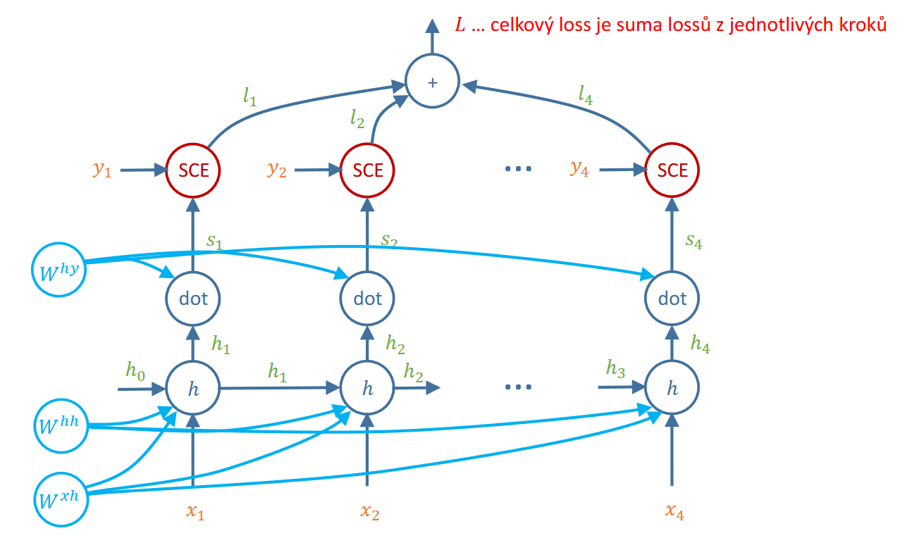

- Učení RNN probíhá pomocí algoritmu **BPTT** (Backpropagation Through Time). Princip spočívá v **rozvinutí rekurentní sítě v čase**;
  - **každý časový krok** se chová jako **samostatná vrstva v dopředné síti**
  - a **gradient se propaguje** zpět **přes všechny tyto vrstvy**, tedy přes celou sekvenci.

  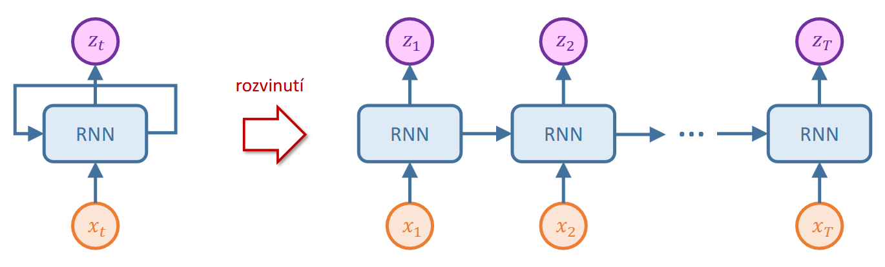

### LSTM

Základní RNN trpí **problémem mizejících nebo explodujících gradientů**.

- **LSTM** (Long Short Term Memory) zavádí hradlové systémy se sigmoidou pro řízení toku informace:
  - **input gate** $i_t$ řídí, jaké nové informace budou přidány do cell stavu (uloží se),
  - **forget gate** $f_t$ rozhoduje, které informace z předchozího cell stavu $c_{t-1}$ mají být zapomenuty,
  - **output gate** $o_t$ určuje, jaká část cell stavu bude vydána jako výstup $h_t$.

- LSTM má dvě stavové proměnné:
  - **cell stav** $c_t$ (cell state), který **nese informaci napříč časem**,
  - a **skrytý stav** $h_t$ (hidden state), který je **výstupem v daném kroku**.
- Matematicky je LSTM popsán následovně:

  $$
    \begin{align*}
    i_t &= \sigma(\boldsymbol{W}^{xi}\boldsymbol{x}_t+\boldsymbol{W}^{hi}\boldsymbol{h}_{t-1}) &&\text{input gate},\\
    f_t &= \sigma(\boldsymbol{W}^{xf}\boldsymbol{x}_t+\boldsymbol{W}^{hf}\boldsymbol{h}_{t-1}) &&\text{forget gate},\\
    o_t &= \sigma(\boldsymbol{W}^{xo}\boldsymbol{x}_t+\boldsymbol{W}^{ho}\boldsymbol{h}_{t-1}) &&\text{output gate},\\
    \tilde{c}_t &= \tanh(\boldsymbol{W}^{xc}\boldsymbol{x}_t+\boldsymbol{W}^{hc}\boldsymbol{h}_{t-1}) &&\text{kandidát na nový cell stav},\\
    c_t &= f_t \odot c_{t-1} + i_t \odot \tilde{c}_t &&\text{cell stav},\\
    h_t &= o_t \odot \tanh(c_t) &&\text{skrytý stav (výstup)}.
    \end{align*}
  $$

### GRU

**GRU** (Gated Recurrent Unit) je **zjednodušení LSTM**, protože má **pouze jednu stavovou proměnnou** $h_t$ (nemá samostatný cell stav $c_t$).

- **Místo tří bran používá dvě**:
  - **reset gate** $r_t$ určuje, **do jaké míry má být zapomenut předchozí stav** $h_{t-1}$ při výpočtu kandidáta na nový stav,
  - **update gate** $z_t$ rozhoduje o **nahrazení starého stavu novým** (zastupuje forget a input gate z LSTM).

- Matematicky je GRU definován jako:

  $$
  \begin{align*}
  z_t &= \sigma(\boldsymbol{W}^{xz}\boldsymbol{x}_t+\boldsymbol{W}^{hz}\boldsymbol{h}_{t-1}) &&\text{update gate},\\
  r_t &= \sigma(\boldsymbol{W}^{xr}\boldsymbol{x}_t+\boldsymbol{W}^{hr}\boldsymbol{h}_{t-1}) &&\text{reset gate},\\
  \tilde{h}_t &= \tanh(\boldsymbol{W}^{xh}\boldsymbol{x}_t+\boldsymbol{W}^{hh}(r_t \odot h_{t-1})) &&\text{kandidát na nový stav},\\
  h_t &= (1-z_t) \odot h_{t-1} + z_t \odot \tilde{h}_t &&\text{nový skrytý stav}.
  \end{align*}
  $$

- GRU má **méně parametrů než LSTM**,
  - což vede k **rychlejšímu trénování** a **menší náročnosti na paměť**,
  - při zachování **srovnatelné výkonnosti** na mnoha úlohách.

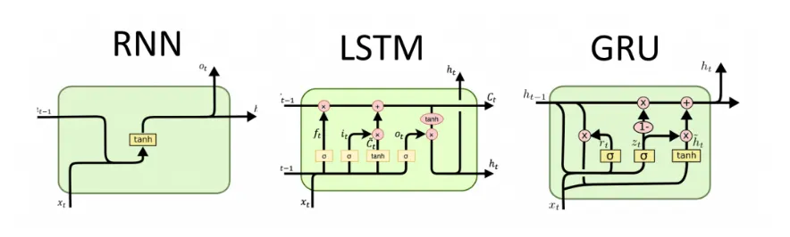

### CTC

**CTC** (Connectionist Temporal Classification) je metoda **umožňující trénování RNN na sekvenční data bez potřeby přesného zarovnání vstupu a výstupu**.

- Do RNN **posíláme vstup s konstantní frekvencí** (např. snímky spektrogramu v případě řeči).
- Síť v **každém časovém kroku** predikuje **pravděpodobnost pro každý znak abecedy** včetně speciálního prázdného symbolu $\epsilon$ (blank).
- Následným **sloučením opakujících se znaků** a **odstraněním $\epsilon$** získáme výslednou sekvenci, aniž bychom potřebovali předem vědět, kde přesně který znak začíná a končí.
- CTC je proto **hojně využívána v rozpoznávání řeči, OCR nebo např. při automatickém odezírání ze rtů**.

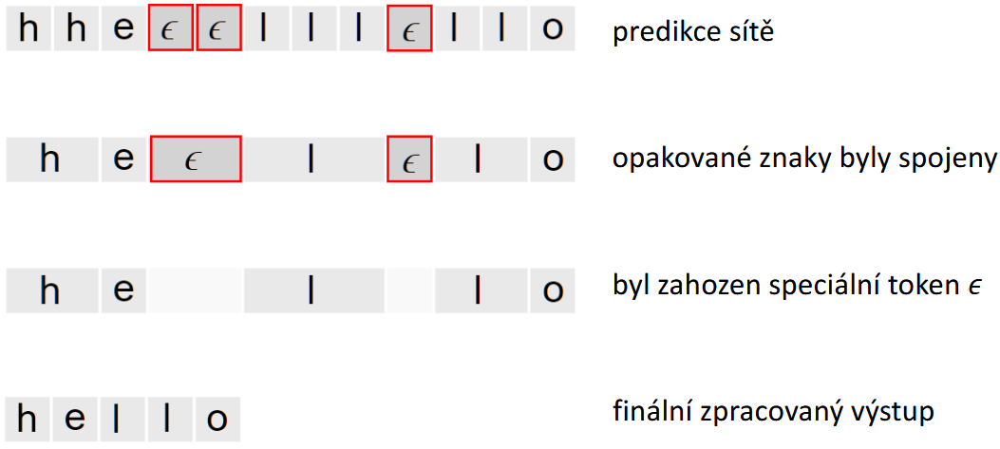


# Attention mechanismus v umělých neuronových sítích a jeho aplikace

## Různé metody zapojení RNN

Rekurentní neuronové sítě lze zapojit v **několika základních konfiguracích** podle **počtu vstupů a výstupů**.

- Každá konfigurace je vhodná pro jiný typ úlohy:
  - **RNN jazykový model bez učitele (M:M)**:
    - v každém okamžiku $t$ síť přijme symbol a ihned predikuje symbol následující,
      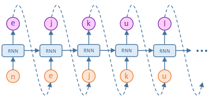
  - **Jazykový model s učitelem (M:M)**
    - v každém okamžiku $t$ síť přijme obraz/vektor a ihned predikuje následující,
    - např. OCR, rozpoznávání fonémů,
      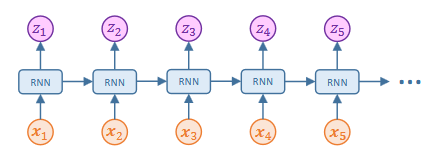
  - **Klasifikace textu (M:1)**
    - síť klasifikuje celý text do jedné z kategorií,
    - např. analýza sentimentu, klasifikace jazyka,
      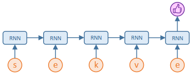
  - **Generování textu (1:M)**
    - síť převezme vektorový vstup pouze jednou a poté predikuje sekvenci znaků,
    - např. tagování obrázků (FC příznaky z FC vrstev z VGG),
      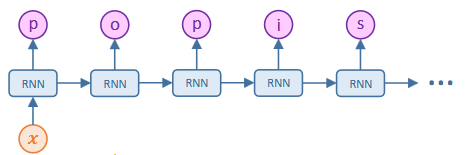
  - **Strojový překlad (M:N)**
    - síť převezme vstup, zakóduje ho a poté generuje překlad, který může mít jinou délku.
      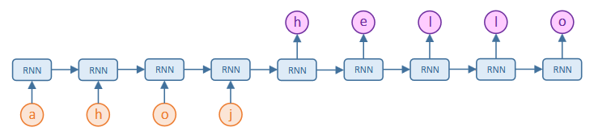

## Attention mechanismus

Základní RNN architektury enkodér-dekodér s jedním kontextovým vektorem trpí **problémem úzkého hrdla**, kdy musí být **vstupní věta zkomprimována do jediného vektoru**, vznikl proto tzv. **attention**.

- Problémy základních RNN:
  - **stavový vektor** $\boldsymbol{h}_t$ musí pojmout **informaci o celé větě**,
  - **embedding vektor** má vždy **stejnou dimenzi nezávisle na délce vstupu**,
  - u **dlouhých vět** dochází k **zapomínání počáteční informace**.
- **Attention mechanismus**, který zavádí:
  - **zapamatování všech skrytých stavů enkodéru**,
  - **dekodér** si v **každém kroku dynamicky vybírá**, **na které části vstupu se zaměřit**,
  - místo jednoho statického kontextového vektoru vzniká **v každém kroku nový, dynamický kontextový vektor** $\boldsymbol{c}_t$.

- **Dekodér** má **v každém svém kroku přístup ke všem skrytým stavům** enkodéru:
  - model se **sám učí**, na která slova **se má v daný moment soustředit**,
  - **zaniká problém** úzkého hrdla v podobě **fixního kontextového vektoru**.

### Rekurentní attention

**Rekurentní attention** pracuje tak, že **dekodér v každém kroku generuje attention vektor**, který se **skalárně násobí se skrytými stavy enkodéru**.

- Vektory $\boldsymbol{x}_t$ **vstupují do enkodéru**, který **generuje skryté stavy** $\boldsymbol{h}_t$:
  $$\boldsymbol{h}_t = \operatorname{RNN}_{\text{ENC}}(\boldsymbol{x}_t, \boldsymbol{h}_{t-1}).$$
- V dekodéru se poté pro každý krok $i$ provede:
  1. Výpočet **skóre**:
     $$s_{it} = \boldsymbol{a}_i^T\boldsymbol{h}_t,$$
  2. **Normalizace**:
     $$p_{it} = \operatorname{SOFTMAX}(s_{i1}, s_{i2}, \cdots, s_{in}),$$
  3. Výpočet **kontextového vektoru**:
     $$\boldsymbol{c}_i = \sum_{t=1}^n p_{it}\boldsymbol{h}_t,$$
  4. Výpočet **skrytého stavu**:

     $$
     \boldsymbol{g}_i = \begin{cases}
        \boldsymbol{h}_n & i=0\\
        \operatorname{RNN}_{\text{DEC}}(\boldsymbol{y}_{i-1}, \boldsymbol{g}_{i-1}, \boldsymbol{c}_i) & i>0
      \end{cases}
     $$

  5. Z každého kroku jsou **3 výstupy**:
  - **nový skrytý stav** $\boldsymbol{g}_i$,
  - **vektor skóre slov** (predikce tokenu $\boldsymbol{y}_i$),
  - **nový attention vektor** $\boldsymbol{a}_{i+1} = \boldsymbol{W}^A\boldsymbol{g}_i.$

## Transformer architektura

**Transformer**, představený v práci _"Attention is all you need"_, je architektura, která se spoléhá **výhradně na attention mechanismus bez rekurentních spojení**.

- Mezi **hlavní vlastnosti** patří to, že
  - se **všechna slova zpracovávají současně** v maticových operacích,
  - díky **paralelizaci lze efektivně využívat GPU**,
  - díky **kratším cestám mezi závislými slovy** lze naučit i **dlouhé závislosti**.

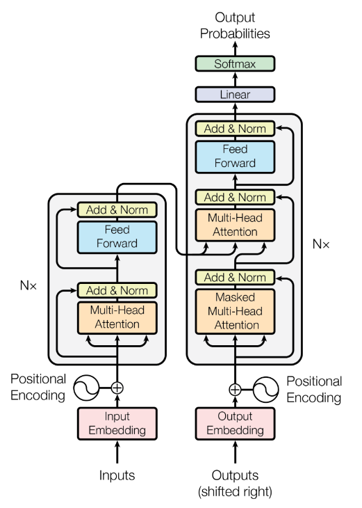

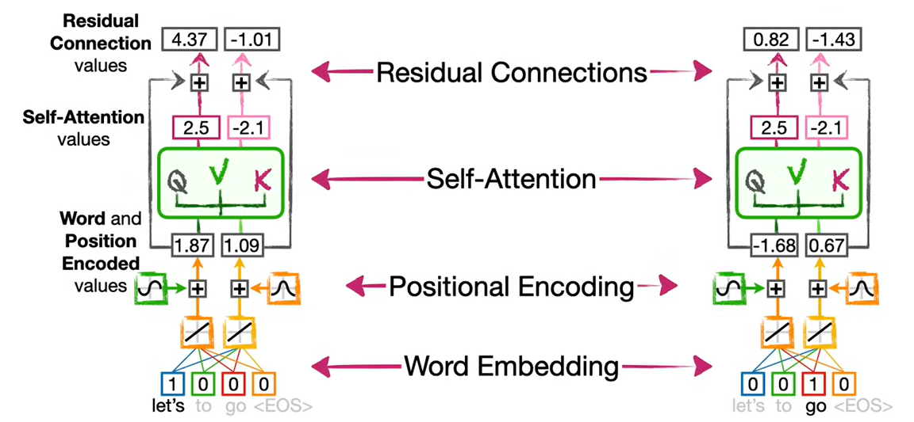

### Self-attention (Transformer)

**Každé slovo ve větě** si hledá **kontext u ostatních slov**, sekvence se dívá **sama na sebe**.

- **Ze vstupu** $\boldsymbol{x}_t$ se ve směru dopředné propagace **odvodí tři vektory**:
  - **query**: $\boldsymbol{q}_t = \boldsymbol{W}^Q\boldsymbol{x}_t$ (co hledám), maticově $\boldsymbol{Q} = \boldsymbol{X}\boldsymbol{W}^Q$,
  - **key**: $\boldsymbol{k}_t = \boldsymbol{W}^K\boldsymbol{x}_t$ (co nabízím), maticově $\boldsymbol{K} = \boldsymbol{X}\boldsymbol{W}^K$,
  - **value**: $\boldsymbol{v}_t = \boldsymbol{W}^V\boldsymbol{x}_t$ (co znamenám), maticově $\boldsymbol{V} = \boldsymbol{X}\boldsymbol{W}^V$.
- **skóre attention**: $\boldsymbol{s}_t = \boldsymbol{q}_t^T\begin{bmatrix}\boldsymbol{k}_1&\cdots&\boldsymbol{k}_t\end{bmatrix}$
- **váhy po softmaxu** se škálováním: $\boldsymbol{p}_t = \operatorname{SOFTMAX}\left(\frac{\boldsymbol{s}_t}{\sqrt{d_k}}\right)$,
- **výstupní embedding**: $\boldsymbol{y}_t = \begin{bmatrix}\boldsymbol{v}_1&\cdots&\boldsymbol{v}_t\end{bmatrix}\boldsymbol{p}_t^T$.

**Pro celou sekvenci** najednou v maticové podobě:

$$
\boldsymbol{Y} = \operatorname{SOFTMAX}\left(\frac{\boldsymbol{Q}\boldsymbol{K}^T}{\sqrt{d_k}}\right)\boldsymbol{V},\\
\boldsymbol{Q}\in\mathbb{R}^{n\times d_k},
\boldsymbol{K}\in\mathbb{R}^{n\times d_k},
\boldsymbol{V}\in\mathbb{R}^{n\times d_v} \rightarrow \boldsymbol{Y}\in\mathbb{R}^{n\times d_v}.
$$

### Multi-head attention

**Místo jedné** attention se používá **více paralelních hlav** (v originálním paperu 8), z nichž **každá se učí** sledovat **jiný typ** vztahů.

- $\boldsymbol{Q}, \boldsymbol{K}, \boldsymbol{V}$ matice se rozdělí do $H$ samostatných hlav.
- **Každá hlava počítá vlastní** attention: $\boldsymbol{Y}^h = \operatorname{ATTENTION}(\boldsymbol{Q}^h, \boldsymbol{K}^h, \boldsymbol{V}^h)$.
- **Výstupy hlav se zřetězí** a lineárně transformují:

  $$
  \begin{align*}
  h_i &= \operatorname{ATTENTION}(\boldsymbol{Q}\boldsymbol{W}_i^Q,\boldsymbol{K}\boldsymbol{W}_i^K,\boldsymbol{V}\boldsymbol{W}_i^V)\\
  &= \operatorname{SOFTMAX}\left(\frac{\boldsymbol{Q}\boldsymbol{W}_i^Q(\boldsymbol{K}\boldsymbol{W}_i^K)^T}{\sqrt{d_k}}\right)\boldsymbol{V}\boldsymbol{W}_i^V\\
  \operatorname{MULTIHEAD}(\boldsymbol{Q},\boldsymbol{K},\boldsymbol{V}) &= \operatorname{CONCAT}(h_1,\dots,h_H)\boldsymbol{W}^O
  \end{align*}\\
  \operatorname{CONCAT}(h_1,\dots,h_H)\in\mathbb{R}^{n\times Hd_v},\;\boldsymbol{W}^O\in\mathbb{R}^{Hd_v\times d_\text{model}},\\\operatorname{MULTIHEAD}(\boldsymbol{Q},\boldsymbol{K},\boldsymbol{V})\in\mathbb{R}^{n\times d_\text{model}}.
  $$

  kde $\boldsymbol{W}^O$ je **lineární transformace** z výstupu hlav.

- **Každá hlava se specializuje** na jiný typ sémantických vztahů (např. gramatické vazby, vzdálené reference, lokální kontext).

### Positional encoding

**Attention** mechanismus **nemá přirozenou představu o pořadí slov**, proto se **před vstupem přidávají informace o pozici**.

- K embeddingům vstupních tokenů se přičítá **poziční kódování**, které má podobu sinusovek a kosinusovek o různých frekvencích.

### Masked attention

Při generování textu nesmí model "koukat dopředu" na budoucí tokeny.

- V **inferenci** attention **přirozeně vidí pouze** již **vygenerované tokeny**.
- **Během trénování** jsou ale **známé všechny tokeny**, takže **model by tedy mohl podvádět**.
- **Maskováním se při trénování váhy budoucích tokenů před softmaxem** nastaví na $-\infty$, což **po softmaxu dá $0$**:

  $$
  \begin{align*}
    \boldsymbol{Q}\boldsymbol{K}^T=
    \begin{bmatrix}
      s_{11} & s_{12} & s_{13} & \cdots & s_{1n}\\
      s_{21} & s_{22} & s_{23} & \cdots & s_{2n}\\
      s_{31} & s_{32} & s_{33} & \cdots & s_{3n}\\
      \vdots & \vdots & \vdots & \ddots & \vdots\\
      s_{n1} & s_{n2} & s_{n3} & \cdots & s_{nn}
    \end{bmatrix}\\
    \text{masking}\quad\Downarrow\\
    \begin{bmatrix}
      s_{11} & -\infty & -\infty & \cdots & -\infty\\
      s_{21} & s_{22} & -\infty & \cdots & -\infty\\
      s_{31} & s_{32} & s_{33} & \cdots & -\infty\\
      \vdots & \vdots & \vdots & \ddots & \vdots\\
      s_{n1} & s_{n2} & s_{n3} & \cdots & s_{nn}
    \end{bmatrix}\\
    \text{softmax po řádcích}\quad\Downarrow\\
    \begin{bmatrix}
      p_{11} & 0 & 0 & \cdots & 0\\
      p_{21} & p_{22} & 0 & \cdots & 0\\
      p_{31} & p_{32} & p_{33} & \cdots & 0\\
      \vdots & \vdots & \vdots & \ddots & \vdots\\
      p_{n1} & p_{n2} & p_{n3} & \cdots & p_{nn}
    \end{bmatrix}
  \end{align*}
  $$

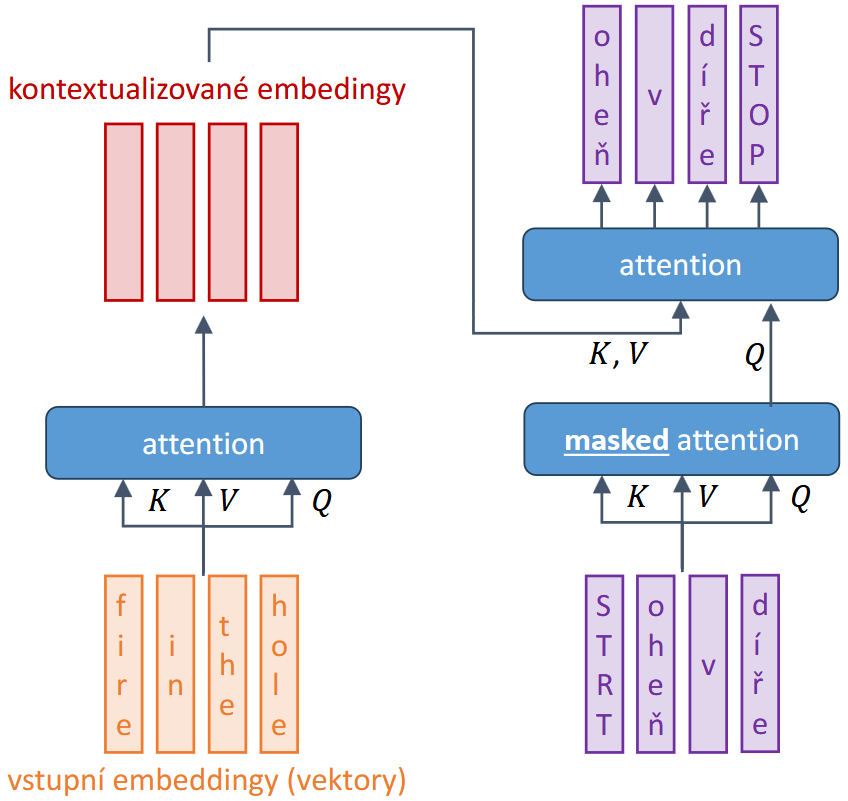

### Využití Transformeru

Transformer architektura je **základem moderních jazykových modelů**.

- **Strojový překlad (encoder-decoder)**:
  - **Enkodér vygeneruje paralelně** $T$ vektorů z $T$ vstupních vektorů.
  - **Dekodér generuje sekvenčně** $M$ výstupních vektorů.
  - **Výstupem je pravděpodobnostní rozdělení** přes všechna slova ve slovníku.
  - **Generování končí** speciálním `EOS` (End of Sequence) tokenem.
  - **Při trénování** se **minimalizuje cross-entropy** pro výstupní pravděpodobnosti.

- **GPT** (Generative Pre-trained Transformer):
  - Používá **pouze dekodér Transformeru s masked attention**.
  - $i$-té slovo výstupu závisí pouze na $(1,\dots,i-1)$-tém vstupu.
  - **Předtrénován jako jazykový model** (predikce příštího tokenu).
  - Poté **přizpůsoben na cílovou úlohu** (fine-tuning).

- **BERT** (Bidirectional Encoder Representations from Transformers):
  - Používá **enkodér Transformeru**.
  - Umí využívat **závislosti z obou směrů** (bidirectional).
  - Předtrénován s **maskovaným jazykovým modelováním** (predikce zamaskovaných slov).
  - Má různé variace jako **RoBERTa**, **ALBERT**, **ELECTRA**, **DistilBERT**, ...

- **DETR** (Detection Transformer):
  - **Enkodér** zpracovává **příznaky z CNN**.
  - **Dekodér** dostane **sadu naučených objektových queries** a přes cross-attention se **dotazuje na příznaky z enkodéru**.
  - Výstupem **pro každé query je třída a bounding box**.


# Vektorová reprezentace slov a její aplikace, Word2Vec a GloVe

## Vektorová reprezentace slov

Vektorová reprezentace slov (word embeddings) **řeší problém vysoké dimenze** a **nulové sémantické provázanosti** one-hot encodingu.

- **Mapuje slova ze slovníku** o velikosti $V$ **do spojitého vektorového prostoru nízké dimenze** $N$ ($N \ll V$), přičemž zachovává sémantické a syntaktické vztahy.

## Word2Vec

**Word2Vec** je jedna z metod **vektorové reprezentace textu**, která vznikla z práce Tomáše Mikolova.

- Je to **neuronová síť** s **jednou skrytou vrstvou**, která na **vstup bere one-hot vektory slov**.

- Vektory významově **podobných slov tvoří shluky**, např.

$$v(\text{king}) - v(\text{man}) + v(\text{woman}) \approx v(\text{queen}).$$

- Jsou možné dva algoritmy:

|                    | CBOW                                                                                                                                                        | Skip-gram                                                                                                                                                           |
| ------------------ | ----------------------------------------------------------------------------------------------------------------------------------------------------------- | ------------------------------------------------------------------------------------------------------------------------------------------------------------------- |
| maximalizace       | cílového slova z okolí                                                                                                                                      | okolních slov z cílového slova                                                                                                                                      |
| např. okolí 2      | $P(w_i \vert w_{i-2}, \boldsymbol{W}) + P(w_i \vert w_{i-1}, \boldsymbol{W}) + P(w_i \vert w_{i+1}, \boldsymbol{W}) + P(w_i \vert w_{i+2}, \boldsymbol{W})$ | $P(w_{i-2}  \vert  w_i, \boldsymbol{W}) + P(w_{i-1}  \vert  w_i, \boldsymbol{W}) + P(w_{i+1}  \vert  w_i, \boldsymbol{W}) + P(w_{i+2}  \vert  w_i, \boldsymbol{W})$ |
| obvyklé okolí      | 5                                                                                                                                                           | 10                                                                                                                                                                  |
| rychlost           | rychlejší                                                                                                                                                   | pomalejší                                                                                                                                                           |
| lepší pro          | četná slova                                                                                                                                                 | méně častá slova                                                                                                                                                    |
| $\boldsymbol{x}$   | $(\boldsymbol{x}_{i-s},\dots,\boldsymbol{x}_{i+s}) \in \mathbb{R}^{C\times V}$                                                                              | $\boldsymbol{x}_i \in \mathbb{R}^{1\times V}$                                                                                                                       |
| $\boldsymbol{W}_1$ | $\boldsymbol{W}_1 \in \mathbb{R}^{V\times N}$                                                                                                               | $\boldsymbol{W}_1 \in \mathbb{R}^{V\times N}$                                                                                                                       |
| $\boldsymbol{h}$   | $\boldsymbol{h} = \frac{1}{2s}\sum_{k=-s, k\neq 0}^{+s}\boldsymbol{x}_{i+k}\boldsymbol{W}_1$                                                                | $\boldsymbol{h} = \boldsymbol{x}_i\boldsymbol{W}_1\in\mathbb{R}^{1\times N}$                                                                                        |
| $\boldsymbol{W}_2$ | $\boldsymbol{W}_2 \in \mathbb{R}^{N\times V}$                                                                                                               | $\boldsymbol{W}_2 \in \mathbb{R}^{N\times V}$                                                                                                                       |
| $\boldsymbol{y}$   | $\boldsymbol{y}_i = \operatorname{SOFTMAX}(\boldsymbol{h}\boldsymbol{W}_2)\in\mathbb{R}^{1\times V}$                                                        | $\boldsymbol{y}_{i+k} = \operatorname{SOFTMAX}(\boldsymbol{h}\boldsymbol{W}_2),\; k\in\{-s,\dots,+s\}$                                                              |
| loss               | cross-entropie mezi $\boldsymbol{y}$ a one-hot vektorem cílového slova                                                                                      | součet cross-entropií pro každé okolní slovo                                                                                                                        |

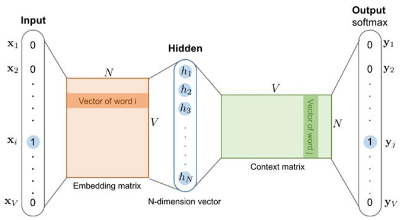

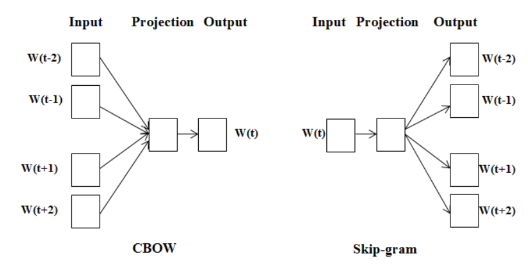

- Typicky se **trénuje pouze** $\boldsymbol{W}_1$, kam se kódují sémantické vztahy, tj. $\boldsymbol{W}_2$ se **po natrénování zahodí**.

## Negative sampling

**Negative sampling** umožňuje **pro každý vzorek modifikovat pouze malou část vah**.

- Negative sampling problém reformuluje takto:
  - **Místo klasifikace 1 z $V$ použijeme $V$ binárních klasifikací**.
  - **Zjednodušení binárního klasifikátoru** tím, že se kromě slova v okolí cílového **vybere i několik náhodně vybraných slov**, které v okolí nejsou.
    - **Chyba** se propaguje **pro jedno slovo z okolí a $K$ slov mimo okolí**.

## GloVe

**GloVe** (Global Vector for Word Representation) **kombinuje výhody** přístupů Word2Vec, který pracuje s lokálním kontextem, a **LSA**, který pracuje s globální maticí výskytů.

- Oproti Word2Vec navíc počítá **společné výskyty slov** v prvním kroku (jelikož **Word2Vec nepřímo modeluje společný výskyt slov**):
  1. **okénkem**, tedy výběrem $n$ slov okolo cílového slova,
  2. nebo **dokumentem**, tedy počítáním v celém dokumentu (LSA).

- **Problémem** je **zvětšování matice s velikostí slovníku** (matice s velkým množstvím nul) a často se vyskytující slova.
  - Tyto problémy jsou řešitelné např. pomocí:
    - **SVD** (Singular Value Decomposition) pro redukci dimenze.
    - **Omezení společného výskytu na max. hodnotu**: `min(100, count(w1, w2))`.
    - **Redukce** počtu **do jednotkového rozsahu**.


# Metody učení bez učitele, shlukování - algoritmus K-means a LGB, hierarchické shlukování

Mezi metody učení bez učitele se počítají např. **shlukovací algoritmy**, **algoritmy redukce dimenzí** (např. PCA) nebo **autoenkodéry** (které slouží také hlavně k redukci dimenzí).

## Nehierarchické shlukování


### K-means

Metoda **K-means** je metoda **nehierarchického shlukování**, přičemž jako u jiných metod shlukování se bere v potaz hlavně **vnitřní kompaktnost shluků stejné třídy** a **vzájemná izolace shluků jiných tříd**.

- Hledá **optimální rozklad** na $K$ shluků, přičemž
  - **reprezentace** každého $j$-tého **shluku** je reprezentována **centroidem** $\mu_j$
  - a **minimalizuje se součet všech vzdáleností**: $\min(\sum_{i=1}^k \sum_{x\in S_i} ||\boldsymbol{x}- \mu_i||^2)$.

- Je to **iterační algoritmus**:
  1. **Zvolíme $K$ prvků** jako **prvotní odhady** centroidů.
  2. **Zařadíme každý prvek** do jedné z $K$ skupin **na základě nejmenší vzdálenosti k centroidu**.
  3. Spočítáme **nové centroidy**: $\mu_j = \frac{1}{|S_j|}\sum_{x\in S_j}x_i$.
  4. **Vyhodnotíme $J$ kritérium**.
  5. **Opakuj** krok 2.

- Má **výpočetní náročnost** $O(T\cdot K\cdot N)$, kde $T$ jsou iterace, $K$ jsou shluky a $N$ jsou data.

- Má nevýhody, že:
  - **není zajištěno** $\min_{\text{abs.}}(J)$,
  - je **náchylný na iniciaci** počátečních odhadů,
  - je **náchylný na outliery**,
  - **není vhodný pro všechny typy dat** (ale např. na elipsoidy ano).


#### LBG

Algoritmus **LBG** (Linde, Buzo, Gray) řeší **lepší inicializaci centroidů** K-means.

- Je to **dvounásobný iterační algoritmus**:
  1. **Inicializujeme centroid** s $K=1$,
  2. **Rozdělíme** $K_t = 2K_{t-1}$,
  3. Najdeme **centroidy** a **určíme** hodnotu $J$,
  4. **Ukončíme při dosažení cílové hodnoty** $K$ nebo **konvergence** $J$, jinak opakujeme krok 2.

### DBSCAN

Metoda **DBSCAN** (Density-Based Spatial Clustering Algorithm) je **neiterativní metoda** založená na základě **hustoty dat**.

- **Shluk** je definován jako **maximální množina hustě spojených bodů**.
- Oproti K-means to není iterační algoritmus a **umožňuje shluky jakéhokoliv tvaru**.

- Má 2 parametry:
  - $\epsilon$: **radius** okolo bodu,
  - $\operatorname{minPts}$: **minimální počet sousedních bodů**, které jsou potřeba, **aby byl bod přiřazen do shluku**.

- Definujeme **3 typy bodů**:
  1. **core bod**
     - $|N_{\epsilon}(p)| \geq \operatorname{minPts}$,
  2. **border bod**
     - leží v okolí $\epsilon$-okolí core bodu, ale sám jím není,
     - $|N_{\epsilon}(p)| < \operatorname{minPts}$,
  3. **outlier bod**
     - nenáleží do clusteru.

  

- **Do shluku core bodu** $q$ **přiřadíme** bod $p$ na základě **tří kritérií**:
  1. **přímo dosažitelné**
     - $p\in N_{\epsilon}(q)$,
     - $|N_{\epsilon}(q)| \geq \operatorname{minPts}$,
  2. **nepřímo dosažitelné**
     - **existuje řetězec bodů** $(p_1 = p,\dots,p_n = q)$ a **každý $p_{i+1}$ je přímo dosažitelný** z $p_i$,
  3. **propojitelné**
     - **body $p$ a $q$ jsou propojené**, pokud exi**stuje bod** $o$, **ze kterého jsou $p$ a $q$ nepřímo dosažitelné**.


## Hierarchické shlukování

**Hierarchické shlukování** hledá **strukturu v datech pomocí hierarchie**.

- Jednotlivé **kroky lze vizualizovat pomocí dendrogramu**, který reflektuje míru podobnosti jednotlivých shluků.
- Může být **aglomerativní** (sloučíme dva nejbližší shluky) nebo **divizní** (rozděláme podle heuristiky, např. bisecting K-means).
- **Nevýhoda zafixování** dat již **jednou zařazených** do shluku.


# Číselné soustavy a převody mezi nimi. Způsoby kódování čísel s pevnou a s pohyblivou řádovou tečkou. Kódování záporných čísel

**Číselné soustavy** jsou **způsoby reprezentace čísel pomocí symbolů** (číslic) a pravidel pro jejich kombinování, přičemž **každá soustava má svůj základ** (tzv. **radix/báze**) určující **počet různých číslic** a **váhový polynom** pro vyjádření hodnoty.

## Číselná soustava

- **Hodnota čísla** v libovolné číselné soustavě se vyjadřuje **pomocí polynomu**:

  $$F(Z) = \sum_{i=0}^{m-1} a_iZ^i,$$
  kde
  - $Z$ je **základ soustavy**,
  - $m$ je **počet řádových míst**
  - a $a_i$ jsou **koeficienty** (číslice) na **jednotlivých pozicích**,
  - např. $143,25_{10} = 1 \cdot 10^2 + 4 \cdot 10^1 + 3 \cdot 10^0 + 2 \cdot 10^{-1} + 5 \cdot 10^{-2}$.

- **MSB** (Most Significant Bit) je **nejvyšší bit s největší váhou** ($\boldsymbol{0}111$),
  - **Big Endian**: uložení **MSB na nejnižší** paměťové adrese.
- **LSB** (Least Significant Bit) je **nejnižší bit s nejmenší váhou** ($011\boldsymbol{1}$),
  - **Little Endian**: uložení **LSB na nejnižší** paměťové adrese.

### Převod mezi soustavami

Pro převod čísel mezi soustavami se používají následující metody:

- **dosazením do polynomu $F(Z)$** pro převod **z menší soustavy do větší**, např.

  $$
  	\begin{align*}
  		1101,1_2 &= 1\cdot2^3 + 1\cdot2^2 + 0\cdot2^1 + 1\cdot2^0 + 1\cdot2^{-1}\\
  		&= 8 + 4 + 0 + 1 + 0,5 = 13,5_{10},
  	\end{align*}
  $$

- **dělením** pro převod **z větší soustavy do menší**, např. pro $25,256_{10}$:
  - **celá část** se převádí **postupným dělením**:

    $$
    	\begin{rcases}
    		\frac{25}{2} &= 12\;(1)\\
    		\frac{12}{2} &= 6 \;(1)\\
    		\frac{6}{2} &= 3\;(0)\\
    		\frac{3}{2} &=1\;(0)\\
    		\frac{1}{2} &=0\;(1)
    	\end{rcases}
    	10011_2,
    $$

  - **desetinná část** se poté převádí **postupným násobením**:

    $$
    \begin{rcases}
    	0,256\cdot2 &= 0,512\\
    	0,512\cdot2 &= 1,024\\
    	0,024\cdot2 &= 0,048\\
    	0,048\cdot2 &= 0,096\\
    	0,096\cdot2 &= 0,192\\
    	0,192\cdot2 &= 0,384\\
    	0,384\cdot2 &= 0,768\\
    	0,768\cdot2 &= 1,536\\
    	\dots
    \end{rcases}01000001\dots_2,
    $$

  - celkem tedy $25,256_{10} \approx 11001,01000001_2$,

- **seskupováním bitů**, jedná-li se o **radixy se stejným základem mocniny** (např. $2, 2^2, 2^3, \dots$), lze převody **provádět pouhým seskupováním bitů** směrem od řádové tečky:
  - např. **binární na hexadecimální**: **rozdělení bitů do čtveřic** a každou čtveřici **nahradit hexadecimální cifrou**, např.
    $$
    \underbrace{1101}_{\text{D}_{16}}\;\underbrace{1011}_{\text{B}_{16}} = \text{DB}_{16},
    $$
  - např. **hexadecimální na binární**: každou **hex cifru** vyjádřit pomocí **4bitového binárního čísla**, např.
    $$
    \text{67}_{16} = \underbrace{0110}_{\text{6}_{16}} \;\underbrace{0111}_{\text{7}_{16}}.
    $$

## Kódování čísel s řádovou tečkou

### S pevnou řádovou tečkou

Kódování s **pevnou řádovou tečkou** má pozici **oddělovače implicitně pevně stanovenou**.

- **Tečka** za celým číslem se **pomyslně nachází za LSB**.
- U **zlomku** má bit na pozici $i$ hodnotu $2^{-i}$.
- V praxi se používá **u jednodušších mikrokontrolérů** jako 8b Arduino.

### S plovoucí řádovou tečkou

Čísla s **plovoucí řádovou tečkou** vycházejí z **vědecké notace**.

- Zapisují se ve tvaru
  $$x = (-1)^s \cdot (1+f)\cdot 2^{e-\text{bias}},$$
  kde:
  - $s$ je **znaménko**,
  - $(1+f)$ je **mantisa** (např. $1,23$),
  - a $e-\text{bias}$ je **exponent**.

- Definované formáty **IEEE 754**:
  - **single precision (32b float)**:
    - 1b **znaménko**,
    - 8b **exponent** (bias = 127),
    - 23b **mantisa**,
  - **double precision (64b double)**:
    - 1b **znaménko**,
    - 11b **exponent** (bias = 1023),
    - 52b **mantisa**,
  - přičemž **normální číslo** v IEEE 754 **předpokládá implicitní jedničku před desetinnou tečkou** (tedy normalizaci na rozsah $f\in[0,\;1)$)
    - u **velmi malých čísel** se **aplikuje norma** $e = 0 \rightarrow x = (-1)^s \cdot (0+f) \cdot 2^{1-\text{bias}}$, díky které vznikají tzv. **denormální čísla**.

- Speciální hodnoty:

  | $s$ | $e$       | $f$       | význam             |
  | --- | --------- | --------- | ------------------ |
  | $0$ | $0\dots0$ | $0\dots0$ | $+0$               |
  | $1$ | $0\dots0$ | $0\dots0$ | $-0$               |
  | $1$ | $0\dots0$ | $\neq 0$  | $-\text{Denormal}$ |
  | $0$ | $0\dots0$ | $\neq 0$  | $+\text{Denormal}$ |
  | $0$ | $1\dots1$ | $0\dots0$ | $+\infty$          |
  | $1$ | $1\dots1$ | $0\dots0$ | $-\infty$          |
  | $0$ | $1\dots1$ | $\neq 0$  | $\text{NaN}$       |
  | $1$ | $1\dots1$ | $\neq 0$  | $\text{NaN}$       |

- **Pro práci** s plovoucí řádovou tečkou je potřeba **FPU** (Floating Point Unit)
  - operace jako **sčítání** vyžadují **nejdříve srovnání exponentů denormalizací**, **sečtení mantis** a následnou **opětovnou normalizaci**, což přináší zaokrouhlovací chyby.

## Kódování záporných čísel

Pro **kódování záporných čísel** se používají následující metody:

- **vyhrazení znaménkového bitu** (většinou MSB)
  - pro **sčítání** a **odčítání** potřeba **dva odlišné algoritmy**,
  - dvě reprezentace čísla nula (kladná a záporná),

- **přičtení konstanty**
  - **posun nuly přičtením** vhodné **konstanty** ke každému číslu,
    - např. $0_{10}\rightarrow128_2$ pro čísla v rozsahu $[-128, 127]$,
  - např. $-128_{10}\rightarrow(128-128)_2, 5_{10}\rightarrow(128+5)_2$,
  - používá se pro ukládání exponentu u plovoucí čárky,

- **dvojkový doplněk** (inverze zvětšená o jedničku):
  - **odčítání** se provádí **jako sčítání** $A + (-B)$,
    - např.

      $$
      \begin{align*}
      5_{10} + (-5)_{10} &= 0_{10}\\

      0101_{2} + 1011_{2} &= \cancel{1}0000_{2},\\
      \end{align*}
      $$

  - **nejčastější** v praxi.


# Jazyk C: základní datové typy a strukturovaný datový typ. Pole a ukazatele, dynamická alokace paměti

## Jazyk C

Jazyk C vznikl **počátkem 70. let** Dennisem Ritchiem.

- Jazyk nízké úrovně.
- **Pracuje přímo pouze se standardními datovými typy**.
- Přímo **neumožňuje práci s řetězci**, **poli** a nemá I/O nástroje (pouze skrze `stdio.h`).
- **Kompilovaný**, **imperativní**, **strukturovaný** jazyk se **statickou typovou kontrolou**.

## Datové typy v C

- Povolené datové typy v C jsou:

  | Typ             | Velikost | Rozsah (signed)                             |
  | --------------- | -------- | ------------------------------------------- |
  | `char`          | 1 B      | $[-128, 127]$                               |
  | `short int`     | 2 B      | $[-32768, 32767]$                           |
  | `int`           | 4 B      | $[-2147483648, 2147483647]$                 |
  | `long int`      | 4–8 B    | závisí na platformě                         |
  | `long long int` | 8 B      | $[-2^{63}, 2^{63}-1]$                       |
  | `float`         | 4 B      | $[\pm 3{,}4 \times 10^{38}]$, 7 des. míst   |
  | `double`        | 8 B      | $[\pm 1{,}7 \times 10^{308}]$, 15 des. míst |
  | `long double`   | 10–16 B  | závisí na platformě                         |
  | `_Bool`         | 1 B      | $\{0, 1\}$                                  |
  | `void`          | —        | žádná hodnota                               |

  přičemž u všech typů mimo `float`, `double`, `long double` a `void` je možná i `unsigned` forma.

- **Datová konverze** probíhá dvěma způsoby:
  - **implicitně**:
    - **před vykonáním operace** se operandy **konvertují**,
    - uplatňuje se tzv. **integer promotion**, tj. typy menších velikostí (`char`, `short`) se **automaticky povýší** na `int`,
    - pokud mají **dva operandy různé typy**, operand s nižší prioritou se **přetypuje na typ s vyšší prioritou** (nejnižší prioritu má `int`), např.

    ```c
          char c; int i; double d;
          i = d * c;
          // char c → int → double
          // double (d * c) → int i
    ```

  - **explicitně**, např. `(int) a`.

## Strukturované datové typy

### Pole

- **Statická pole** se inicializují pomocí syntaxe:

```c
  int pint[10] = {1, 2, 3, 4, 5, 6, 7, 8, 9, 10};
  int* p_int = pint;
```

přičemž `pint` i `p_int` **jsou pointery**, ale `pint` **nelze měnit** (ukazuje vždy na začátek pole).

- **Dynamická pole** se **alokují** pomocí `malloc()`:

```c
  int n = 4;
  int* p_int;
  p_int = (int*) malloc(n * sizeof(int));
```

**Přístup k prvkům** je pak **ekvivalentní** oběma notacemi:

```c
  p_int[0] == *(p_int + 0);
  p_int[1] == *(p_int + 1);
```

### Ukazatele

Neboli **pointery** ukazují na **místo v paměti počítače**, kde je **uložena příslušná hodnota**.

```c
hodnoty        | [25] → [96]
symbol. adresy | p_x    *p_x
abs. adresy    | 0x222  25
```

Tj. `p_x` **leží** na adrese `0x222` a **obsahuje hodnotu** `25` (adresu, na kterou ukazuje). Na adrese `25` je pak **uložena** hodnota `96`, **přístupná** jako `*p_x`.

- Pokud je třeba **získat adresu proměnné**, používá se **ampersand** `&`:

```c
  int* p_i;
  int i = 10;
  p_i = &i;
```

- Možná je i **konverze pointerů**, ale **snažíme se jí vyvarovat**:

```c
  char* p_c; int* p_i;
  p_c = (char*) p_i;
```

- **Každý pointer se implicitně konvertuje** na `void*`, lze proto mít **pointer na neurčitý typ**:

```c
  int i; float f;
  void* p_v = &i;
  *(int*) p_v = 2;
  p_v = &f;
  *(float*) p_v = 3.14;
```

- **Pointery nelze sčítat**, pouze odečítat; lze ale **sečíst pointer a celé číslo**.

## Alokace paměti

V jazyce C jsou dvě možnosti **alokace paměti**: **statická** a **dynamická**.

- **Statickou alokaci** lze použít, pokud **předem známe paměťové nároky** programu:
  - překladač **alokuje paměť do stacku** při spuštění programu,
  - **uvolňuje se automaticky** na konci bloku.

### Dynamická alokace

- Paměť se **vymezuje v heapu**.
- Paměť **nemá symbolickou adresu**; **přistupuje** se k ní **pomocí pointeru**.
- Provádí se pomocí `malloc()` z `stdlib.h`:
  - parametr typu `size_t` **udává počet bajtů k alokaci** za běhu programu,
  - **vrací pointer** typu `void*`.
- **Lze měnit** pomocí `realloc()`.
- **Uvolňování paměti** se provádí pomocí `free()` (s nutností nastavení na `NULL`):

```c
  free(p);
  p = NULL;
```


# Algoritmy pro vyhledávání a řazení, složitost algoritmů

## Algoritmus

Algoritmus je **přesný návod nebo postup**, který popisuje **sérii kroků nutných k vyřešení určitého problému** nebo **dosažení konkrétního cíle**.

### Algoritmická složitost

Každému algoritmu **můžeme přiřadit funkci asymptotická složitost**, která **určuje počet operací algoritmu** v závislosti na **rostoucím rozsahu dat**.

- Asymptotická složitost se zapisuje pomocí tzv. **notace velké O**:

  $$
  \mathcal{O}(f(n))\\
  \mathcal{O}(1)<\mathcal{O}(\log n)<\mathcal{O}(\sqrt{n})\\<\mathcal{O}(n)<\mathcal{O}(n\log n)<\mathcal{O}(n^c)<\mathcal{O}(c^n),
  $$
  - **Řád růstu** je **nejjednodušší funkce**, pro kterou platí, že je $f$ **asymptoticky ohraničená** funkcí $g$ **z obou stran**, tedy např. $3n^2 + 5n \rightarrow \mathcal{O}(n^2)$.
  - Může mít **více variant**, např. pokud je **pole již (skoro) seřazené**, u některých algoritmů **může být složitost výrazně menší**.

- **Amortizovaná složitost** pak určuje **průměrné náklady na operaci přes posloupnost operací**,
  - kdy **jednotlivá operace může být nákladná**, ale **průměr vychází nízko**.

### Řadící algoritmy

Řadící algoritmy používáme pro **řazení prvků v poli** na základě **určitého kritéria**.

- Máme různé možnosti řazení:
  - **Bubble Sort**
    - je **nejjednodušší** algoritmus,
    - projíždí **sousedící dvojice** a **prohazuje je, pokud jsou ve špatném pořadí**,
    - $\mathcal{O}(n^2)$,
      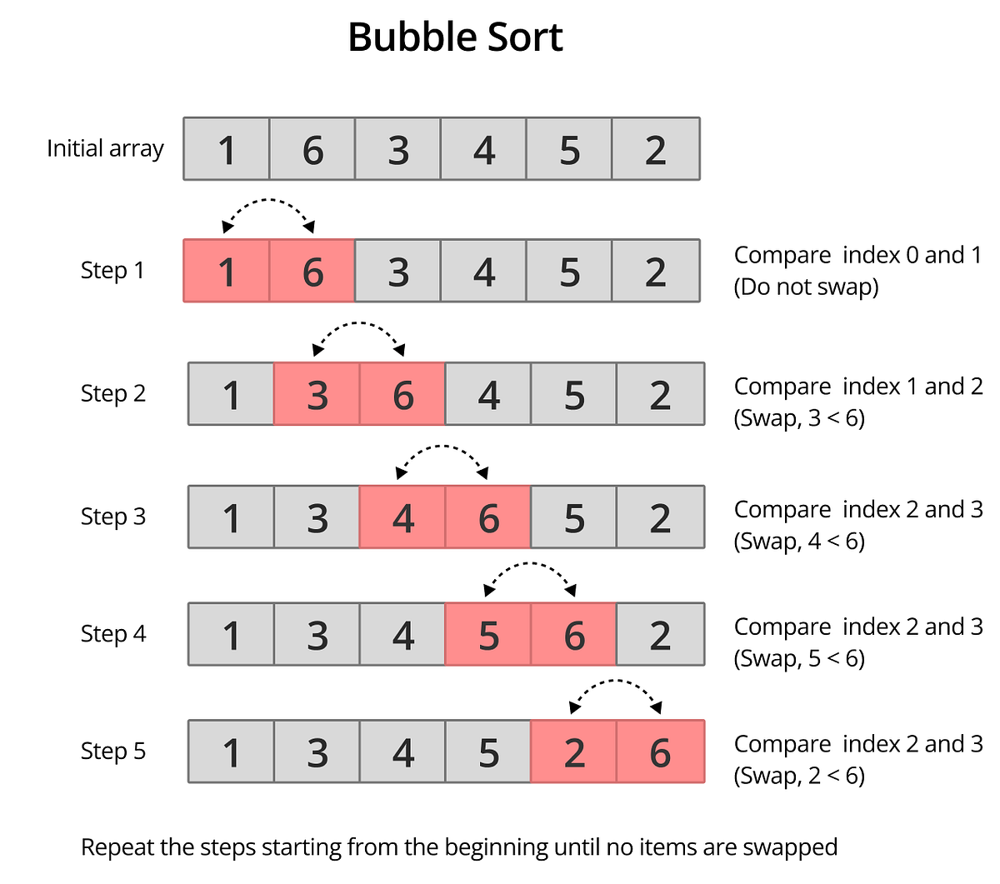
  - **Shaker (Cocktail) Sort**
    - je **oboustranný Bubble Sort**,
    - $\mathcal{O}(n^2)$,
  - **Heap Sort**
    - využívá **max/min-heap**,
    - $\mathcal{O}(n\log n)$,
  - **Select Sort**
    - vyhledává **minimální prvek v nesetřiděné části** a **zařadí ho na konec setřiděné části**,
    - $\mathcal{O}(n^2)$,
  - **Insertion Sort**
    - postupně **projíždí prvky** a **vkládá je na správné místo v setřiděné části**,
    - postup **seřazování karet v ruce**,
    - může být **i online** (tj. při novém vstupu automaticky správně zařadí),
    - $\mathcal{O}(n^2)$,
  - **Quick Sort**
    - pomocí **rozděl a panuj**,
    - využívá **rekurzi** (pole rozděluje podle pivota),
    - nejdříve **projdeme pole zleva** dokud nenajdeme **větší prvek než pivot**,
    - poté **projdeme pole zprava** dokud nenajdeme **menší prvek než pivot**,
    - **tyto prvky poté proházíme**,
    - $\mathcal{O}(n\log n)-\mathcal{O}(n^2)$.

  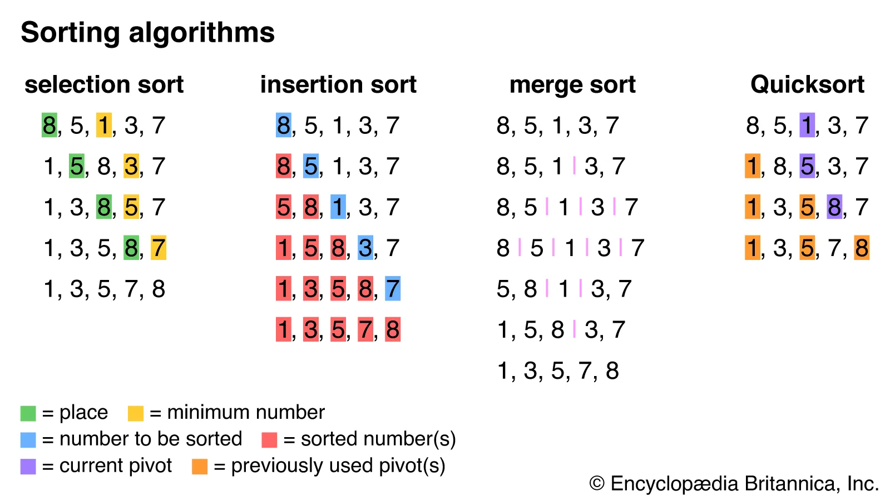

### Vyhledávající algoritmy

V úloze vyhledávání **hledáme $k$ (key) v množině $S$ (search space)**.

- Máme různé možnosti vyhledávání:
  - **Binární vyhledávání**
    - využívá **metodu půlení pomocí rozděl a panuj**,
    - $S$ **musí** být uspořádané,
    - $\mathcal{O}(\log n)$,
      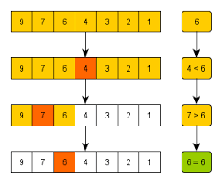
  - **Interpolační vyhledávání**
    - je **variantou binárního** (se **začátkem vyhledávání kolem hledané hodnoty**, čehož můžeme využít díky **rovnoměrnému rozložení**),
    - snaží se o **simulaci lidského chování**, např. **vyhledávání ve slovníku**,
    - $\mathcal{O}(\log \log n) - \mathcal{O}(n)$,
  - **Binární vyhledávací stromy**
    - jsou **jednoduché** pro **hledání určitého klíče** nebo **minima a maxima**,
      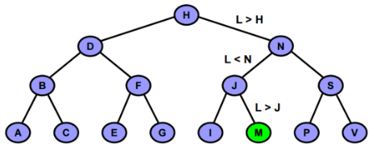
  - **Asociativní vyhledávání s hashováním**
    - se realizuje **pomocí porovnávání klíčů**,
    - _asociativní pole_ je buď **hash tabulka** nebo **BST** (Binary Search Tree),
  - **Adresní vyhledávání s indexem**
    - kde **indexem** je **hledaný klíč**,
    - **počet klíčů** určuje **velikost indexu**, tedy **náročné na paměť**,
    - $\mathcal{O}(1)$.


# Rekurze a její použití. Rekurzivní a nerekurzivní realizace vybraných algoritmů. Využití zásobníku programu

## Rekurze

Rekurze je **programovací technika**, při které je určitá **procedura nebo funkce znovu volána dříve, než je dokončeno její předchozí volání**.

- Rozlišujeme rekurzi:
  - **přímou**, kdy podprogram volá přímo sám sebe: `A -> A`,
  - a **nepřímou**, kdy `A -> B -> A`.

- Dále rozlišujeme rekurzi:
  - **lineární**, kdy podprogram volá **sám sebe pouze** jednou: `A -> A`,
  - **stromová**, kdy podprogram volá **sám sebe vícekrát** a **vytváří tak stromovou strukturu**:

  ```
    A
   / \
  A   A
     / \
    A   A
  ```

- **Každá rekurze** musí mít tzv. **_bázový případ_**, který určuje, **kdy rekurze končí**, jinak nastává **nekonečné volání** a **stack overflow**.

- **Koncová rekurze** je úplně **posledním krokem funkce**, **výsledek** z ní se už nijak **neupravuje**,
  - moderní **kompilátory** pak dokáží **koncovou rekurzi optimalizovat**, tedy interně **přeměnit na cyklus**.

### Využití zásobníku

Při **každém vyvolání podprogramu** se provádí několik kroků.

- Mezi ty patří:
  - uložení **lokálních proměnných do zásobníku**,
  - **předání parametrů** a **návratové adresy**,
  - **skok** do podprogramu.

- Při používání rekurze pak musíme dávat **pozor na velikost zásobníku** a **jeho přetečení** (stack overflow).
- Některé **programovací jazyky a prostředí** můžou mít omezení na **maximální hloubku rekurze**.
- **Iterativní implementace** mohou v některých případech **simulovat zásobník programu**.


### Vybrané algoritmy

#### Faktoriál

```c
// pomalejsi, spotrebovava O(n) pameti na zasobniku
long fact_r(int n) {
  if (n <= 1) return 1;
  return n * fact_r(n-1);
}

// rychlejsi, spotrebovava O(1) pameti
long fact_i(int n) {
  long res = 1;
  for (int i = 2; i <= n; i++) {
    res *= i;
  }
  return res;
}
```

#### Fibonacciho posloupnost

```c
// vysoce neefektivni - slozitost O(2^n), stejne vetve se pocitaji znovu a znovu
long fib_r(int n) {
  if (n <= 0) return 0;
  if (n == 1) return 1;
  return fib_r(n - 1) + fib_r(n - 2);
}

long fib_i(int n) {
  if (n <= 0) return 0;
  if (n == 1) return 1;

  long a = 0, b = 1, res = 0;
  for (int i = 2; i <= n; i++) {
      res = a + b;
      a = b;
      b = res;
  }
  return res;
}

```

#### Binární vyhledávání

```c
int bin_s_r(int arr[], int low, int high, int target) {
  if (low > high) return -1;

  int mid = (low + high) / 2;
  if (arr[mid] == target) return mid;
  if (arr[mid] > target) return bin_s_r(arr, low, mid - 1, target);

  // koncova rekurze -> tail call optimalization
  return bin_s_r(arr, mid + 1, high, target);
}

// mene citelne
int bin_s_i(int arr[], int size, int target) {
  int low = 0;
  int high = size - 1;

  while (low <= high) {
    int mid = low + (high - low) / 2;
    if (arr[mid] == target) return mid;
    if (arr[mid] > target) high = mid - 1;
    else low = mid + 1;
  }

  return -1;
}

```


# Členění programu v jazyce vyšší úrovně. Metody, funkce, procedury, makra. Parametry metod, procedur a funkcí a způsoby jejich předávání. Globální a lokální proměnné.

## Metody, funkce a procedury

Všechny tři jsou **podprogramy**, tedy **pojmenované části kódu**, které **vykonávají určitou činnost** a lze je v programu **volat opakovaně**.

```cpp
// funkce vraci z podprogramu vypocitanou (ci jinak zpracovanou) hodnotu
int f(int a, int b) {
	return a + b;
}

// procedura nic nevraci
// v C-like jazycich vraci void
void p(std::string text) {
	std::cout << text << std::endl;
}

class Person {
public:
	// metoda je soucasti tridy
	void printName() {
		std::cout << name << std::endl;
	}

private:
	std::string name;
};
```

## Makra

Makra jsou **předdefinované textové záměny v kódu**, zpracovává je **preprocesor** ještě **před kompilací kódu**, přičemž je mechanicky nahradí.

```c
#define PI 3.14159
#define MAX(a, b) ((a) > (b) ? (a) : (b))
```

## Parametry a jejich předávání

**Parametry** do podprogramů můžeme **předávat hodnotou, nebo referencí**.

- Při **předávání hodnotou** se do funkce předává **kopie** původní hodnoty,
  - **změny** provedené na parametru pak **nemají vliv na hodnotu v původním kódu**:

```c
int a = 1; int b = 2;
int add(int _a, int _b) {
	int res = _a + _b;
	return res;
}

int c = add(a, b);

// a = 1, b = 2, c = 3
```

- Při **předávání referencí** se předává **adresa v paměti na původní proměnnou**, jakákoliv **změna** parametru uvnitř funkce se pak **projeví i na původní proměnné**,
  - v C++ lze poté **reference** realizovat pomocí **skutečné reference** `&`, **nebo pomocí pointerů** `*`:

```c
int a = 1; int b = 2;

void swap_r(int& a, int& b) {
	int tmp = a;
	a = b;
	b = tmp;
}

void swap_p(int* a, int* b) {
	int tmp = *a;
	*a = *b;
	*b = tmp;
}

swap_r(a, b);
// a = 2, b = 1

swap_p(&a, &b);
// a = 1, b = 2
```

## Globální a lokální proměnné

Proměnné můžou být **globální** nebo **lokální**, podle místa deklarace a jejich rozsahu platnosti.

- **Globální** proměnné jsou deklarované **mimo těla podprogramů** a mají **platnost v celém programu**,
  - mohou pak být změněny v jakémkoli místě programu.

- **Lokální** proměnné jsou deklarované **uvnitř těla bloku kódu** (tedy např. i uvnitř cyklů nebo podmínek),
  - mají **platnost pouze v těle tohoto bloku** kódu,
  - nejsou pak viditelné mimo tento blok.

- V OOP pak definujeme i **atributy** objektu, které **nejsou ani globální, ani lokální** proměnné.


# Objektově orientované programování, význam a základní principy: zapouzdření, dědičnost a polymorfismus, správa přístupu. Abstraktní třídy a rozhraní. Genericita a její využití

## Objektově orientované programování

OOP je **programovací paradigma**, kde je **program strukturován jako sada objektů**, které spolu **komunikují pomocí volání** jejich **metod**.

- **Třída** je **šablona pro vytváření objektů**, která **definuje atributy a metody**.
- **Objekt** je **konkrétní exemplář třídy**, který má **vlastní hodnoty atributů**.
- **Metoda** je **funkce** definovaná **v kontextu třídy**.
- **Atribut** je **proměnná**, která **patří třídě nebo instanci**.

### Dědičnost (inheritance)

**Dědičnost** umožňuje **třídě (potomkovi) přebírat atributy a metody jiné třídy (rodiče)** a **rozšiřovat nebo přepisovat jejich chování**.

```cpp
class Animal {
	public:
		virtual std::string speak() { return "..."; }
};

class Dog : public Animal {
	public:
		Dog() : Animal() {}
		std::string speak() override { return "haf"; }
};

class Cat : public Animal {
	public:
		Cat() : Animal() {}
		std::string speak() override { return "mňau"; }
};

Dog dog;
Cat cat;

std::cout << dog.speak() << std::endl; // haf
std::cout << cat.speak() << std::endl; // mňau
```

### Zapouzdření (enkapsulace)

Díky **zapouzdření** můžeme **ovlivňovat viditelnost jednotlivých atributů a metod třídy**.

- V C++ definujeme takto:
  - **atributy se označí** jako `private`/`protected`, viz [zde](#správa-přístupu),
  - **přístup** se řídí **přes gettery/settery**.

```cpp
class BankAccount {
	private:
		int balance; // zvenku neviditelne

	public:
		BankAccount(int init) : balance(init) {}
		void deposit(int amount) { balance += amount; }
		int getBalance() { return balance; }
};

BankAccount acc(0);
acc.deposit(100);
int balAttr = acc.balance; // chyba
int balGetter = acc.getBalance(); // spravne

```

### Polymorfismus

Díky **polymorfismu** lze **s objekty různých tříd** pracovat **jednotně přes společný typ rodiče**, přičemž **každý objekt se chová podle své vlastní implementace**.

- Ke svému fungování **potřebuje dědičnost**.

- Metody můžeme:
  - **přetížit** (overload): metoda **se stejným jménem**, ale **s jinými vstupními parametry**,
  - **přepsat** (override): metoda **se stejným názvem** a **stejnými parametry**, ale **s jinou implementací**.

```cpp
class Printer {
	public:
		virtual void print(std::string text) = 0; // ciste virtualni metoda, NUTNA implementace v subtridach
		virtual void print(std::string text, int count) { // pretizeni, vychozi implementace
			print(std::to_string(count) + "x " + text);
		}
		virtual void print(std::string text, bool clean) = 0; // pretizeni, ciste virtualni metoda
		virtual ~Printer() = default;
};

class OfficePrinter : public Printer {
	public:
		void print(std::string text) override { // prepsani
			std::cout << "Kancelar " << text << std::endl;
		}
		void print(std::string text, bool clean) override { // prepsani
			std::cout << "Kancelar " << text << " " << (clean ? "[clean office]" : "") << std::endl;
		}
};

class PhotoPrinter : public Printer {
	public:
		void print(std::string text) override { // prepsani
			std::cout << "Foto " << text << std::endl;
		}
		void print(std::string text, bool clean) override { // prepsani
			std::cout << "Foto " << text << " " << (clean ? "[clean photo]" : "") << std::endl;
		}
};

Printer* printers[] = { new OfficePrinter(), new PhotoPrinter() };

for (Printer* printer : printers) {
	printer->print("Hello world");
	printer->print("Hello world", 2);
	printer->print("Hello world", true);
}

// Kancelar Hello world
// Kancelar 2x Hello world
// Kancelar Hello world [clean office]
// Foto Hello world
// Foto 2x Hello world
// Foto Hello world [clean photo]

for (Printer* printer : printers) {
    delete printer;
}
```

### Správa přístupu

**Modifikátory přístupu** určují, _odkud_ jsou dané **atributy nebo metody viditelné**.

- V jazyce C++ definujeme následující možnosti:
  - `private`: přístup **pouze v dané třídě**,
  - `protected`: `private` **+ v potomcích**,
  - `public`: přístup **mají všechny třídy**.

- Člen **by měl mít co nejužší viditelnost**, která je **nutná** pro funkci v programu.

## Abstraktní třídy a rozhraní

Z **abstraktní třídy nelze** přímo **vytvářet instance** a zároveň musí obsahovat **alespoň jednu čistě virtuální metodu** (`= 0`).

```cpp
class Logger{
	public:
		// konkretni metoda, ktera ma sdilenou logiku
		void log(std::string message) {
			write("[LOG] " + message);
		}
		// virtualni metoda = potomek ji MUSI implementovat sam
		virtual void write(std::string message) = 0;
};

class ConsoleLogger : public Logger {
	public:
		void write(std::string message) override {
			std::cout << message << std::endl;
		}
};

Logger l; // chyba, nelze vytvorit instanci abstraktni tridy
ConsoleLogger cl;
cl.log("Hello world"); // [LOG] Hello world
```

- V **některých jazycích** pak existují i tzv. **rozhraní**,
  - **v C++** se poté řeší **pomocí třídy**, kde jsou **všechny metody čistě virtuální** a třída nemá **žádné atributy**.

```cpp
class Printable {
	public:
		virtual void print() = 0;
		virtual ~Printable() = default; // virtualni destruktor
};

class Saveable {
	public:
		virtual void save() = 0;
		virtual ~Saveable() = default;
};

class Document : public Printable, public Saveable {
	public:
		void print() override { std::cout << "print" << std::endl; }
		void save() override { std::cout << "save" << std::endl; }
};

Printable* p = new Document();
p->print(); // print
p->save(); // chyba, Printable nema metodu save

Document* d = new Document();
d->print(); // print
d->save(); // save
```

## Genericita

Díky **genericitě** je možné psát **třídy a funkce parametrizované typem**, kód je tedy **znovu použitelný pro různé typy**, přičemž **při kompilaci** je zachována **typová bezpečnost**.

```cpp
template<typename T>
class Stack {
	private:
		std::vector<T> items;
	public:
		void push(T item) { items.push_back(item); }
		T pop() { return items.back(); }
};

Stack<int> intStack;
intStack.push(1);
intStack.push(2);
std::cout << intStack.pop() << std::endl; // 2

Stack<std::string> stringStack;
stringStack.push("Hello");
stringStack.push(1); // chyba, nelze pridat int do Stack<string>
```

- Využívá se např. v:
  - **kolekcích** `std::vector<T>`,
  - **algoritmech**, které pracují **s libovolným typem**: `std::sort`, `std::find`,
  - **smart pointerech**: `std::unique_ptr<T>`.


# Operační systém, vysvětlení pojmu, typy, poskytované funkce. Správa procesů v operačním systému, vztah programu a procesu, životní cyklus procesu

## Operační systém

Operační systém je **software spravující počítačové zdroje a programy v jednotném řízeném prostředí**.

- Funguje jako **rozhraní mezi HW a aplikačním SW/uživatelem**.
- Musí mít funkce:
  - **zapouzdření** a **řízení přístupu k HW**,
  - **řízení IO**,
  - **runtime** pro programy,
  - **UI**,
  - **API** pro programátory,
  - **zabezpečení**,
  - **detekce chyb**,
  - **částečné zotavení** z chybových stavů,
  - **vyvažování výkonu** mezi výpočetní jádra,
  - **záznam událostí**,
  - **správcovské** nástroje, aj.

- Musí mít **efektivní kód**, být velmi rychlý a být **maximálně spolehlivý**.
- Operační systémy můžou být **serverové**, **počítačové**, **mobilní**, **embedded (RTOS)** nebo **IoT**.

### Jádro

**Jádro** operačního systému je jeho **nejdůležitější součást**.

- Zodpovídá za **správu zdrojů PC** a **HW/SW komunikaci**.
- Zajišťuje **bezpečnost**.
- **Jádro** pracuje **v chráněném (kernel) režimu**, **data** jsou **v chráněné části paměti**.

- Rozlišujeme tyto typy jader:
  - **monolitické**: **všechny služby** běží v **kernel módu** (méně bezpečné, může spadnout celý systém),
  - **mikrojádro**: **v kernel módu** běží **naprosté minimum procesů** (bezpečné, pomalejší),
  - **hybridní**: kompromis (Windows, macOS).

### Procesy

**Program** je **statický soubor instrukcí uložený na disku**, např. ve formě .exe souboru, **proces** je pak **spuštěná instance programu**, tedy kdy je **kód programu v RAM** (navíc obsahuje stav CPU, přidělený paměťový blok, PCB).

- **Paměť procesu** v RAM je **přiřazena jen jemu**.
- Na **jednom CPU jádru** běží vždy **jen jeden proces**.
- Je tvořen z:
  - **kódu**, v **RAM** (příp. cache),
  - **dat**, v **RAM** (**zásobník pro lok. proměnné** a **dynamicky** alokovaná **halda v paměti procesu**),
  - **kontextu** (stavu CPU): v **registrech**,
  - a **zdrojů**, formou **odkazů v RAM**.
- **PCB** je **datová struktura jádra OS** obsahující **metadata o procesu**, které jsou uloženy v chráněné části RAM.


#### Správa procesů

OS **spravuje proces pomocí plánovačů** (schedulerů), které **vybírají z fronty `ready` procesy** nebo se **starají o odswapování z RAM na disk**.

- Při **přepínání** kontextu jádro:
  1. **uloží stav běžícího procesu** do jeho PCB,
  2. **načte stav dalšího procesu** z jeho PCB,
  3. **předá CPU** novému procesu.

#### Životní cyklus procesu

1. **start**: vytvoření a načtení do RAM,
2. **wait (ready)**: čekání ve frontě na přidělení CPU schedulerem,
3. **run**: proces běží,
4. **blocked**: čekání na I/O nebo jiný zdroj (např. přístup k locked souboru),
5. **swap**: odswapovaní do úložiště schedulerem (např. dlouho neběžel, nebo dochází RAM),
6. **end**: dokončení/ukončení procesu a uvolnění zdrojů.


# Principy vrstvené architektury počítačových sítí, referenční model OSI. Charakteristika lokálních počítačových sítí. Technologie Ethernet, její principy a vývoj, algoritmus CSMA/CD. Bezdrátové lokální sítě standardu IEEE 802.11

## Počítačová síť

Počítačová síť **umožňuje technické prostředky**, které realizují **spojení a výměnu informací**, tedy komunikaci, **_mezi počítači_**.

- **Zařízení** se k síti **připojuje pomocí síťové karty**.

- **MAC** (Media Access Control) adresa:
  - váže **adresu na síťovou kartu**,
  - 48b, polovina je **unikátní identifikátor výrobce**, druhá polovina **je přidělená výrobcem**,
  - je určena **pro komunikaci na linkové vrstvě**.

- **IP** (Internet Protocol) adresa:
  - **identifikuje zařízení v síti**,
  - IPv4 32bit, IPv6 128bit,
  - s využitím **ARP** (Adress Resolution Protocol) se **na základě IP adresy zjišťuje MAC adresa**.

### OSI model

**OSI** (Open System Interconnection) je **referenční model** standardizovaný organizací ISO.

- Má celkem **7 vrstev**, přičemž **každá vrstva přidává** k datům z vyšší vrstvy vlastní **hlavičku s řídícími informacemi**:
  1.  **fyzická**: **fyzické** a elektrické **parametry**, např. DSL, 802.11 (mezi 1. a 2.), optika,
  2.  **linková**: metody pro **výměnu datových rámců**, pracuje s MAC adresami, např. Ethernet,
  3.  **síťová**: protokoly pro **směrování dat**, pracuje s IP adresami, např. IP, ARP (mezi 2. a 3.),
  4.  **transportní**: protokoly pro **strukturované zprávy**, pracuje **s porty**, např. TCP, UDP,
  5.  **relační**: **koordinace komunikace** a udržení relace,
  6.  **prezentační**: formátování, **prezentace**, kódování,
  7.  **aplikační**: komunikace **aplikace se sítí**, např. HTTP, POP3.

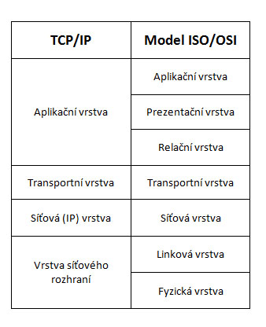

- **Nižší vrstvy poskytují služby těm vyšším, aniž** by ta musela **znát implementaci té nižší**,
  - např. **nahrazení kabelu** se **vrstev výše nedotkne**, týká se to **jen fyzické vrstvy**.

### Lokální počítačová síť

**Lokální síť** je počítačová síť, která je **na jedné geografické poloze**, **pod jednou administrativní správou**, nebo **síť, která končí gatewayí**.

- Topologie LAN můžou být:
  - **sběrnicová**,
  - **hvězdicová**,
  - **kruhová**.

#### Ethernet

**Ethernet** (IEEE 802.3) je **protokol definující přenos dat** na linkové vrstvě.

- **Rámec** v Ethernetu obsahuje např. **zdrojovou a cílovou MAC adresu**, **délku paketu**, **obsah** a **kontrolní součet**.

- **CSMA/CD** (Carrier Sense Multiple Access with Collision Detection) je **přístupová metoda používaná ve starších verzích Ethernetu se sdíleným médiem** (koaxiál, hub), která **sloužila k prevenci kolizí**,
  - jejíž význam ztratil smysl při nástupu full-duplex switchů.

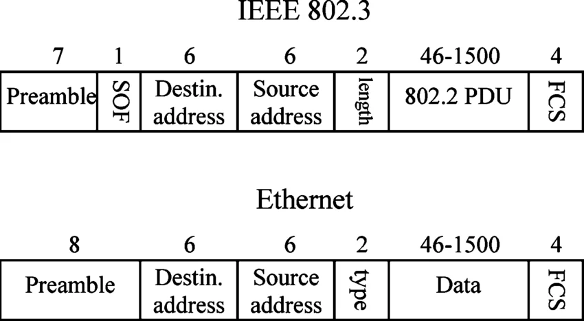

### IEEE 802.11

**IEEE 802.11** je standard pro **bezdrátové lokální sítě (WLAN) označované jako Wi-Fi**.

- **AP** (Access Point) řídí **komunikaci mezi Wi-Fi zařízeními**.

- Existuje **mnoho standardů**, nyní nejnovější **802.11be** (Wi-Fi 7), které využívají frekvenční pásma 2,4, 5 a 6 GHz.

- **Fyzický přenos** pomocí **modulace signálu na nosnou vlnu**,
  - např. algoritmy DSSS, OFDM.

- **CSMA/CA** (Carrier Sense Multiple Access with Collision Avoidance) je **metoda, která předchází kolizím za vysílání**.

- **MIMO** (Multiple Input Multiple Output) využívá **více antén pro prostorové multiplexování**, **ve stejném frekvenčním kanálu** tak může být **více nezávislých datových toků**.


# Základní principy činnosti protokolů sítě Internet – IP, TCP, UDP. Domain Name System, jeho role a činnost, DNS servery, postup řešení dotazu, reverzní DNS

## Internet

**Internet** je **celosvětový systém propojených počítačových sítí**, ve kterých mezi sebou **počítače komunikují pomocí TCP/IP protokolu**.

- Nejpoužívanější porty aplikační vrstvy:

| Protokol     | Port  | Využití                             |
| ------------ | ----- | ----------------------------------- |
| FTP          | 20-21 | File Transfer Protocol              |
| SSH          | 22    | Secure Shell                        |
| SMTP         | 25    | Simple Mail Transfer Protocol       |
| DNS          | 53    | Domain Name System                  |
| DHCP         | 67-68 | Dynamic Host Configuration Protocol |
| HTTP         | 80    | Hypertext Transfer Protocol         |
| POP3 poslech | 110   | Post Office Protocol 3              |
| IMAP poslech | 143   | Internet Message Access Protocol    |
| HTTPS        | 443   | Hypertext Transfer Protocol Secure  |
| IMAP         | 993   | Internet Message Access Protocol    |
| POP3         | 995   | Post Office Protocol 3              |

### IP

**IP** je **protokol síťové vrstvy**, který zajišťuje **adresaci a směrování paketů přes libovolný počet routerů**.

- **Není spolehlivý**, **doručení** zajišťuje případně **TCP z vyšší vrstvy**.

- **Router** udržuje **routovací tabulku** ve tvaru `(cílová síť, next-hop, rozhraní)`,
  - **při příchodu paketu** pak **router vybere záznam s nejdelší shodnou předponou**,
  - **směrovací protokoly** jako RIP tuto **tabulku pak automaticky aktualizují**.

#### IPv4

**IPv4** je **původní protokol s 32bit adresou**.

- Adresa se **rozděluje na 2 části**:
  - **síťovou**, která **určuje síť**,
  - a **hostitelskou**, která **určuje samostatné zařízení**.

- Mezi **speciální adresy** patří:
  - `127.0.0.0/8`: **loopback**,
    - `127.0.0.1/32`: **localhost**,
  - `10.0.0.0/8`, `172.16.0.0/12`, `192.168.0.0/16`: **privátní adresy**, co nejsou směrovatelné přes internet,
  - `255.255.255.255`: **broadcast**.

- **NAT** (Network Address Translation) umožňuje **více zařízením s privátními adresami sdílet jednu veřejnou IP adresu**,
  - přičemž **router nahrazuje zdrojovou privátní adresu svoji veřejnou** při průchodu paketu ven.

- Adresy došly v roce 2011.

#### IPv6

IPv6 je **novější protokol se 128bit adresou**.

- **Větší adresní prostor** odstraňuje potřebu NAT.

### TCP

**TCP** je **protokol transportní vrstvy**, který je **spolehlivý**, tj. zaručuje doručení všech dat ve správném pořadí bez duplikátů.

- Před přenosem dat musí být **navázáno spojení** pomocí **třícestného handshaku**:
  1.  `C SYN-> S`
      - oznámení **ISN (Initial Sequence Number) klienta**,
  2.  `C <-SYN-ACK S`
      - **potvrzení serverem** a oznámení **ISN serveru**,
  3.  `C ACK -> S`
      - **potvrzení klientem** a **navázání spojení**.
- **Ukončení spojení** poté probíhá **čtyřcestně** (každá strana posílá `FIN` a čeká na `ACK` nezávisle).

- **Flow control**: **příjemce při každém `ACK`** oznamuje **velikost svého přijímacího bufferu**, aby se **zamezilo případnému zahlcení příjemce**.
- **Congestion control**: **odesílatel** sám **odhaduje stav sítě**, což **zabraňuje přehlcení sítě**.

- Využívá se hlavně v **HTTP(S), FTP, SMTP, SSH**.

### UDP

**UDP** je **protokol transportní vrstvy**, který **není spolehlivý**, tj. **nenavazuje spojení a nezaručuje doručení, pořadí ani detekci ztráty paketu**.

|                     | TCP                  | UDP                  |
| ------------------- | -------------------- | -------------------- |
| Navázání spojení    | Ano                  | Ne                   |
| Spolehlivost        | Zaručená             | Nezaručená           |
| Pořadí dat          | Zachováno            | Nezachováno          |
| Řízení zahlcení     | Ano                  | Ne                   |
| Latence             | Vyšší                | Nižší                |
| Multicast/Broadcast | Ne                   | Ano                  |
| Využití             | HTTP, FTP, SMTP, SSH | DNS, VoIP, streaming |

### DNS

**DNS** je **distribuovaná hierarchická databáze**, která **překládá doménová jména na IP adresy**.

- Typicky pracuje na `53/UDP`, při větších odpovědích přepíná na `53/TCP`.

- **TLD** (Top-Level Domain) je **první úroveň pod kořenem**, tedy např. **generické `.com` nebo národní ccTLD `.cz`**.

- DNS záznamy jsou např.

  | Typ   | Popis                           |
  | ----- | ------------------------------- |
  | A     | IPv4 adresa                     |
  | AAAA  | IPv6 adresa                     |
  | CNAME | Kanonické jméno (alias)         |
  | MX    | Poštovní server pro doménu      |
  | NS    | Autoritativní name server zóny  |
  | TXT   | Textový záznam (SPF, DKIM, ...) |

- Rozlišujeme následující DNS servery:
  - **Kořenové servery**: **13 logických serverů**, které jsou **fyzicky replikované do stovek lokalit**,
  - **TLD servery**: spravují **konkrétní TLD**,
  - **Autoritativní DNS**: uchovává **přímé záznamy pro konkrétní doménu**, spravuje **správce domény nebo hosting**,
  - **Rekurzivní resolver**: server, **na který se obrací klientské zařízení** a který **vyřeší dotazování root serverů**, typicky **ISP nebo veřejné služby** (Google `8.8.8.8`, Cloudflare `1.1.1.1`), pracují s **cache hit/miss**.

- **Postup dotazu** je tedy:
  1. klient -> rekurzivní resolver,
  2. rekurzivní resolver -> root server,
  3. root server -> TLD server,
  4. TLD server -> autoritativní server,
  5. autoritativní server -> rekurzivní resolver,
  6. rekurzivní resolver -> klient.

- **Reverzní DNS** překládá **IP adresu na doménové jméno**, což slouží např. pro
  - **ověření identity mail serveru** (spam filtry),
  - **diagnostiku sítě** (`tracert`, `nslookup`).
  - Využívá **speciální obrácené domény** `in-addr.arpa.` nebo `ip6.arpa.`, tedy např. `93.184.216.34` -> `34.216.184.93.in-addr.arpa.`, protože **v doménovém jménu jde hierarchie zleva doprava** (obecné -> konkrétní), **v IP adrese naopak** (konkrétní -> obecné).


# Architektura relačních databázových systémů, datový model, konceptuální modelování

## Databázový systém

**Databázový systém** se vytváří za účelem **centralizovaného úložiště dat**, vytvoření **mezivrstvy mezi aplikací a fyzickými daty** a **kontroly přístupu mimo aplikaci**.

- Sestává z:
  - **DB** (Database): systémového **katalogu s vlastními daty**,
  - **DBMS** (Database Management System): **softwarovým systémem** umožňujícím **definovat, vytvářet a udržovat databáze**,
    - např. PostgreSQL, Oracle, MySQL, SQLite, ...

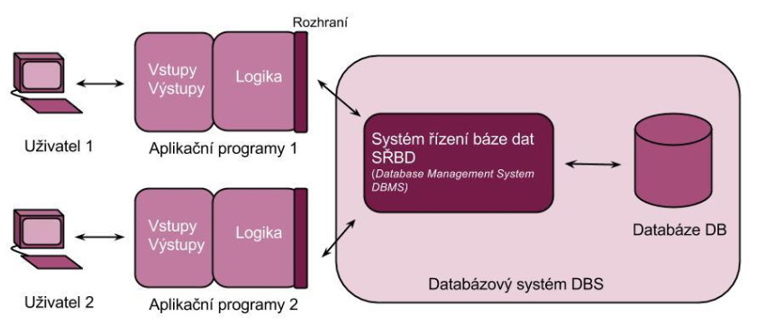

## Datový model

**Datové modely** popisují **strukturu dat, jejich vztahy a omezení**.

- **Optimální** datový model je **jednoduchý**, **expresivní**, **bez redundancí** a **rozšiřitelný**.

- **Návrh** datové vrstvy **shora dolů**:
  1. **Konceptuální model**
     - je **nezávislý na DBMS**,
     - slouží ke **komunikaci se zákazníkem**,
  2. **Relační model**
     - jeho **reprezentace je vhodná pro DBMS**,
     - **nezávislý na konkrétní implementaci**,
     - vzniká transformací konceptuálního modelu,
  3. **Fyzický model**
     - implementace **v konkrétním DBMS**,
     - zahrnuje **indexy**, **datové typy** atd.

### Konceptuální modelování

**Konceptuální modelování** slouží k definici **požadavků klienta**.

- Je ve formě **entit**, **vztahů** a **omezení**, tedy **ER (Entity-Relationship) diagramu**.
- Je **nezávislý na implementačních detailech**, tedy na použitém DBMS.

- **Entita** je **abstrakce pro množinu podobných věcí** reálného světa,
  - **silná entita** je **nezávislá na jiné**, má **vlastní primární klíč**,
  - **slabá entita** je **závislá na jiné**, je identifikována **pomocí částečného klíče** a **cizího klíče rodičovské entity**,
  - **instance entity** je **konkrétní výskyt** (**jeden řádek** v databázi),
  - **entitní množina** je **množina všech instancí** dané entity.

- **Atributy** jsou **vlastnosti entity**, které chceme ukládat,
  - má **datové typy**,
  - jsou následující druhy:
    1. **jednoduchý**: **atomická hodnota**,
    2. **složený**: skládá se **z více částí**, např. adresa,
    3. **vícehodnotový**: může nabývat **více hodnot najednou** (v relačním modelu **se normalizuje pomocí 1NF**),
    4. **odvozený**: **vypočítaný**, např. věk z data narození.

- **Vztahy** jsou **asociace mezi entitami**,
  - vztah **může mít vlastní atributy**,
  - existují stupně vztahů:
    1. **binární**,
    2. **ternární**,
    3. **rekurzivní** (**entita ve vztahu sama se sebou**, např. `zaměstnanec` má nadřízeného, co je taky `zaměstnanec`),
  - máme **vztahová integritní omezení**:
    1. **kardinalita**: **počet možných relací pro jednu entitu** (1:1, 1:M, M:N),
    2. **parcialita**: **povinnost existence ve vztahu**.


# Relační model, základní konstrukty, realizace vztahů v relačním modelu, integritní omezení. Normalizace, normální formy, funkční závislosti, aktualizační anomálie

## Relační model

**Relační model** je založený **na matematickém základu**, tedy **relační algebře**.

- **Relace** $R$ je **pojmenovaná tabulka s řádky a sloupci**.
- **Atribut** $A$ je **pojmenovaný sloupec**.
- **Doména** $D$ je **množina přípustných hodnot pro atribut**.
- **Stupeň** $n$ je **počet atributů relace**.
- **$n$-tice** je **řádek relace**.

- Rozlišujeme následující **klíče**:
  - **superklíč**: libovolná množina atributů, která **jednoznačně identifikuje $n$-tici v relaci**,
  - **kandidátní klíč**: **minimální superklíč**,
  - **primární klíč**: **vybraný kandidátní klíč**,
  - **cizí klíč**: atribut **odkazující na primární klíč jiné relace**.

- Srovnání pojmů s konceptuálním a fyzickým modelem:

| Model        | Šablona         | Instance | Vlastnost |
| ------------ | --------------- | -------- | --------- |
| Konceptuální | Entitní množina | Entita   | Atribut   |
| Relační      | Relace          | $n$-tice | Atribut   |
| Fyzický      | Tabulka         | Záznam   | Sloupec   |

## Integritní omezení

**Integritní omezení** jsou **explicitně vyjádřené podmínky**, které má databáze splňovat.

- U **relačního modelu** definujeme **integritu**:
  - **doménovou**: **hodnoty musí být z domény** (povolených hodnot) atributu,
  - **entitní**: **žádná část PK nesmí být `NULL`**,
  - **referenční**: **FK musí odkazovat na existující $n$-tici** (nebo být `NULL`).

## Normalizace

**Normalizace** je **dekompozice na základě vlastností dat**.

- Normalizací **získáváme menší relace**, které splňují normální formy, ale **zachycují stejné informace**.
- Jsou **snadno udržitelné**, ale jelikož je potřeba **více tabulek**, je **vyhledávání náročnější**.

- Dělají se **kvůli aktualizačním anomáliím**, tedy:
  - **insertion anomaly**: **nejde vložit data bez jiných dat** (např. nejde vložit univerzitu bez přihlášky),
  - **deletion anomaly**: **smazáním řádku ztratíme jiná data**,
  - **update anomaly**: jelikož jsou **data redundantně na více místech**, je **nutno je aktualizovat všude**.

### Normální formy

**Normální formy** slouží jako **pravidla pro dekompozici na menší relace**, které **splňují pravidla normálních forem**.

- V praxi jsme **nejčastěji na úrovni 3NF/BNCF**.

- **1NF**
  - **každý atribut obsahuje atomické hodnoty**,
  - **relace neobsahuje vícehodnotové atributy**,
  - **kritické** pro relační databáze,
  - např. student se hlásí na více univerzit -> rozdělíme.
    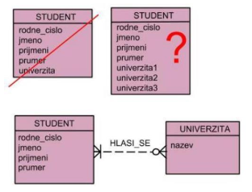
- **2NF**
  - relevantní **pro složené kandidátní klíče**,
  - **každý neklíčový atribut je funkčně závislý na celém klíči**,
  - **neexistuje závislost podklíč -> neklíč**,
  - např. adresu univerzity dáme do tabulky Univerzita, protože nesouvisí s přihláškou.
    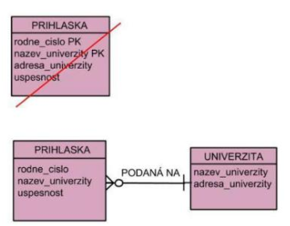
- **3NF**
  - **všechny neklíčové atributy jsou navzájem nezávislé**,
  - **žádný neklíčový atribut není tranzitivně závislý na klíči**,
  - **neexistuje závislost neklíč -> neklíč**,
  - např. adresa SŠ nesouvisí se studentem -> rozdělíme.
    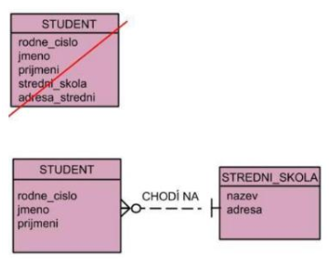

## Funkční závislost

**Funkční závislost** popisuje **vztahy mezi atributy v relaci**, která je **definována ze specifikace požadavků**.

- **Musí platit** pro **všechny $n$-tice** v relaci.

- Pro jejich odvozování slouží **Armstrongovy axiomy**:
  - **spojení pravé strany**: `A->BC, A->G => A->BCG`,
  - **rozdělení pravé strany**: `A->BC => A->B, A->C`,
  - **triviální funkční závislost**: `DE->E`,
  - **tranzitivnost**: `A->G, G->H => A->H`,
  - **rozšíření**: `A->G => AD->GD`.


# Jazyk SQL - selekce, projekce, agregační funkce, množinové operace, typy spojení, vnořené dotazy, spouště a uložené procedury

## SQL

Jazyk **SQL** (Structured Query Language) je standardizovaný **jazyk pro přístup k relačním databázím**.

### DDL

**DDL** (Data Definition Language) je **podmnožina jazyka SQL**, která slouží k **definici DB schématu**.

- Je to **neprocedurální jazyk**, tedy **popisujeme požadovaný výsledek**, **ne to, jak ho získat**.

- Definuje následující příkazy:
  - `CREATE TABLE`,
  - `ALTER TABLE`,
  - `DROP TABLE`: vymazání **schématu i dat**,
  - `TRUNCATE TABLE`: vymazání **dat**,
  - `RENAME`,
  - IO:
    - `NOT NULL`: hodnota nesmí být `NULL`,
    - `UNIQUE`,
    - `PRIMARY KEY`,
    - `REFERENCES`: hodnota ve sloupci **je FK**,
    - `CHECK`: IO zadané **logickým výrazem**,
    - `DEFAULT`: **implicitní hodnota** sloupce,
  - datové typy:
    - `integer`,
    - `smallint`,
    - `decimal`,
    - `float`,
    - `date`,
    - `time`,
    - `interval`,
    - a další (např. `money`, `shape` - závislé na použitém DBMS).

### DML

**DML** (Data Manipulation Language) je **podmnožina jazyka SQL**, která slouží k **manipulaci s daty v DB**.

- Definuje následující příkazy:
  - `SELECT`,
  - `INSERT`,
  - `UPDATE`,
  - `DELETE`.

#### SELECT

Příkaz `SELECT` slouží k **výběru dat z tabulky**.

- **Projekce** je výběr sloupců z tabulky se `SELECT`.
- **Selekce** je filtrování řádků s `WHERE`.

- Můžeme využít:
  - **množinové operace**, které mohou **spojovat data z nesouvisejících tabulek**, ale musí splňovat stejný počet sloupců a kompatibilní typy:
    - **sjednocení** `UNION`,
    - **průnik** `INTERSECT`,
    - **rozdíl** `EXCEPT`,
  - **vnořené dotazy** pomocí:
    - `WHERE (NOT) IN`,
    - vnořený `SELECT`,
    - `(NOT) EXISTS`,
  - **klauzule**:
    - `GROUP BY`,
    - `HAVING`,
    - se kterými lze poté počítat **agregační funkce** (`COUNT`, `SUM`, `AVG`, `MIN`, `MAX`).

```sql
/* nadprumerni zakaznici s vnorenym SELECT */
SELECT customers.name
FROM customers
WHERE (
    SELECT AVG(orders.value)
    FROM orders
    WHERE orders.customer_id = customers.id
) > (
    SELECT AVG(value)
    FROM orders
);

SELECT customers.name, AVG(orders.value) AS avg_value
FROM customers
JOIN orders ON customers.id = orders.customer_id
GROUP BY customers.name
HAVING AVG(orders.value) > (
    SELECT AVG(value) FROM orders
);
```

- Například:
  - `customers`:

    | id  | name |
    | --- | ---- |
    | 1   | John |
    | 2   | Jane |
    | 3   | Mark |

  - `orders`:

    | id  | customer_id | value |
    | --- | ----------- | ----- |
    | 1   | 1           | 100   |
    | 2   | 1           | 200   |
    | 3   | 2           | 300   |
    | X   | NULL        | 0     |

- Dále můžeme využít **spojení pomocí `JOIN`** se syntaxí, kde definujeme:
  - `INNER JOIN`: **společné prvky**:

    | customer_id | name | order_id | value |
    | ----------- | ---- | -------- | ----- |
    | 1           | John | 1        | 100   |
    | 1           | John | 2        | 200   |
    | 2           | Jane | 3        | 300   |

  - `LEFT JOIN`: **vše z levé tabulky, i když neexistuje propojení v pravé tabulce**:

    | customer_id | name | order_id | value |
    | ----------- | ---- | -------- | ----- |
    | 1           | John | 1        | 100   |
    | 1           | John | 2        | 200   |
    | 2           | Jane | 3        | 300   |
    | 3           | Mark | NULL     | NULL  |

  - `RIGHT JOIN`: **vše z pravé tabulky, i když neexistuje propojení v levé tabulce**:

    | customer_id | name | order_id | value |
    | ----------- | ---- | -------- | ----- |
    | 1           | John | 1        | 100   |
    | 1           | John | 2        | 200   |
    | 2           | Jane | 3        | 300   |
    | NULL        | NULL | X        | 0     |

  - `FULL JOIN`: **vše z obou tabulek**:

    | customer_id | name | order_id | value |
    | ----------- | ---- | -------- | ----- |
    | 1           | John | 1        | 100   |
    | 1           | John | 2        | 200   |
    | 2           | Jane | 3        | 300   |
    | NULL        | NULL | X        | 0     |
    | 3           | Mark | NULL     | NULL  |

```sql
/* aktivni zakaznici a jejich objednavky s LEFT JOIN, GROUP BY a HAVING */
SELECT customers.name, COUNT(orders.id)
FROM customers
LEFT JOIN orders
ON customers.id = orders.customer_id
GROUP BY customers.name
HAVING COUNT(orders.id) > 1;
```

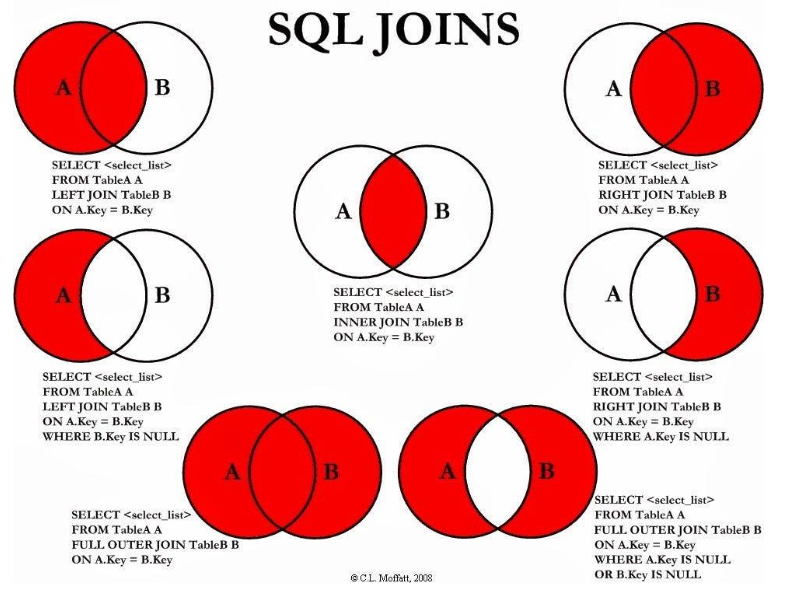

### Triggery a uložené procedury

Na databázovém serveru můžeme mít **definované podprogramy, tzv. procedury**.

- **Triggery** jsou procedury uložené na DB serveru, které jsou **automaticky spuštěné v reakci na akci v DB**, např. `INSERT`, `UPDATE`, `DELETE`,
  - které mají **syntaxi velmi závislou na DBMS**,
  - a můžeme je definovat 3 způsoby:
    - `BEFORE`: **před provedením operace**, např. k validaci dat,
    - `AFTER`: **po provedení operace**, např. pro aplikační logiku,
    - `INSTEAD OF`: **pro nahrazení standardního provedení operace**,
  - můžeme také definovat **granularitu**:
    - `FOR EACH STATEMENT`,
    - `FOR EACH ROW`,
  - a můžeme pracovat i s **referenčními proměnnými**:
    - `OLD ROW`, `OLD TABLE`,
    - `NEW ROW`, `NEW TABLE`.

- **Uložená procedura** je poté **procedura, kterou můžeme spouštět nezávisle**, např.
  - pro **validaci dat**,
  - agregaci **více SQL dotazů do jednoho**,
  - nebo **posunutí programové logiky do DB** (např. `pg_cron`).


# Transakce – koncept a vlastnosti transakcí (ACID)

## Transakce

**Transakce** jsou **posloupnost SQL příkazů**, se kterými se **zachází jako s celkem**.

- Umožňují:
  - **nezávislý přístup více uživatelů** do jedné DB (sessions),
  - **odolnost vůči systémovým poruchám**,
  - **konzistentní DB i při narušení** v průběhu provádění transakce.

- **Transakce** mají následující vlastnosti (ACID):
  - **atomicity** (atomicita): buď se provede **celá transakce, nebo vůbec**,
  - **consistency** (konzistentnost): transformace DB **z jednoho konzistentního stavu do druhého konzistentního stavu**,
  - **isolation** (isolace): **dílčí efekty transakcí nejsou viditelné jiným** transakcím,
  - **durability** (trvalost): efekty **úspěšné transakce jsou uloženy do DB** a zalogovány.

- V SQL jsou poté **příkazy na transakce** tyto:
  - `BEGIN TRANSACTION`,
  - `COMMIT`: **potvrzení transakce** (durability),
  - `ROLLBACK`: **vrácení transakce** (atomicity).

### Izolovanost

U transakcí můžeme definovat to, **jak se zachází s daty při více simultánních transakcích** zároveň.

- Definujeme 4 úrovně:
  - `SERIALIZABLE`
    - **úplná izolace** mezi transakcemi,
    - **sekvenční chování**,
    - **omezení přístupu více uživatelů** zároveň,
  - `REPEATABLE READ`
    - **transakce vidí snapshot dat z okamžiku svého počátku**,
    - **opakované čtení stejného řádku vrací vždy stejnou hodnotu**,
  - `READ COMMITTED`
    - každá **transakce vidí pouze data, která byla commitována jinými transakcemi**,
    - **změny v rámci jiné transakce nejsou viditelné** (nedochází ke čtení nekonzistentních dat),
  - `READ UNCOMMITTED`
    - **transakce může číst i používat data**, která byla změněná jinou transakcí **bez čekání na commit**,
    - použití **by mělo být pouze read-only**.
- Anomálie čtení, které mohou nastat, jsou:
  - **dirty read**: čtení dat, která jiná transakce ještě nezacommitovala,
  - **non-repeatable read**: stejný `SELECT` vrátí **v rámci jedné transakce jiný výsledek**, protože **jiná transakce mezitím změnila** řádek,
  - **phantom read**: stejný `SELECT` vrátí **jiný počet řádků**, protože **jiná transakce mezitím vložila nebo smazala** nějaké řádky.

| Úroveň             | Dirty read | Non-repeatable read | Phantom read |
| ------------------ | ---------- | ------------------- | ------------ |
| `READ UNCOMMITTED` | ✔️         | ✔️                  | ✔️           |
| `READ COMMITTED`   | ❌         | ✔️                  | ✔️           |
| `REPEATABLE READ`  | ❌         | ❌                  | ✔️           |
| `SERIALIZABLE`     | ❌         | ❌                  | ❌           |


# BigData - definice, dělení podle struktury a původu, charakteristika, aplikace. Analýza velkých dat - jednotlivé kroky, typy, výhody a výzvy

## Big Data

**Big Data** jsou data, jejichž **objem, rychlost přírůstku nebo rozmanitost přesahují schopnosti** tradičních relačních databázových systémů je **efektivně zachycovat, spravovat a zpracovávat**.

- **Tradiční relační databáze selhávají** na třech úrovních (3V):
  - **objem (volume)**: TB až PB dat,
  - **rychlost (velocity)**: data jako logy a transakce přicházejí v reálném čase,
  - **rozmanitost (variety)**: různé formáty (strukturované, semi-strukturované, nestrukturované).

- Rozšířená charakteristika zahrnuje další následující V:
  - **Věrohodnost (veracity)**: kvalita a důvěryhodnost dat (šum, zaujatost, anomálie),
  - **Hodnota (value)**: užitečnost, kterou z dat dokážeme extrahovat,
  - **Vizualizace (visualization)**: schopnost data smysluplně zobrazit.

### Struktura dat

Podle struktury rozlišujeme **3 kategorie dat**:

- **Strukturovaná data**
  - mají **pevně definované schéma**,
  - např. záznamy z transakčních systémů a relační databáze,
- **Semi-strukturovaná data**
  - **nemají striktní schéma**, ale nesou značky popisující hierarchii,
  - např. JSON, NoSQL dokumenty,
- **Nestrukturovaná data**
  - **nemají** předem **dané schéma**.

### Původ dat

Podle původu rozlišujeme 3 hlavní kategorie **původu dat**:

- **Strojová data**
  - např. senzory v průmyslu, automobilech, zdravotnictví, IoT,
  - jsou **největší zdroj dat**.

- **Lidská data**
  - např. sociální média, blogy, komentáře, vyhledávání, emaily, osobní dokumenty,
  - **většinou textová a nestrukturovaná**.

- **Organizační data**
  - např. transakce, kreditní karty, bankovnictví, akcie, zdravotní záznamy,
  - **vysoce strukturovaná**, uložená v relačních databázích,
  - **důvěryhodná a užitečná**, ale **riziko datových sil**, tedy že **data nejsou propojitelná**, i když by měla být.

### Aplikace

Big Data nachází **uplatnění** v mnoha oblastech:

- **Cílený marketing a personalizace** na základě aktivity uživatele (historie vyhledávání, objednávky, navštívené stránky, ...),
  - např. Alza, Google, Facebook.
- **Doporučovací systémy** pro udržení pozornosti uživatele a zvýšení prodeje,
  - např. Netflix, Steam, Spotify, Amazon.
- **Analýza sentimentu**
  - založena na **NLP analýze recenzí a komentářů**,
  - např. sledování sentimentů na diskuzních fórech, reakce na události.
- **Mobilní reklamy**
  - kombinují **informace o uživateli se senzory** v telefonu (GPS primárně),
  - např. slevové akce v okolí uživatele, doporučení restaurací/obchodů.
- **Chování skupin**
  - **úprava služeb podle chování** cílové skupiny,
  - např. přesun večerních letů na ráno podle obsazenosti.

## Analýza velkých dat

Analýza velkých dat je o **získávání užitečných informací** z **velkých datových zdrojů**.

- Typický postup analýzy zahrnuje:
  1. **sběr dat**
     - z různých zdrojů,
     - např. Kafka, Flume, Sqoop,
  2. **uložení dat**
     - distribuované souborové systémy (HDFS), NoSQL databáze, datové sklady,
  3. **předzpracování a čištění**
     - **odstranění duplikátů, chybných a narušených dat a outlierů**,
     - **oprava** strukturálních chyb, **normalizace a integrace** z různých zdrojů,
     - **časté využití AI/ML** včetně NLP pro automatizaci,
  4. **zpracování dat**
     - **dávkové zpracování**: **velké objemy dat najednou a plánovaně** s vysokou latencí,
     - **proudové zpracování**: **okamžité zpracování událostí s nízkou latencí** pro real-time aplikace,
     - **distribuované zpracování**: **rozdělení dat a výpočtů mezi více serverů** s vyšší odolností vůči chybám,
     - **micro-batching**: **batchové zpracování s velmi krátkým intervalem pro simulaci streamování** (např. Spark Streaming),
  5. **výsledky**
     - **vizualizace**: grafy, dashboardy, reporty,
     - **interpretace**: zpracování dat a výsledky,
     - např. Tableau, Power BI, Grafana, Kibana,
  6. **rozhodování a akce**
     - automatizované reakce nebo **podpora lidského rozhodování**.

| Výhody                             | Výzvy                         |
| ---------------------------------- | ----------------------------- |
| rozhodování založené na faktech    | kvalita a věrohodnost dat     |
| real-time zpracování dat           | latence                       |
| rychlá analýza v různých formátech | různorodost dat               |
| odhalování skrytých vzorů a trendů | škálovatelnost infrastruktury |
| optimalizace a úspora nákladů      | vysoké náklady                |
| personalizace produktů             | soukromí a bezpečnost dat     |
| vývoj inovativních produktů        | nedostatek expertů            |
| vyšší konkurenceschopnost          | odpor společností             |
| propojení datových sil             | synchronizace datových zdrojů |
| technologická modernizace          | výběr vhodných nástrojů       |

### Typy analýzy

Podle hloubky zpracování:

- **deskriptivní**: **co se stalo?** (agregace, reporty, dashboardy), tedy **shrn minulých dat**,
- **diagnostická**: **proč se to stalo?** (korelace, drill-down, data mining, regrese, detekce anomálií), tedy **retrospektivní hledání příčin**,
- **prediktivní**: **co se stane?** (regrese, klasifikace, predikce, ML), tedy **predikce budoucnosti**, např. bankovní detekce podvodů,
- **preskriptivní**: **co udělat?** (optimizace, doporučení, rozhodovací modely), tedy **optimalizace zdrojů se zapojením AI/ML**, např. navigace v mapách.


# NoSQL databáze - koncept, vlastnosti, dělení, srovnání s relačními databázemi. Pojmy: volné schéma, CAP teorém, indexování, agregace, replikace, škálování, sharding

## NoSQL databáze

NoSQL (Not Only SQL) jsou databáze navržené pro ukládání a zpracování dat, která nejsou dobře obsloužitelná klasickým relačním modelem.

- Jelikož je význam s **not only**, je možné u některých NoSQL databází SQL používat (např. Cassandra CQL (Cassandra Query Language)).
- Hlavními motivacemi jsou:
  - horizontální škálovatelnost (přidávání strojů, ne zvětšování jednoho),
  - práce s velkými objemy dat (Big Data),
  - flexibilní schéma pro semi-strukturovaná a nestrukturovaná data,
  - vysoká dostupnost a odolnost proti výpadkům,
  - jednodušší vývoj v distribuovaném prostředí.

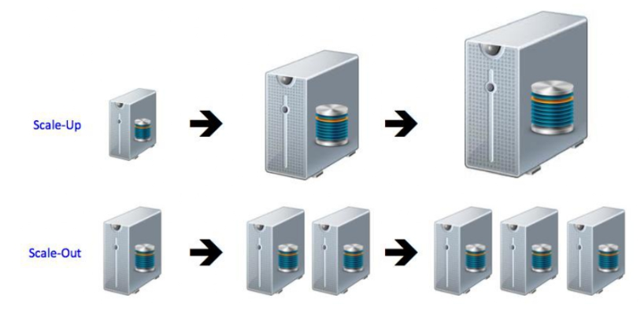

- NoSQL jsou většinou **schemaless**, tedy databáze nemusí mít pevnou strukturu dokumentů nebo záznamů,
  - různé dokumenty v kolekci můžou mít různé atributy,
  - validace se přesouvá do aplikační logiky nebo schématu,
  - výhodou snadná evoluce schématu a práce s heterogenními daty,
  - nevýhodou nebezpečí nekonzistencí a obtížnější dotazování,
  - např. v MongoDB lze definovat validační schéma (`validator` + `jsonSchema`) vynucující strukturu na úrovni kolekce.

- **Indexy** umožňují rychlé vyhledávání bez procházení celé kolekce,
  - které obsahují pointer na celý dokument pro snadný přístup,
  - můžou být definovány nad jedním polem nebo nad jejich kombinací,
  - v NoSQL musí být většinou explicitně definované.

- **Agregace** zpracovává data skrze sekvenční fáze,
  - v MongoDB např. agregační rámce `$match`, `$group`, `$project`, `$sort`, `$lookup`, ...,
  - v Cassandra DB jsou agregace přes SQL omezené, složitější výpočty se dělají v aplikaci nebo ve Sparku,
  - oproti SQL jsou agregační operace méně expresivní a bez `JOIN`,
  - v ElasticSearch bucket (`terms`, `range`, `date_histogram`) nebo metrické agregace (`sum`, `avg`, `min`, `max`, `stats`).

- U NoSQL častá **replikace**, tedy ukládání kopií dat na více uzlů pro zajištění dostupnosti a odolnosti při výpadku.

- **Sharding** je databázový vzor pro horizontální škálování na více serverů,
  - tedy rozdělení kolekce/tabulky na části umístěné na více serverech,
  - u dokumentových databází rozdělení podle dokumentů,
  - může být i u relačních databází, kde se rozděluje podle řádků,
  - určuje se podle **shard key**.

### Dělení NoSQL databází

NoSQL databáze mohou mít mnoho podob:

- **Key-value**
  - každá **hodnota identifikována klíčem**,
  - **hodnota** pro DB **typicky neprůhledná** (opaque blob),
  - podobné **hashmapě/asociativnímu poli**,
  - **extrémně rychlé**, ale **špatně upravitelné a filtrovatelné podle neklíčových hodnot**,
  - např. Redis.

- **Dokumentové**
  - hodnota je **dokument** (JSON, XML),
  - koncepčně odpovídají **objektům v OOP**,
  - např. MongoDB, CouchDB, ElasticSearch.

- **Grafové**
  - ukládají **uzly, hrany, vlastnosti**,
  - např. Neo4j.

- **Vyhledávací**
  - uzpůsobené pro **fulltextové vyhledávání**,
  - obsahují **invertovaný index**,
  - např. ElasticSearch (zároveň dokumentová).

- **Pro časové řady**
  - uzpůsobené pro **ukládání a analýzu časově značených dat**,
  - např. InfluxDB.

### CAP teorém

**CAP teorém** říká, že **v distribuovaném systému lze garantovat v jednu chvíli max. 2 ze 3 vlastností**:

- **C** (consistency): **všichni klienti vidí všechna data ve stejném okamžiku**, každé čtení vrací poslední výsledek nebo chybu,
- **A** (availability): **každý požadavek dostane odpověď**,
- **P** (partition tolerance): **systém funguje i při výpadku sítě mezi uzly**.

- V praxi je **P** nevyhnutelné, takže se systémy dělí na CP a AP:
  - **CP** systémy **obětují dostupnost ve prospěch konzistence** (MongoDB, Redis s clusterem, Cosmos DB s konzistentním nastavením),
  - **AP** systémy **obětují striktní konzistenci ve prospěch dostupnosti** (Cassandra, DynamoDB, CouchDB, Cosmos DB s eventuálním nastavením).
  - CA prakticky neexistuje, protože **nelze při síťovém výpadku zajistit zároveň konzistenci a dostupnost**.

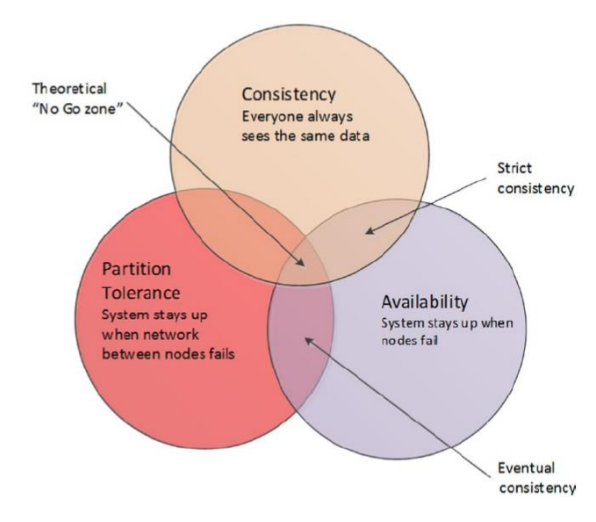


# Dokumentové databáze - koncept, srovnání s key-value úložišti, pojem dokument, výhody a nevýhody. MongoDB - charakteristika a architektura

## Dokumentové databáze

**Dokumentové databáze** jsou typ NoSQL databází, kde je **základní jednotkou pro ukládání dokument**.

- V současnosti patří k **nejpoužívanějším NoSQL databázím**.

- **Dokument** je samostatná, sémanticky ucelená datová struktura,
  - je **typicky ve formátu semi-strukturovaných dat** (JSON, BSON, XML),
  - **časté vnořené objekty a pole**,
  - koncepčně **odpovídá objektům v OOP**,
  - jsou **jednoznačně identifikovány klíči**, které jsou **často indexovány**.
- Databáze pak ukládá **kolekce** dokumentů (obdoba tabulek v relační DB).
- Na rozdíl od key-value úložišť **rozumí databáze struktuře dokumentu**, umožňuje
  - **dotazování** nad atributy,
  - **indexy** nad atributy,
  - **agregační pipeline**.

- Např. MongoDB, CouchDB, Amazon Document DB, Firebase Firestore, Couchbase.

|              | Key-Value databáze            | Dokumentové databáze                      |
| ------------ | ----------------------------- | ----------------------------------------- |
| komplexita   | jednodušší                    | složitější                                |
| operace      | CRD                           | CRUD + agregace                           |
| hodnoty      | libovolná data (blob)         | (semi-)strukturovaná data                 |
| optimalizace | velké objemy jednoduchých dat | komplexní dotazy nad strukturovanými daty |
| příklady     | Redis (key-value v paměti)    | MongoDB                                   |
| indexy       | nejsou potřeba                | ano                                       |
| analogie     | hashtable / asociativní pole  | objekty v OOP                             |

### MongoDB

**MongoDB** je **v současnosti nejpopulárnější dokumentová databáze**, která je **multiplatformní** a open source.

- **Dokumenty** jsou uloženy **ve formátu BSON** (binary JSON).
- **Automaticky** se do dokumentů přidává `_id` typu `ObjectId`,
  - který je 12B, unikátní a rostoucí.

- **Vazby** mezi kolekcemi **by měly být co nejvíce redukovány**,
  - pokud jsou potřeba, je nutné je sloučit manuálně, tedy:
    1. dotaz na první dokument v první kolekci,
    2. dotaz na základě prvního dokumentu na druhou kolekci.

- Jsou 2 paradigmata vytváření prvků v dokumentové databázi:
  1. **embedding**: **vnoření subdokumentu přímo** (rychlé, vhodné pro 1:few a stabilní data):

  ```json
  {
    "_id": ObjectId("1"),
    "name": "Alice",
    "email": "alice@example.com",
    "orders": [
      { "id": ObjectId("100"), "value": 250 },
      { "id": ObjectId("101"), "value": 80 }
    ],
    "address": {
      "city": "Liberec",
      "zip": "46001"
    }
  }
  ```

  2. **referencing**: **ukládání `_id` jako FK a využití** `$lookup` (vhodné pro 1:many a sdílená data, analogie s RDBMS):

  ```json
  {
    "_id": ObjectId("1"),
    "name": "Alice",
    "email": "alice@example.com",
    "orders": [ ObjectId("100"), ObjectId("101") ],
    "address": {
      "city": "Liberec",
      "zip": "46001"
    }
  }

  { "_id": ObjectId("100"), "value": 250 }
  { "_id": ObjectId("101"), "value": 80 }
  ```

  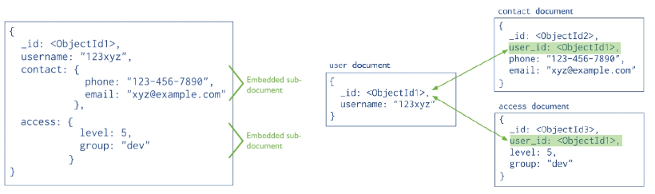

- Příkazy:
  - `show collections`,
  - `db.createCollection("...")`,
  - `db.<collection>.insertOne({...})`,
  - `db.<collection>.insertMany([...])`,
  - `db.<collection>.find()`, který umožňuje filtry, např.
    - `db.users.find({ age: { $gt: 18 } })`,
    - `db.users.find({ likes: { $in: [15, 16, 17] } })`,
    - `db.users.find({ $and: [{ age: { $gt: 18 } }, { gender: 'male' }] })`,
    - querying vnořených objektů pomocí tečkové notace,
  - `db.<collection>.findOne()`, který také umožňuje filtry,
  - `db.<collection>.updateOne|Many()`, který také umožňuje úpravu na základě filtrů, např.
    - `db.users.updateMany({ age: { $gt: 18 } }, { $inc: { age: 1 } })`.

- V MongoDB **replikace řešená pomocí `master-slave` paradigmatu** (v MongoDB tzv. **Replica Set**: `primary-secondary`).

  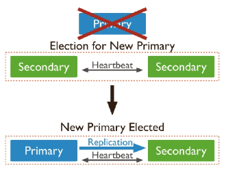

- **Agregace** je poté řešená **pomocí agregační pipeline** nebo **jednoúčelové agregace**:

```js
// jednoucelova agregace
db.users.estimatedDocumentCount({});

// agregacni roura - ziskani poctu dospelych uzivatelu seskupenych podle pohlavi
db.users.aggregate([
  { $match: { age: { $gt: 18 } } },
  { $group: { _id: "$gender", count: { $sum: 1 } } },
]);

// agregacni roura s $lookup ("NoSQL JOIN")
db.users.aggregate([
  {
    $lookup: {
      from: "orders",
      localField: "_id",
      foreignField: "userId",
      as: "user_orders",
    },
  },
]);
```

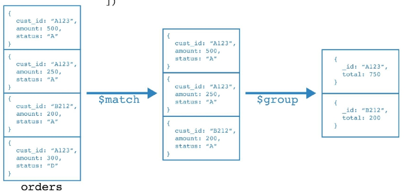

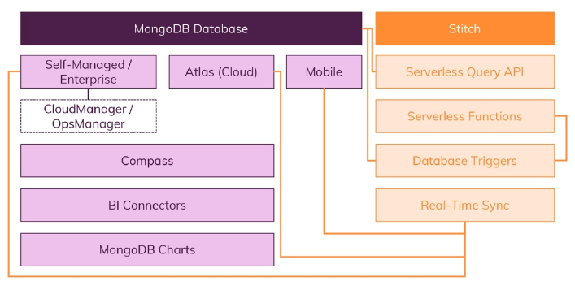

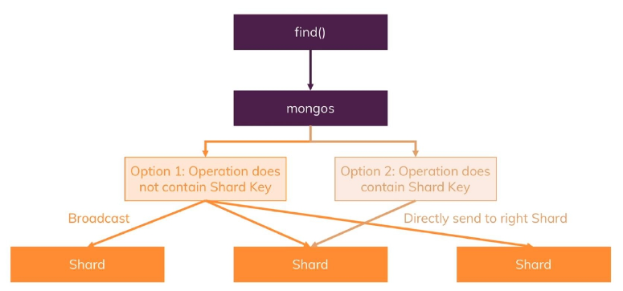


# Databáze pro prohledávání a analýzu textu - princip, vlastnosti. Elasticsearch - architektura, prohledávání vs. analýza, invertovaný index

## Datatabáze pro prohledávání a analýzu textu (search-engine databáze)

**Databáze pro prohledávání a analýzu textu** jsou NoSQL databáze **zaměřené na vyhledávání obsahu**.

- Využívají **indexování**, které **slouží ke kategorizaci podobných vlastností** mezi daty.
- Poskytují **speciální funkce** jako
  - **full-textové vyhledávání**,
  - složité **vyhledávací výrazy**
  - a **řazení výsledků**.

- Např. Elasticsearch, Opensearch.

- Využívají algoritmy jako **TF-IDF** nebo **BM25** (TF-IDF s normalizací délky dokumentu a saturací frekvence termínu):

  $$
  \operatorname{sim}(q,d) = \sum_{i=1}^N x_i y_i = \sum_{w\in q \cap d} c(w,q)\frac{(k+1)c(w,d)}{c(w,d)+k}\log\left(\frac{M+1}{\operatorname{df}(w)}\right),
  $$

  kde:
  - $c(w,q)$ je **frekvence slova $w$ v query $q$**,
  - $\frac{(k+1)c(w,d)}{c(w,d)+k}$ je **saturovaná frekvence** (přínos každého dalšího výskytu klesá) slova $w$ v dokumentu $d$,
  - $\operatorname{IDF}(w) = \log\left(\frac{M+1}{\operatorname{df}(w)}\right)$ je **IDF** slova $w$,
    - když je **slovo $w$ ve všech dokumentech**, je $IDF(w) \approx 0$, takže **nás tolik nezajímá**,
    - když je **slovo $w$ v málo dokumentech**, je $\operatorname{IDF}(w)$ velké, tedy mu **přisuzujeme velkou váhu pro rozlišení relevance**,
    - $M$ je **celkový počet dokumentů** v kolekci,
    - $\operatorname{df}(w)$ je **počet dokumentů, které obsahují slovo $w$**.

  - Dá se využít i **zlepšení vyhledávání s Word2Vec**:
    $$
    \text{query}_{\text{vec}} = \frac{1}{|q|}\sum_{w\in q}\operatorname{WORD2VEC}(w) \times \operatorname{TFIDF}(w),
    $$
    což **umožňuje sémantické vyhledávání** (např. $\text{pes}\in q \Rightarrow \text{štěně}\in q \Rightarrow \text{štěně} \in d$).

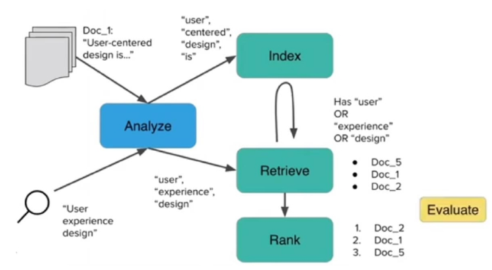

### Elasticsearch

**Elasticsearch** je opensource **search-engine/dokumentová databáze**, která slouží ke **zpracování full-textových dat a jejich analýzu**.

- **Uzel** je instance Elasticsearch obsahující data,
  - může jich **být více**,
  - vytváří se **automaticky při spuštění Elasticsearch**,
  - je součástí **clusteru**,
    - kterých může **být také více**,
    - a který je také vytvořen **automaticky při spuštění Elasticsearch**.

- Data v **dokumentech** jsou ukládána do **indexů**,
  - které **logicky shlukují kolekce dokumentů s podobnými vlastnostmi**,
  - jejichž **dotazování probíhá pomocí REST API**:
    - `GET /_search`,
    - `GET /{index}/_search`,
    - `GET /{index}/_doc/{id}`,
    - `POST /{index}/_doc` pro vložení dokumentu do indexu,
    - `POST /_bulk` pro hromadné vložení dokumentů do indexu,
    - `PUT /{index}`,
    - `POST /{index}/_update/{id}`,
    - `DELETE /{index}`.

```json
{
  "_index": "products",
  "_type": "_doc",
  "_id": "1",
  "_version": 1,
  "result": "created",
  "_shards": {
    "total": 2,
    "successful": 2,
    "failed": 0
  },
  "_seq_no": 1,
  "_primary_term": 1
}
```

- **Vyhledávání probíhá dvěma způsoby**:
  1. **Request URI**: `GET /{index}/_search?q={query}`,
  - které má **omezenější funkcionalitu**,
  2. **Query DSL**: `GET /{index}/_search` + `{"query": {"match": ...}}`,
  - což je **hlavní způsob dotazování**.

```json
{
  "took": 1, //ms
  "_shards": {
    "total": 1,
    "successful": 1,
    "skipped": 0,
    "failed": 0
  },
  "hits": {
    "total": {
      // pocet nalezenych dokumentu
      "value": 1,
      "relation": "eq"
    },
    "max_score": 8.577639,
    "hits": [
      // samotne vysledky
      {
        "_index": "products",
        "_type": "_doc",
        "_id": "1",
        "_score": 8.577639, // Okapi BM25 pouzivane k vypoctu relevance
        "_source": {
          "name": "Potatoes",
          "price": 10
        }
      }
    ]
  }
}
```

- **Elastic stack** v sobě obsahuje další části:
  - **Kibana**: platforma pro **analýzu a vizualizaci dat**,
  - **Logstash**: **roura (pipeline) na zpracování dat**,
  - **X-Pack**: **balík funkci** do Elasticsearch a Kibany,
  - **Beats**: kolekce **data shippers**.

- Elasticsearch definuje také:
  - **tokenizéry**,
  - **analyzéry**: např. pro **stemmatizaci** (děláš -> dělat).

- **Agregace** v Elasticsearch tzv. **bucket agregace**,
  - kde se **vytváří skupiny dokumentů**,
  - přičemž **každá skupina má svá kritéria**, která rozhodují, jestli do nich daný dokument spadá.

### Invertovaný index

**Invertované indexy** slouží k **efektivnímu mapování mezi výrazy a dokumenty**, které je obsahují.

- Mimo kontext analyzéru jsou **tokeny z tokenizéru označovány jako výrazy** (terms).
- **Invertovaný**, protože je **obrácené mapování logičtejší** (term → dokumenty).
- Vytváří se **jeden index pro každé jedno textové pole**.

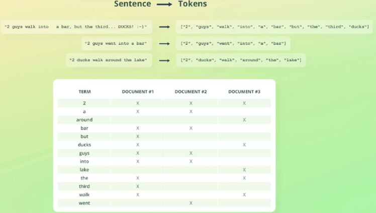


# Sloupcové databáze - koncept, sloupcově orientovaný model, výhody a nevýhody. Cassandra - architektura, distribuce dat a replikace, sekundární index

## Sloupcové databáze

**Sloupcové databáze** jsou distribuované NoSQL databáze optimalizované pro **rychlý přístup k velkým objemům dat**.

- Využívají **sloupcový model ukládání dat**,
  - který je schopný pojmout **velké množství dynamických sloupců**,
  - **keyspace** dává představu o struktuře databáze (~ schéma v RDBMS),
  - **column families** volně **odpovídají relacím v RDBMS**,
    - které **obsahují seřazené řádky**,
      - které **obsahují sloupce** (patřící jen svému řádku), jejichž **počet se může lišit**.

```text
keyspace > column family > row > column > (name, value, timestamp)
```


- U sloupcových databází je zpravidla **množství zápisů výrazně vyšší než čtení**, s **malým množstvím aktualizací**, tedy např. pro časové řady.
- Dají se velmi **jednoduše škálovat**, a **replikovat s volným schématem**.

### Cassandra

**Cassandra** je v současnosti **nejpopulárnější sloupcová databáze** od Apache původně vyvinutá pro Facebook.

- Velmi často **se vyskytuje na velkém množství uzlů přes více datových center**,
  - přičemž **každý uzel má stejnou funkcionalitu** (není to master-slave architektura),
    - **uzly o sobě vědí** pomocí tzv. **snitch**, který **poskytuje uzlům informace o topologii sítě a směřuje requesty**,
    - a **komunikují spolu mezi sebou** pomocí tzv. **gossip**, což je peer-to-peer komunikační protokol.

- Využívá se např. pro
  - **katalogy produktů/playlisty** (Netflix, Hulu),
  - **doporučovací systémy** (eBay),
  - **detekce podvodů** (Instagram),
  - **platformy pro odesílání zpráv**,
  - **IoT/senzorová data**.

- Využívá **dotazovací jazyk CQL** (Cassandra Query Language), který je podobný SQL,
  - nemá ale `JOIN`, **všechna kýžená data v jednom dotazu tedy musí být v jedné tabulce**,
  - `UPDATE` je pak realizován **jako přidání nového záznamu s novějším `timestampem`**, a **v případě konfliktů se vybírá nejnovější záznam**,
  - **mazání** je realizováno pomocí vytvoření tzv. **tombstone** (značky smazání), a **fyzické smazání proběhne až po uplynutí nějaké doby**,
  - v CQL modelu je pak **datový model definován** takto:

    ```text
    keyspace > table > partition > row
    ```


- **Sekundární indexy** umožňují filtrování nad danými sloupci (s `WHERE`),
  - **nezrychlují prohledávání, ale umožňují jej i nad ostatními sloupci**,
  - umožnění definice nad vybranými sloupci (kromě partition key, který už indexovaný je),
  - pro každý sekundární index je vytvořená skrytá tabulka na každém uzlu.


# Dávkové zpracování dat – MapReduce (princip, fáze mapování a redukování). Apache Hadoop - popis, důvod vzniku, ekosystém, komponenty a jejich význam (HDFS, YARN, MapReduce)

## MapReduce

**MapReduce** je programovací model umožňující **distribuované zpracování dat na clusteru**.

- Rozděluje **data na partitions**, které **lze zpracovávat paralelně**.
- Stará se o **provedení zpracování** a **řešení případných selhání**.

- Sestává ze skriptů pro mapování a redukování:
  - **mapování**: efektivní **paralelní transformace dat na clusteru**,
    - jednotlivé **mappery o sobě nemusí vědět**, ale **Hadoop sleduje dokončení**,
  - **shuffle & sort**: **přesun výstupu mapperů ke správným reducerům** podle klíče,
  - **redukování**: **agregace mapovaných dat do finální podoby** (skript zpracovávající výstupy z **shuffle & sort** volaný pro každý unikátní klíč),
    - jednotlivé **reducery o sobě nemusí vědět**, **každý je zodpovědný za rozsah** klíčů.

- Příklad: kolik filmů viděl každý uživatel?
  1. mapování:

     ```
     | user_id | movie_id | rating | => 1:1, 1:2, 2:3, 3:1, 3:2, 3:3
     | ------- | -------- | ------ |
     | 1       | 1        | 3      |
     | 1       | 2        | 3      |
     | 2       | 3        | 3      |
     | 3       | 1        | 3      |
     | 3       | 2        | 3      |
     | 3       | 3        | 3      |
     ```

  2. shuffle & sort:

     ```
     1:1, 1:2, 2:3, 3:1, 3:2, 3:3 => 1:[1,2], 2:[3], 3:[1,2,3]
     ```

  3. redukování:

     ```
     1:[1,2] => 1:2
     2:[3] => 2:1
     3:[1,2,3] => 3:3
     => uživatel 1 viděl 2 filmy, uživatel 2 viděl 1 film, uživatel 3 viděl 3 filmy
     ```

## Hadoop

**Hadoop** je opensource ekosystém pro **distribuované ukládání a zpracování velkých datových sad na počítačových clusterech z komoditního (běžného) HW**.

- Má více částí:
  - **HDFS** (Hadoop Distributed File System): **distribuovaný souborový systém**,
  - **YARN**: (Yet Another Resource Negotiator): místo, kde **začíná zpracování dat a řeší se systémové zdroje**,
  - **Mesos**: alternativa k YARN,
  - **MapReduce**: výchoze v Javě,
  - **Spark**: **zpracování a dotazování dat**, na stejné úrovni jako MapReduce,
  - **Pig**: **skriptovací jazyk** postavený nad MapReduce se syntaxí vzdáleně podobnou SQL,
  - **Hive**: podobný jako Pig, **více odpovídá SQL databázi**,
  - **Ambari**: umožňuje **pohled na cluster** a **vizualizaci běžících aplikací**, sedí nad vším,
  - **Sqoop**: umožňuje **propojení mezi Hadoop a RDBS**,
  - **Kafka**: **distribuovaná event streamovací platforma**.

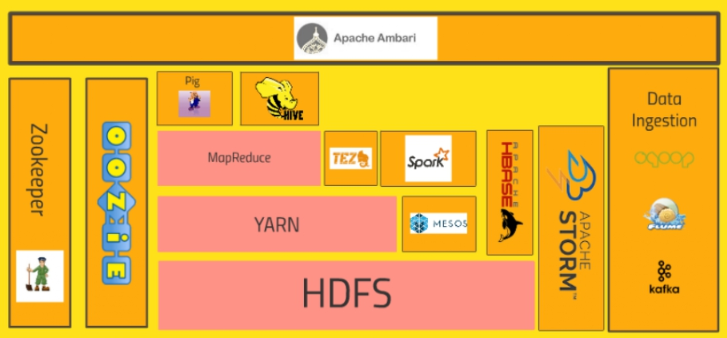

- **Velké soubory** (jejichž správa je optimalizovaná) jsou **rozdělovány na bloky**,
  - **bloky** jsou poté **ukládány na různých komoditních strojích**,
  - přičemž je **ukládáno více kopií bloků na různých strojích**.

- Má dva typy nodů:
  - **name node**: jeden, **udržuje přehled o umístění jednotlivých bloků**,
    - bod selhání se řeší pomocí **konstantní zálohy metadat na disk**, nebo pomocí **sekundárního name nodu**,
  - **data nodes**: více, **ukládají jednotlivé bloky** souborů.

- Zápis souborů probíhá takto:
  1. **klient osloví name node** s novým souborem,
  2. **name node vytvoří nový záznam** a **povolí vytvoření** na data nodes,
  3. **klient osloví vybrané data nodes** a předá soubor,
  4. **data nodes spolu komunikují** a **soubor si replikují**,
  5. **data nodes potvrdí vytvoření** klientovi,
  6. **klient předá potvrzení** na name node,
  7. **name node si zaznamená úspěšné vytvoření** souboru.

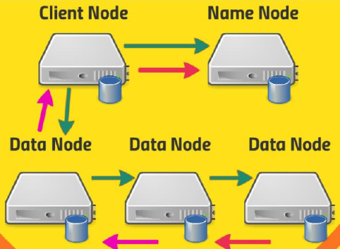

- **Přílišná komplexnost způsobila opuštění od core Hadoopu** a nahrazení jinými technologiemi:
  - HDFS nahrazeno **Amazon S3**,
  - MapReduce nahrazeno **Apache Spark**, **Apache Flink** nebo **Apache Beam**,
  - YARN nahrazeno **Kubernetes**,
  - _velké korporace_ s vlastními servery **ho ale dále používají**.


# Apache Spark – popis a srovnání s Apache Hadoop, jednotlivé komponenty a jejich význam. Koncepty RDD a DataFrame - princip, popis a rozdíly. Transformace vs. akce

## Apache Spark

**Apache Spark** je **rychlý a obecný engine pro zpracování dat ve velkém měřítku**.

- Je **horizontálně škálovatelný**.
- Výpočty pomocí **Spark skriptů**, např. ve **Scale**, Pythonu, Javě nebo R.
- Spark běží nad **Cluster Managerem**
  - **má vlastní**, ale lze využít např. YARN na Hadoop clusteru,
    - ten sparkový rozděluje a koordinuje práci mezi **vykonávače** (Executors),
      - přičemž **může běžet více exekutorů na jednom stroji**,
  - poskytuje **odolnost vůči chybám** (např. při výpadku jednoho executoru).

- Z **vývojářského pohledu** se jedná o **program běžící na jednom stroji**, **byť je to distribuovaná architektura**.

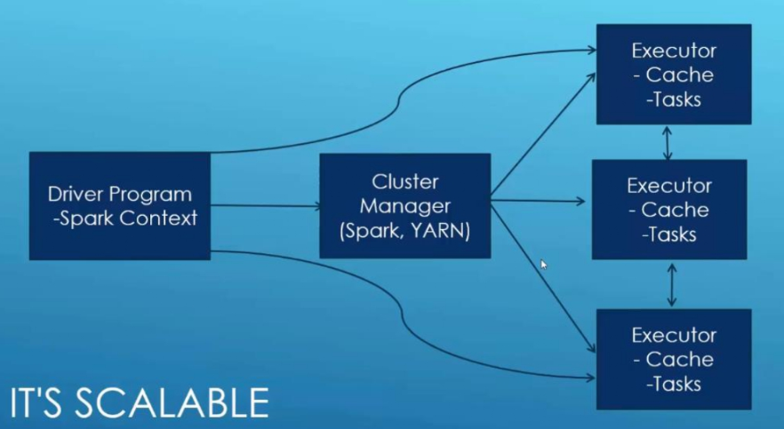

- Využívá **orientované acyklické grafy** (DAG engine),
  - díky čemuž je **rychlý a optimalizovaný**,
  - v praxi **Spark vyčekává do chvíle, než je požádán o výsledky** a **následně vybere optimální cestu** pro zodpovězení otázky.

- Má více komponent:
  - **Spark Core**: **práce s RDD**, **distribuce** zpracování,
  - **Spark Streaming**: podpora pro **analýzu streamovaných dat v reálném čase**,
  - **Spark SQL**: **práce se strukturovanými daty** a následné dotazování,
  - **MLLib**: algoritmy pro **strojové učení**,
  - **GraphX**: algoritmy pro **teorii grafů**.

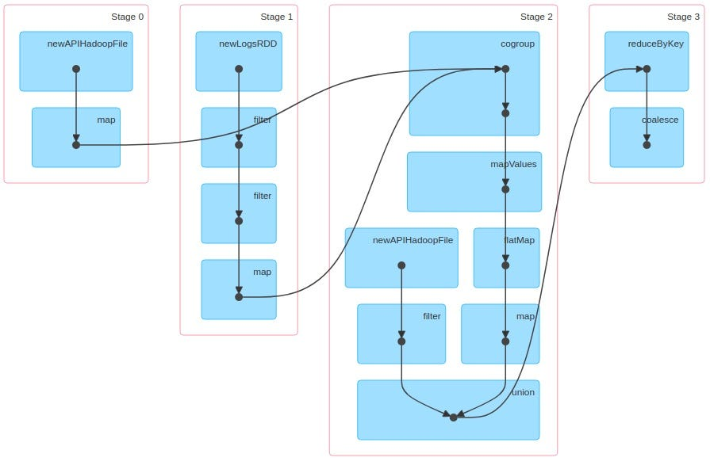

|                     | Hadoop MapReduce | Apache Spark                                                    |
| ------------------- | ---------------- | --------------------------------------------------------------- |
| soubory             | na disku         | v paměti                                                        |
| rychlost            | rychlý           | 100× rychlejší v paměti, 10× rychlejší při práci s daty z disku |
| zápis výsledků      | na disk          | ponechání v paměti                                              |
| efektivita programu | malá - MapReduce | vyšší - MapReduce lze nahradit třeba 1 řádkem kódu              |

### RDD

**RDD** (Resilient Distributed Dataset) je **reprezentace velkých dat**, díky které **lze transformovat jednu datovou sadu na druhou**.

- **Resilient**: **automatická obnova** a **přerozdělení práce v případě výpadku** uzlu.
- **Distributed**: **možnost objekty rozdělit** po celém clusteru.
- **Dataset**: **abstrakce pro velkou sadu** dat.

- K jejich vytváření slouží **Spark Context**.

```python
from pyspark import SparkConf, SparkContext
import collections

conf = SparkConf().setMaster("local").setAppName("RatingsHistogram")
sc = SparkContext(conf = conf)

lines = sc.textFile("file:///SparkCourse/ml-100k/u.data")

ratings = lines.map(lambda x: x.split()[2])

# az tady se spousti vypocet
result = ratings.countByValue() # [3, 3, 1, 2, 1] -> {3: 2, 1: 2, 2: 1}

sortedResults = collections.OrderedDict(sorted(result.items()))
for key, value in sortedResults.items():
		print("%s %i" % (key, value))
```

### DataFrame

**DataFrame** je **distribuovaná kolekce dat organizovaná do pojmenovaných objektů**.

- Odpovídá **velké databázové tabulce**.
- Podporuje **schéma**, **efektivnější ukládání** a **formální popis dat se snadným čtením a zápisem z různých formátů**.

|                      | RDD                           | DataFrame                               |
| -------------------- | ----------------------------- | --------------------------------------- |
| **úroveň API**       | nízkoúrovňová                 | vysokoúrovňová                          |
| **struktura**        | nestrukturovaná data          | strukturovaná data se schématem         |
| **optimalizace**     | od vývojáře přes transformace | automatická s Catalyst optimizérem      |
| **přístup k prvkům** | přes index                    | přes jméno sloupce                      |
| **výkon**            | méně optimalizované           | obvykle rychlejší díky Catalystu        |
| **podpora**          | menší                         | větší (např. MLLib už podporuje jen DF) |

```python
from pyspark.sql import SparkSession

spark = SparkSession.builder.master("local").appName("SparkSQL").getOrCreate()

df = spark.read.text("file:///SparkCourse/ml-100k/u.data")

from pyspark.sql.functions import split
ratings_df = df.select(split(col("value"), r"\s+").getItem(2).alias("rating"))

result_df = ratings_df.groupBy("rating").count().sort("rating")

for row in result_df.collect():
    print(f"{row['rating']} {row['count']}")
```

### Transformace a akce

- **Transformace** jsou **líné operace vracející nové RDD/DataFrame**,
  - např. s `map`, `filter`, `flatMap` aj.,
  - **nevykonají se hned, jen sestaví DAG**.
- **Akce** jsou potom **operace, které spustí výpočet a vrátí jeho výsledek**,
  - např. `count`, `show`, `save` aj.


# Proudové (streamové) zpracování dat - Spark Streaming a Structured Streaming - popis, rozdíly, výhody a nevýhody. Okna a práce s nimi

## Proudové zpracování dat

**Proudové zpracování dat** je **zpracování dat v reálném čase (online)**.

- **Důležité pro real-time** aplikace jako **monitoring**, **doporučovací systémy**, **detekce podvodů**.

- **Micro-batching** je **kompromis mezi dávkovým a streamovým zpracováním**,
  - který **simuluje streamování zpracováváním malých dávek v krátkém intervalu**.

- Definují se **různé časy**:
  - **processing time**: **systémový čas stroje** zpracovávajícího data,
  - **ingestion time**: **čas, kdy událost vstoupila** do streamovacího systému (zejména Flink),
  - **event time**: čas **vzniku události**.

## Spark Streaming

**Spark Streaming** je součást Sparku **určená pro analýzu streamovaných dat**.

- Je to **škálovatelná komponenta**
  - s **vysokou propustností**
  - a **odolností vůči chybám** (checkpointy se pravidelně ukládají na disk).

- Data **jsou agregována a analyzována v určitém intervalu**
  - a mohou **pocházet z různých zdrojů** (např. HDFS, Kafka, sockety, ...).

- Založené na **RDD**.

### Structured Streaming

**Novější API** založené na `DataFrame` architektuře Sparku.

- Streamovaná **data jsou modelována jako DataFramy**, které **jsou rozšířovány**.
- **Data** jsou **udržována ve vstupní tabulce**, **nová data připnuta na konec** vstupní tabulky.
- **Zpracováním** vzniká **výsledková tabulka**, která je **aktualizovaná při příchodu nových dat**.

- Výstupní módy:
  - **complete**: zapíše **celou výsledkovou tabulku**,
  - **append**: jen **nové řádky**,
  - **update**: jen **zaktualizované řádky**.

- **Watermarky** jsou **časové hranice**, které streamovacímu enginu říkají, **jak dlouho ještě čekat na opožděná data**.

|               | Spark Streaming    | Structured Streaming               |
| ------------- | ------------------ | ---------------------------------- |
| API           | RDD                | DataFrame/SQL                      |
| optimalizace  | od vývojáře        | automatická s Catalyst optimizérem |
| zpracování    | micro-batch        | micro-batch i continuous           |
| záznam času   | pouze doručení dat | event-time + watermarks            |
| opožděná data | problematická      | řešena přes watermarks             |
| integrace     | obtížnější         | snadná (stejné API jako batch)     |

## Okna

**Okna** (windows) jsou **základní stavební kámen zpracování nekonečných proudů dat**, která se **dívají jen na určitou dobu do minulosti**.

- Rozdělují **proud** na **konečné úseky, ve kterých jsou prováděny výpočty**.
- Umožňují **agregaci** a **výpočty za určitý časový interval**.

|               | tumbling (statická) | sliding (posuvná)              | session (událostní)                       |
| ------------- | ------------------- | ------------------------------ | ----------------------------------------- |
| **interval**  | pevný               | pevný                          | různě dlouhé                              |
| **překryvy**  | ne                  | ano                            | není definováno                           |
| **realizace** | např. 5min okna     | např. 10min okno s 5min slidem | sdružení aktivit jednoho uživatele/relace |

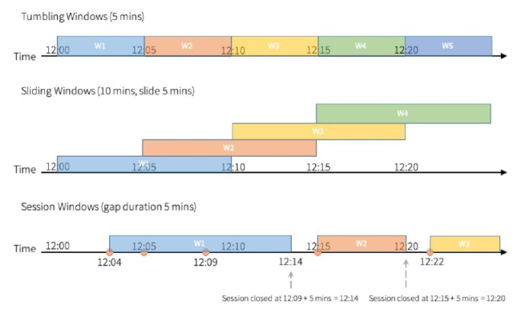
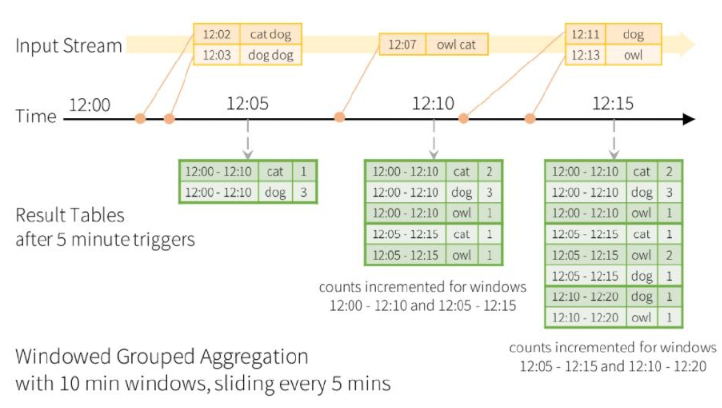

## Apache Flink

**Apache Flink** je navržen jako **skutečně nativní streamovací engine**.

- **Zpracovává** data **záznam po záznamu** s **extrémně nízkou latencí**.
- **Dávkové zpracování** vnímá Flink jako **speciální případ streamování**, kde je datový proud ohraničený.

|                         | Spark                      | Flink                          |
| ----------------------- | -------------------------- | ------------------------------ |
| **původně**             | batch                      | stream                         |
| **rozšířeně**           | stream                     | batch                          |
| **okna**                | micro-batching             | okna a checkpointy             |
| **na pozadí**           | orientovaný acyklický graf | cyklický graf závislostí       |
| **správce paměti**      | ne                         | automatický                    |
| **hlavní implementace** | Scala                      | Java                           |
| **implementace časů**   | processing + event         | processing + ingestion + event |

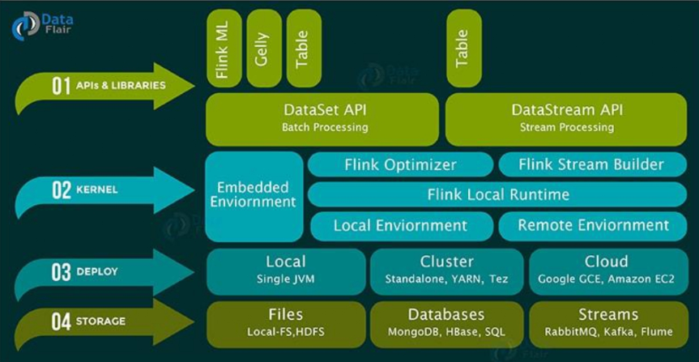

